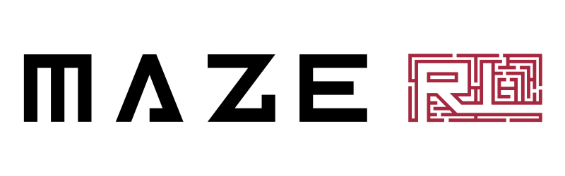

# Applied Reinforcement Learning with Python

MazeRL is an application oriented Deep Reinforcement Learning (RL) framework, addressing real-world decision problems.
Our vision is to cover the complete development life cycle of RL applications ranging from simulation 
engineering up to agent development, training and deployment.

*This is a preliminary, non-stable release of Maze. It is not yet complete and not all of our interfaces have settled
yet. Hence, there might be some breaking changes on our way towards the first stable release.*

## Spotlight Features

Below we list a few selected Maze features.

 - Design and visualize your policy and value networks with the 
   [Perception Module](https://maze-rl.readthedocs.io/en/latest/policy_and_value_networks/perception_overview.html). 
   It is based on PyTorch and provides a large variety of neural network building blocks and model styles. 
   Quickly compose powerful representation learners from building blocks such as: dense, 
   convolution, graph convolution and attention, recurrent architectures, action- and observation masking, 
   self-attention etc.
 - Create the conditions for efficient RL training without writing boiler plate code, e.g. by supporting 
   best practices like [pre-processing](https://maze-rl.readthedocs.io/en/latest/environment_customization/observation_pre_processing.html) and 
   [normalizing](https://maze-rl.readthedocs.io/en/latest/environment_customization/observation_normalization.html) your observations.
 - Maze supports advanced [environment structures](https://maze-rl.readthedocs.io/en/latest/concepts_and_structure/env_hierarchy.html) reflecting 
   the requirements of real-world industrial decision problems such as multi-step and multi-agent scenarios. 
   You can of course work with existing [Gym-compatible environments](https://maze-rl.readthedocs.io/en/latest/best_practices_and_tutorials/integrating_gym_environment.html).
 - Use the provided [Maze trainers](https://maze-rl.readthedocs.io/en/latest/trainers/maze_trainers.html) (A2C, PPO, Impala, SAC, Evolution Strategies), 
   which are supporting dictionary action and observation spaces as well as multi-step (auto-regressive policies) training. 
   Or stick to your favorite tools and trainers by [combining Maze with other RL frameworks](todo/best_practices_and_tutorials/maze_and_other_frameworks.html).
 - Out of the box support for advanced training workflows such as [imitation learning from teacher policies and 
   policy fine-tuning](https://maze-rl.readthedocs.io/en/latest/workflow/imitation_and_fine_tuning.html). 
 - Keep even complex application and experiment configuration manageable with the [Hydra Config System](https://maze-rl.readthedocs.io/en/latest/concepts_and_structure/hydra.html).
 
## Get Started

* Make sure [PyTorch](https://pytorch.org/get-started/locally/) is installed and then get the latest released version of Maze as follows

      pip install -U maze-rl
      
      # optionally install RLLib if you want to use it in combination with Maze
      pip install ray[rllib] tensorflow  
    
  We recommend Python 3.7. [Read more about other options](https://maze-rl.readthedocs.io/en/latest/getting_started/installation.html) like the installation of the latest 
  development version.  

* To see Maze in action check out a [first example](https://maze-rl.readthedocs.io/en/latest/getting_started/first_example.html).

* For a more applied introduction visit the [step by step tutorial](https://maze-rl.readthedocs.io/en/latest/getting_started/step_by_step_tutorial.html).

<table><tbody><tr>
    <td align="center"><a href="https://maze-rl.readthedocs.io/en/latest/getting_started/installation.html">
         
        <strong>Installation</strong>
    </a></td>
    <td align="center"><a href="https://maze-rl.readthedocs.io/en/latest/getting_started/first_example.html">
         
        <strong>First Example</strong>
    </a></td>
    <td align="center"><a href="https://maze-rl.readthedocs.io/en/latest/getting_started/step_by_step_tutorial.html">
         
        <strong>Step by Step Tutorial</strong>
    </a></td>
    <td align="center"><a href="https://maze-rl.readthedocs.io/en/latest/">
         
        <strong>Documentation</strong>
    </a></td>
</tr></tbody></table>

## Learn more about Maze

The [documentation](https://maze-rl.readthedocs.io/en/latest/index.html#documentation-overview) is the starting point to learn more about
  the underlying concepts, but most importantly also provides code snippets and minimum working examples to 
  get you started quickly.

* The *Workflow* section guides you through typical tasks in a RL project
  * [Training](https://maze-rl.readthedocs.io/en/latest/workflow/training.html)
  * [Rollouts](https://maze-rl.readthedocs.io/en/latest/workflow/rollouts.html)
  * [Collection and Visualizing Rollouts](https://maze-rl.readthedocs.io/en/latest/workflow/rollouts_trajectories_viewer.html)
  * [Imitation Learning and Fine-Tuning](https://maze-rl.readthedocs.io/en/latest/workflow/imitation_and_fine_tuning.html) 

* *Policy and Value Networks* introduces you to the 
  [Perception Module](https://maze-rl.readthedocs.io/en/latest/policy_and_value_networks/perception_overview.html), 
  how to [customize action spaces and the underlying action probability distributions](https://maze-rl.readthedocs.io/en/latest/policy_and_value_networks/distributions_and_action_heads.html) 
  and two styles of policy and value networks construction:
  
  * [Template models](https://maze-rl.readthedocs.io/en/latest/policy_and_value_networks/perception_template_models.html) 
    are composed directly from an environment's observation and action space,
    allowing you to train with suitable agent networks on a new environment within minutes.
    
  * [Custom models](https://maze-rl.readthedocs.io/en/latest/policy_and_value_networks/perception_custom_models.html) gives you the full 
    flexibility of application specific models, either with the provided Maze building blocks or 
    directly with PyTorch. 

* Learn more about core *concepts and structures* such as the 
  [Maze environment hierarchy](https://maze-rl.readthedocs.io/en/latest/concepts_and_structure/env_hierarchy.html), the 
  [Maze event system](https://maze-rl.readthedocs.io/en/latest/concepts_and_structure/event_system.html) providing a convenient way to collect 
  statistics and KPIs, enable flexible reward formulation and supporting offline analysis. 

* [Structured Environments and Action Masking](https://maze-rl.readthedocs.io/en/latest/best_practices_and_tutorials/struct_env_tutorial.html) 
  introduces you to a general concept, which can greatly improve
  the performance of the trained agents in practical RL problems.

## License

Maze is freely available for research and non-commercial use. A commercial license is available, if interested please 
contact us on our [company website](https://enlite.ai) or write us an [email](mailto:office@enlite.ai).

We believe in Open Source principles and aim at transitioning Maze to a commercial Open Source project, 
releasing larger parts of the framework under a permissive license in the near future.  
