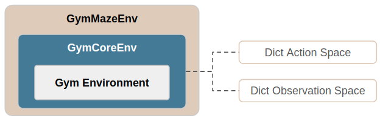

.. _tutorial_gym_env:

Integrating an Existing Gym Environment
=======================================

Maze supports a seamless integration of existing OpenAI Gym environments.
This holds for already registered, `built-in Gym environments <https://gym.openai.com/envs/#classic_control>`_
but also for any other custom environment following the
`Gym environments interface <https://github.com/openai/gym/blob/master/gym/core.py>`_.

To get full Maze feature support for Gym environments we first have to transform them into Maze environments.
This page shows how this is easily accomplished via the :ref:`GymMazeEnv <env_wrappers_ref-gym_env>`.

In short, a Gym environment is transformed into a
:class:`MazeEnv <maze.core.env.maze_env.MazeEnv>` by wrapping it with the
:class:`GymMazeEnv <maze.core.wrappers.maze_gym_env_wrapper.GymMazeEnv>`.
Under the hood the :class:`GymMazeEnv <maze.core.wrappers.maze_gym_env_wrapper.GymMazeEnv>` automatically:

 1. Transforms the Gym environment into a
    :class:`GymCoreEnv <maze.core.wrappers.maze_gym_env_wrapper.GymCoreEnv>`.
 2. Transforms the observation and action spaces into a dictionary spaces via the
    :class:`GymObservationConversion <maze.core.wrappers.maze_gym_env_wrapper.GymObservationConversion>` and
    :class:`GymActionConversion <maze.core.wrappers.maze_gym_env_wrapper.GymActionConversion>`
    interfaces.
 3. Packs the GymCoreEnv into a :class:`MazeEnv <maze.core.env.maze_env.MazeEnv>`
    which is fully compatible with all other Maze components and modules.

To get a better understanding of the overall structure please see the
:ref:`Maze environment hierarchy <env-hierarchy>`.

Instantiating a Gym Environment as a Maze Environment
-----------------------------------------------------

The config snippet below shows how to instantiate an existing, already registered Gym environment
as a GymMazeEnv referenced by its environment name (here *CartPole-v1*).

.. code-block:: YAML

    # @package env
    _target_: maze.core.wrappers.maze_gym_env_wrapper.make_gym_maze_env
    name: CartPole-v1

To achieve the same result directly with plain Python you can start with the code snippet below.

.. code-block:: PYTHON

    from maze.core.wrappers.maze_gym_env_wrapper import GymMazeEnv
    env = GymMazeEnv(env="CartPole-v1")

In case your custom Gym environment is not yet registered with Gym,
you can also explicitly instantiate the environment before passing it to the GymMazeEnv.

.. code-block:: PYTHON

    from maze.core.wrappers.maze_gym_env_wrapper import GymMazeEnv
    custom_gym_env = CustomGymEnv()
    env = GymMazeEnv(env=custom_gym_env)

Test your own Gym Environment with Maze
---------------------------------------

If you already have a project set up and would like to test Maze with your own environment
the quickest way to get started is to:

First, make sure that your project is either installed or available in your :code:`PYTHONPATH`.

Second, add an environment factory function similar to the one shown in the snippet
below to your project (e.g., :code:`my_project/env_factory.py`).

.. code-block:: PYTHON

    from maze.core.env.maze_env import MazeEnv
    from maze.core.wrappers.maze_gym_env_wrapper import GymMazeEnv

    def make_env(name: str) -> MazeEnv:
        custom_gym_env = CustomGymEnv()
        return GymMazeEnv(custom_gym_env)

That's all we need to do. You can now start training an agent for your environment by running:

.. code-block:: console

  $ maze-run -cn conf_train env._target_=my_project.env_factory.make_env

This basically updates the original
`gym_env <https://github.com/enlite-ai/maze/blob/main/maze/conf/env/gym_env.yaml>`_ config
via :ref:`Hydra overrides <hydra-overview-overrides>`.

Note that the argument :code:`name` is unused so far but is required to adhere to the
`gym_env <https://github.com/enlite-ai/maze/blob/main/maze/conf/env/gym_env.yaml>`_ config signature.
When :ref:`creating your own config files <hydra-custom>` you can of course tailor this signature to your needs.

Where to Go Next
----------------

- For technical details on the GymMazeEnv please see the :ref:`reference documentation <env_wrappers_ref-gym_env>`.
- Next you might be interested in how to :ref:`train an agent for your environment <training>`.
- You might also want to read up on the :ref:`Maze environment hierarchy <env-hierarchy>`
  for the bigger picture.