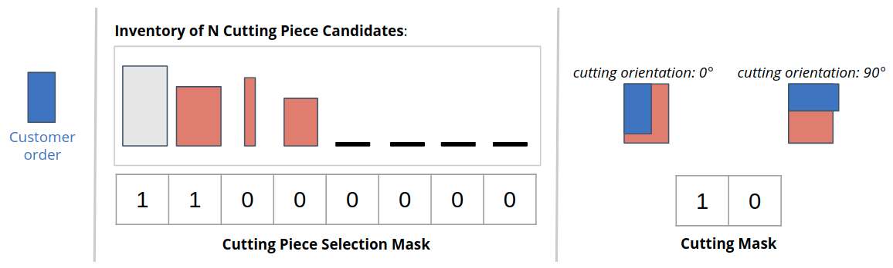

.. |tutorial_code_part_06| raw:: html

   <a href="https://github.com/enlite-ai/maze-examples/tree/main/tutorial_maze_env/part06_struct_env/" target="_blank">can be found here</a>

.. _adding_masking:

Adding Step-Conditional Action Masking
======================================

In this part of the tutorial we will learn how to substantially increase the sample efficiency of our agents
by adding *sub-step conditional action masking* to the structured environment.

The complete code for this part of the tutorial |tutorial_code_part_06|

.. code:: bash

    # relevant files
    - cutting_2d
        - main.py
        - env
            - struct_env_masked.py

In particular, we will add two different masks:

- **Inventory_mask**: allows to only select cutting pieces from inventory slots actually holding a piece
  that would allow to fulfill the customer order.
- **Rotation_mask**: allows to only specify valid cutting rotations
  (e.g., the ordered piece fits into the cutting piece from inventory).
  Note that providing this mask is only possible once the cutting piece has been selected in the first sub-step -
  hence the name *step-conditional masking*.

The figure below provides a sketch of the two masks.

Only the first two inventory pieces are able to fit the customer order.
The four rightmost inventory slots do not hold a piece at all and are also masked.
When rotating the piece by 90° for cutting the customer order would not fit into the selected inventory piece
which is why we can simply mask this option.

Masked Structured Environment
-----------------------------

One way to incorporate the two masks in our structured environment is to
simply inherit from the initial version and extend it by the following changes:

- Add the two masks to the observation spaces (e.g., ``inventory_mask`` and ``cutting_mask``)
- Compute the actual mask for the two sub-steps in the respective functions
  (e.g., ``_obs_selection_step`` and ``_obs_cutting_step``).

.. literalinclude:: ../../../../tutorials/tutorial_maze_env/part06_struct_env/env/struct_env_masked.py
  :language: python
  :caption: env/struct_env_masked.py

Test Script
-----------

When re-running the :ref:`main script <struct_env_tutorial-main>` of the previous section
with the masked version of the structured environment we now get the following output:

.. code:: bash

    action_space 1:      Dict(piece_idx:Discrete(200))
    observation_space 1: Dict(inventory:Box(200, 2), inventory_size:Box(1,), ordered_piece:Box(2,), inventory_mask:Box(200,))
    observation 1:       dict_keys(['inventory', 'inventory_size', 'ordered_piece', 'inventory_mask'])
    action_space 2:      Dict(cut_order:Discrete(2), cut_rotation:Discrete(2))
    observation_space 2: Dict(ordered_piece:Box(2,), selected_piece:Box(2,), cutting_mask:Box(2,))
    observation 2:       dict_keys(['selected_piece', 'ordered_piece', 'cutting_mask'])

As expected, both masks are contained in the respective observations and spaces.
In the next section we will utilize these masks to enhance the sample efficiency ouf our trainers.
