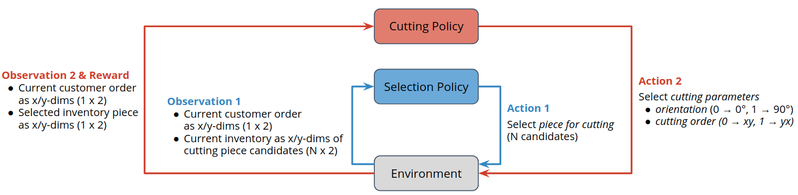

.. _flat_to_structured:

Turning a “flat” MazeEnv into a StructuredEnv
=============================================

In this part of the tutorial we will learn how to reformulate an RL problem in order to
turn it from a "flat" Gym-style environment into a structured environment.

The complete code for this part of the tutorial
`can be found here <https://github.com/enlite-ai/maze-examples/tree/main/tutorial_maze_env/part06_struct_env>`_

.. code:: bash

    # relevant files
    - cutting_2d
        - main.py
        - env
            - struct_env.py

.. contents:: Page Overview
    :depth: 1
    :local:
    :backlinks: top

Analyzing the Problem Structure
-------------------------------

Before we start implementing the structured environment lets first
:ref:`revisit the cutting 2D problem <env_from_scratch-problem>`.
In particular, we put our attention to the joint action space
consisting of the following components:

- Action :math:`a_0`: cutting piece selection (decides which piece from inventory to use for cutting)
- Action :math:`a_1`: cutting orientation selection (decides on the orientation of the cut)
- Action :math:`a_2`: cutting order selection (decides which cut to take first; x or y)

.. image:: ../../getting_started/maze_env/cutting_parameters.png
    :width: 100 %
    :align: center

**Analysis of Action Space and Problem**:

- We are facing a combinatorial action space with :math:`O(N \cdot 2 \cdot 2)` possible actions
  the agent has to choose from in each step. :math:`N` is the maximum number of pieces stored in the inventory.
- Sampling from this joint action space might result in invalid cutting configurations.
  This is because the three sub-actions are treated independently from each other.
  For the problem at hand this is obviously not the case.
- It would be much more intuitive to sample the sub-actions sequentially and conditioned on each other.
  (E.g., it seems to be easier to decide on the cutting order and orientation once we know the piece we will cut from.)

Implementing the Structured Environment
---------------------------------------

We now address the issues discovered in the previous section and re-formulate the cutting 2D problem as a
:class:`~maze.core.env.structured_env.StructuredEnv` with the following two sub-steps:

- **Select cutting piece** from inventory given inventory state and customer order.
- Select cutting configuration (**cutting order** and **cutting orientation**) given customer order and
  inventory cutting piece selected in the previous sub-step.

This could be also described with the modified agent environment interaction loop shown in the figure below.
Note that the both observation and action space differ between the selection and the cutting sub-step.
For the present example, reward is only granted once the cutting sub-step (i.e., the second step) is complete.

.. note::
    Conceptually structured environments and conditional sub-steps
    are related to auto-regressive action spaces where subsequent actions are sampled conditioned on their predecessors.
    [e.g. DeepMind (2019), "Grandmaster level in StarCraft II using multi-agent reinforcement learning."]

The code for the ``StructuredCutting2DEnvironment`` below implements exactly this interaction pattern.

.. literalinclude:: ../../../../tutorials/tutorial_maze_env/part06_struct_env/env/struct_env.py
  :language: PYTHON
  :caption: env/struct_env.py

.. _struct_env_tutorial-main:

Test Script
-----------

The following snippet first instantiates the structured environment
and then performs one cycle of the structured agent environment interaction loop.

.. literalinclude:: ../../../../tutorials/tutorial_maze_env/part06_struct_env/main.py
  :language: PYTHON
  :caption: main.py

Running the script will print the following output.
Note that the observation and action spaces alternate from sub-step to sub-step.

.. code:: bash

    action_space 1:      Dict(piece_idx:Discrete(200))
    observation_space 1: Dict(inventory:Box(200, 2), inventory_size:Box(1,), order:Box(2,))
    observation 1:       dict_keys(['inventory', 'inventory_size', 'order'])
    action_space 2:      Dict(order:Discrete(2), rotation:Discrete(2))
    observation_space 2: Dict(order:Box(2,), selected_piece:Box(1, 2))
    observation 2:       dict_keys(['selected_piece', 'order'])

In the next part of this tutorial we will train an agent on this structured environment.
