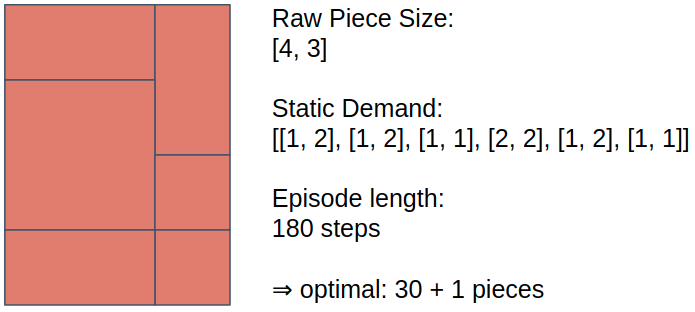
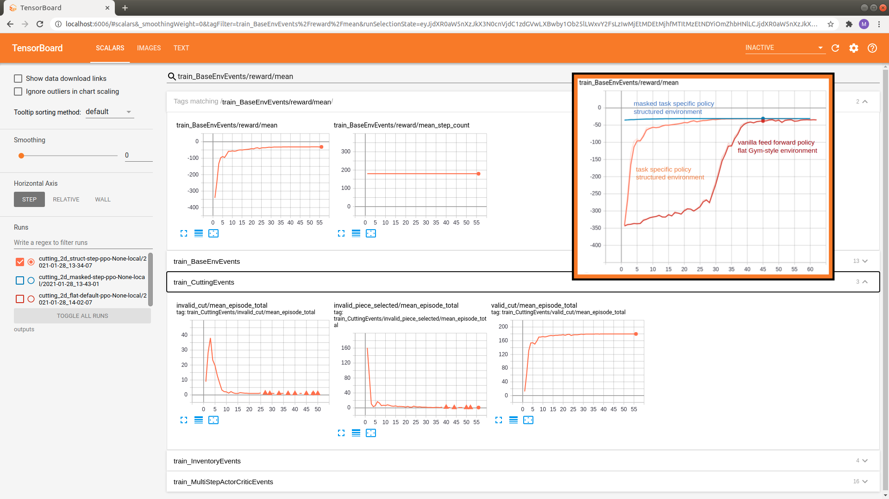

.. _train_no_mask:

Training the Structured Environment
===================================

In this part of the tutorial we will learn how to train an agent
with a :ref:`Maze trainer<maze_trainers>` implicitly supporting a Structured Environment.
We will also design a policy network architecture matching the task at hand.

The complete code for this part of the tutorial
`can be found here <https://github.com/enlite-ai/maze/tree/main/tutorials/tutorial_maze_env/part06_struct_env>`_

.. code:: bash

    # relevant files
    - cutting_2d
        - conf
            - env
                - tutorial_cutting_2d_flat.yaml
                - tutorial_cutting_2d_struct.yaml
            - model
                - tutorial_cutting_2d_flat.yaml
                - tutorial_cutting_2d_struct.yaml
            - wrappers
                - tutorial_cutting_2d.yaml
        - models
            - actor.py
            - critic.py

.. contents:: Page Overview
    :depth: 1
    :local:
    :backlinks: top

A Simple Problem Setting
------------------------

To emphasize the effects of action masking throughout this tutorial we devise a simple problem instance
of the cutting 2d environment with the following properties:

Given the raw piece size and the items in the static demand (appear in an alternating fashion)
we can cut six customer orders from one raw inventory piece.
When limiting the episode length to 180 time steps the optimal solution
with respect to new raw pieces from inventory is 31
(30 + 1 because the environment adds a new piece whenever the current one has been cut).

Task-Specific Actor-Critic Model
--------------------------------

For this advanced tutorial we make use of Maze :ref:`custom models <custom_models>`
to compose an actor-critic architecture that is geared towards the respective sub-tasks.
Our structured environment requires two policies, one for piece selection and one for cutting parametrization.
For each of the two sub-step policies we also build a distinct state critic
(see :class:`~maze.perception.models.critics.step_state_critic_composer.StepStateCriticComposer` for details).
Note that it would be also possible to employ a
:class:`~maze.perception.models.critics.shared_state_critic_composer.SharedStateCriticComposer`
used to compute the advantages for both policies.

The images below show the for network architectures (click to view in large).
For further details on how to build the models we refer to the accompanying repository and the section on
:ref:`how to work with custom models <custom_models>`.

.. list-table::
    :widths: 1 1 1 1
    :align: center

    * - | Piece Selection Policy

      - | Cutting Policy

      - | Piece Selection Critic

      - | Cutting Critic

    * - .. figure:: models_struct/policy_0.png
           :width: 95 %
           :align: center

      - .. figure:: models_struct/policy_1.png
           :width: 95 %
           :align: center

      - .. figure:: models_struct/critic_0.png
           :width: 95 %
           :align: center

      - .. figure:: models_struct/critic_1.png
           :width: 95 %
           :align: center

Some notes on the models:

- The selection policy takes the current *inventory* and the *ordered piece* as input and
  predicts a selection probability (*piece_idx*) for each inventory option.
- The cutting policy takes the *ordered piece* and the *selected piece* (previous step) as input and predicts
  *cutting rotation* and *cutting order*.
- The critic models have an analogous structure but predict the state-value instead of action logits.

Multi-Step Training
-------------------

Given the models designed in the previous section we are now ready to train our first agent on a Structured Environment.
We already mentioned that :ref:`Maze trainers <maze_trainers>` directly support the training of Structured Environments
such as the ``StructuredCutting2DEnvironment`` implemented in the previous part of this tutorial.

To start training a cutting policy with the PPO trainer, run:

.. code:: bash

    maze-run -cn conf_train env=tutorial_cutting_2d_struct wrappers=tutorial_cutting_2d \
    model=tutorial_cutting_2d_struct algorithm=ppo

As usual, we can watch the training progress with Tensorboard.

.. code:: bash

    tensorboard --logdir outputs

We can see that the reward slowly approaches the optimum.
Note that the performance of this agent is already much better
than the vanilla Gym-style model we employed in the :ref:`introductory tutorial <env_from_scratch>`
(compare evolution of rewards above).

However, the event logs also reveal that the agent initially samples many invalid actions
(e.g, *invalid_cut* and *invalid_piece_selected*).
This is sample inefficient and slows down the learning progress.

Next, we will further improve the agent by avoiding sampling of these invalid choices via action masking.