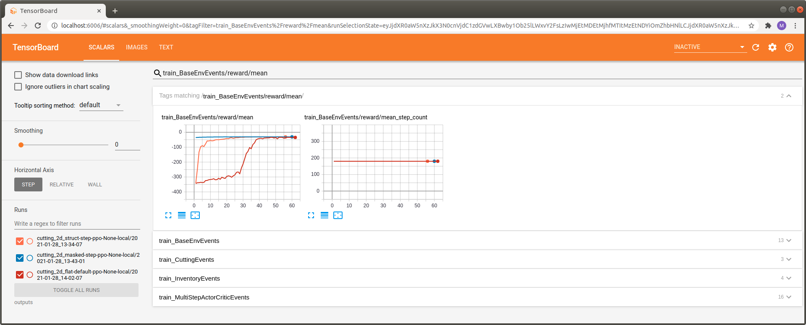

.. _train_with_mask:

Training with Action Masking
============================

In this part of the tutorial we will retrain the environment with step-conditional action masking activated
and benchmark it with the initial, unmasked version.

The complete code for this part of the tutorial
`can be found here <https://github.com/enlite-ai/maze/tree/main/tutorials/tutorial_maze_env/part06_struct_env>`_

.. code:: bash

    # relevant files
    - cutting_2d
        - conf
            - env
                - tutorial_cutting_2d_flat.yaml
                - tutorial_cutting_2d_struct.yaml
                - tutorial_cutting_2d_struct_masked.yaml
            - model
                - tutorial_cutting_2d_flat.yaml
                - tutorial_cutting_2d_struct.yaml
                - tutorial_cutting_2d_struct_masked.yaml
            - wrappers
                - tutorial_cutting_2d.yaml
        - models
            - actor.py
            - critic.py

.. contents:: Page Overview
    :depth: 1
    :local:
    :backlinks: top

Masked Policy Models
--------------------

Before we can retrain the masked version of the structured environment we first need to specify
how the masks are employed within the models.
For this purpose we extend the two policy models with an
:class:`~maze.perception.blocks.general.action_masking.ActionMaskingBlock`
applied to the respective logits. The resulting models are shown below:

.. list-table::
    :widths: 1 1 1 1
    :align: center

    * - | Masked Piece
        | Selection Policy

      - | Masked Cutting Policy

      - | Piece Selection Critic

      - | Cutting Critic

    * - .. figure:: models_masked/policy_0.png
           :width: 95 %
           :align: center

      - .. figure:: models_masked/policy_1.png
           :width: 95 %
           :align: center

      - .. figure:: models_masked/critic_0.png
           :width: 95 %
           :align: center

      - .. figure:: models_masked/critic_1.png
           :width: 95 %
           :align: center

Retraining with Masking
-----------------------

.. code:: bash

    maze-run -cn conf_train env=tutorial_cutting_2d_struct_masked wrappers=tutorial_cutting_2d \
    model=tutorial_cutting_2d_struct_masked algorithm=ppo

Once training has finished we can again inspect the progress with Tensorboard.
To get a better feeling for the effect of action masking we benchmark the following versions of the environment:

 - Flat Gym-style environment with vanilla feed forward models (red)
 - Structured Environment (e.g., with hierarchical sub-steps) with task specific policy networks (orange)
 - Structured Environment (e.g., with hierarchical sub-steps) with masked, task specific policy networks (blue)

First of all we can observe a massive increase in learning speed when activating action masking.
In fact the reward of the masked model starts at an much higher initial value.
We can also observe a substantial improvement when switching from the vanilla feed forward Gym-style
example (red) to the structured environment using task specific custom models (orange).

In Depth Inspection of Learning Progress
----------------------------------------

In this section we make use of :ref:`Maze Event Logging System <event_kpi_log>`
to learn more about the learning progress and behaviour of the respective versions.

.. image:: tb_imgs/tb_events.png
    :width: 100 %

- When looking at the cutting events we see that the agent utilizing action masking only performs valid cutting attempts
  right from the beginning of the training process.
  Avoiding the part where the agent has to learn via reward shaping which cuts are actually possible
  allows it to focus on learning how to cut efficiently.
  For the two other versions exactly the latter is the case.
- The same observation holds for the piece selection policy where
  again a lot of invalid attempts take place for the two unmasked versions.
- Finally, when looking at the inventory statistics we can see that the masked agent keeps very few pieces in inventory
  (*pieces in inventory*) which is why it never has to discard any piece (*pieces discarded*) that might be required
  to fulfill upcoming customer orders.