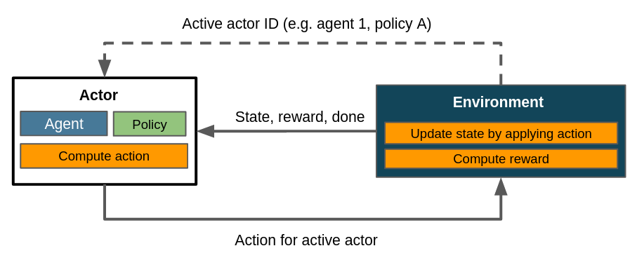

.. _struct_env_flat:

Flat Environments
=================

All instantiable environments in Maze are subclasses of :class:`StructuredEnv <maze.core.env.structured_env.StructuredEnv>`. Structured environments are discussed in :ref:`Control Flows with Structured Environments<control_flows_struct_envs>`, which we recommend to read prior to this article. *Flat* environments in our terminology are those utilizing a single actor and a single policy, i. e. a single actor. Within Maze, flat environments are a special case of structured environments.

Let's revisit a classic depiction of a RL control flow first:

    Simplified control flow within a flat scenario. The agent selects an action, the environment updates its state and computes the reward. There is no need to distinguish between different policies or agents since we only have one of each. :meth:`~maze.core.env.structured_env.StructuredEnv.actor_id` should always return the same value.

A more general framework however needs to be able to integrate multiple agents and policies into its control flow. Maze does this by implementing actors, which are abstractions introduced in the RL literature to represent the application of one policy on one agent.
The figure above collapses the concepts of policy, agent and actor into a single entity for the sake of simplicity. The actual control flow in Maze for a flat environment is closer to this:

    More accurate control flow for a flat environment in Maze, showing how the actor mechanism integrates agent and policy. Note that the line denoting the communication of the active actor ID is dashed because it is not returned by :meth:`~maze.core.env.maze_env.MazeEnv.step`, but instead queried via :meth:`~maze.core.env.structured_env.StructuredEnv.actor_id`.

A flat environment interacts with a single actor consisting of a single agent and a single policy. The concept of actors is crucial to the flexibility of Maze, since it allows to arbitrarily scale up the number of agents, policies or both - which enables the application of RL to a wider range of use cases and exploit properties of the respective domains more efficiently.

Where to Go Next
----------------

- :ref:`Multi-stepping applies the actor mechanism to enact several policies in a single step<struct_env_multistep>`.
- :ref:`Multi-agent RL by using multiple actors with different agents<struct_env_multiagent>`.
- :ref:`Hierarchical RL by chaining and nesting tasks via policies.<struct_env_hierarchical>`.
- :ref:`Arbitrary environments with evolutionary strategies<struct_env_evolutionary>` [todo].