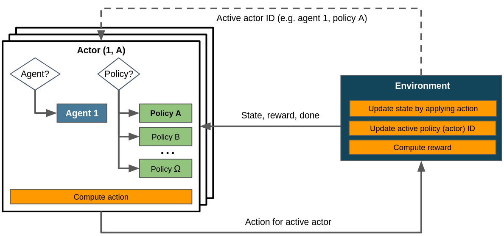

.. _struct_env_hierarchical:

Hierarchical RL with Structured Environments
============================================

.. note::
    Recommended reads prior to this article:
        - :ref:`Control Flows with Structured Environments<control_flows_struct_envs>`.
        - :ref:`Flat Environments as a special case of structured environments<control_flows_struct_envs>`.
        - `Well written and accessible summary of hierarchical RL covering many important concepts. <https://thegradient.pub/the-promise-of-hierarchical-reinforcement-learning/>`_

Reinforcement learning is prone to scaling and generalization issues. With large action spaces, it takes a lot of time and resources for agents to learn the desired behaviour successfully. `Hierarchical reinforcement learning (HRL) <https://link.springer.com/referenceworkentry/10.1007%2F978-0-387-30164-8_363>`_ attempts to resolve this by decomposing RL tasks into a hierarchy of subtasks. This addresses the curse of dimensionality by mitigating or avoiding the exponential growth of the action space.

Beyond reducing the size of the action space HRL also provides an opportunity for easier generalization. Through its modularization of tasks, learned policies for super-tasks may be reused even if the underlying sub-tasks change. This enables transfer learning between different problems in the same domain.

Note that the action space can also be reduced with :ref:`action masking<adding_masking>`, which indicates the invalidity of certain actions in the observations provided to the agent. HRL and action masking can be used in combination. Other than action masking HRL also addresses the issue of generalization and transferability though. Whenever possible and sensible we recommend to use both.

Motivating Example
------------------

Consider a `pick and place robot <https://6river.com/what-is-a-pick-and-place-robot/>`_, which is supposed to move to an object, pick it up, move it to a different location and place it there. They consist of different segments connected via joints that enable free movement in three dimensions and a gripper able to grasp and hold the target object. The gripper may resemble a pair of tongs or be more complex, e.g. be built to resemble a human hand.

A naive approach would present all possible actions, i.e. rotating the arms and moving the gripper, in a single action space and let the agent learn the correct sequences. The task at hand however can be intuitively represented as a hierarchy: The top-level tasks includes the task sequence of "move", "grasp", "move", "place". This corresponds to three policies (since "move" is used twice) which learn how to enact primitive actions, i.e. arm or gripper movements.

With HRL we can define the action space for each policy. In this example we could omit gripper actions in the action space provided during "move" and arm actions in the one provided during "grasp" or "place". This reduces the dimensionality action space and enables the reusability of individual policies for other tasks in the same domain.

todo: estimation of action space reduction with discretized example.

Control Flow
------------

    Control flow within a HRL scenario. Note that we assume a single agent here. Building the task hierarchy happens implicitly in :meth:`~maze.core.env.maze_env.MazeEnv.step`. Dashed lines denote the exchange of information on demand as opposed to doing so passing it to or returning it from the environment's :meth:`~maze.core.env.maze_env.MazeEnv.step`.

todo: describe control flow and describe how task hierarchy is built implicity in .step().

Where to Go Next
----------------

- :ref:`Gym-style flat environments as a special case of structured environments<struct_env_multiagent>`.
- :ref:`Multi-stepping applies the actor mechanism to enact several policies in a single step<struct_env_multistep>`.
- :ref:`Multi-agent RL by using multiple actors with different agents<struct_env_multiagent>`.