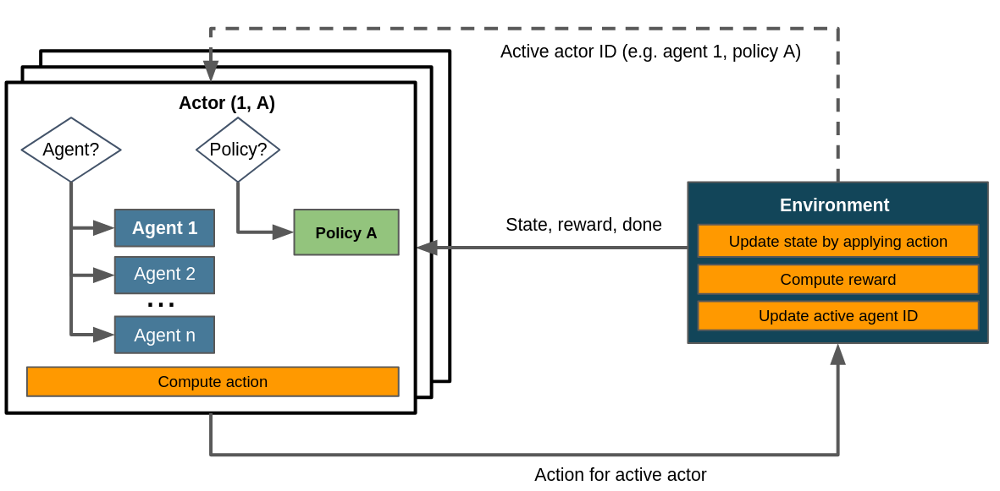

.. _struct_env_multiagent:

Multi-Agent RL with Structured Environments
===========================================

.. note::
    Recommended prior to this article:
        - :ref:`Control Flows with Structured Environments<control_flows_struct_envs>`.
        - :ref:`Flat Environments as a special case of structured environments<control_flows_struct_envs>`.

`Multi-agent reinforcment learning (MARL) <https://arxiv.org/abs/1911.10635>`_ describes a setup in which several collaborating or competing agents act as individual entitites in an environment. This introduces the additional complexity of emergent effects between those agents. Some problems require to or at least benefit from deviating from a single-agent formulation, such as the `vehicle routing problem <https://en.wikipedia.org/wiki/Vehicle_routing_problem>`_, `(video) games like Starcraft <https://www.nature.com/articles/s41586-019-1724-z>`_, `traffic coordination <http://www.wiomax.com/team/xie/paper/ICAPS12.pdf>`_, `power systems and smart grids <https://ieeexplore.ieee.org/abstract/document/7855760>`_ and many others.

Maze supports multi-agent learning out of the box. In order to make a :class:`StructuredEnv <maze.core.env.structured_env.StructuredEnv>` compatible with such a setup, it needs to keep track of the activities of each agent internally. How this is done and the order in which sequence agents enacted their actions is entirely to the environment. As per customary for a structured environment, it is required to provide the ID of the active actor via :meth:`~maze.core.env.structured_env.StructuredEnv.actor_id` (see :ref:`here<control_flows_struct_envs>` for more information on the distinction between actor and agent). There are no further prequisites to use multiple agents with an environment.

It is easily possible, but not necessary, to include multiple policies in a multi-agent scenario. The control flow with multiple agents and a single policy can be summarized like this:

    Control flow within a multi-agent scenario. Note that we assume a single policy here. Dashed lines denote the exchange of information on demand as opposed to doing so passing it to or returning it from the environment's :meth:`~maze.core.env.maze_env.MazeEnv.step`.

| When comparing this to the control flow depicted in :ref:`the article on flat environments<control_flows_struct_envs>` you'll notice that here we consider several agents and therefore several actors - more specifically, in a setup with *n* agents we have at least *n* actors. Consequently the environment has to update its active actor ID, which is not necessary in flat environments.
| The underlying pathways however are identical for all instances of :class:`StructuredEnv <maze.core.env.structured_env.StructuredEnv>`. Within Maze' actor mechanism, multi-agent environments are merely a particular specification amongst many.

Where to Go Next
----------------

- :ref:`Gym-style flat environments as a special case of structured environments<struct_env_multiagent>`.
- :ref:`Multi-stepping applies the actor mechanism to enact several policies in a single step<struct_env_multistep>`.
- :ref:`Hierarchical RL by chaining and nesting tasks via policies.<struct_env_hierarchical>`.