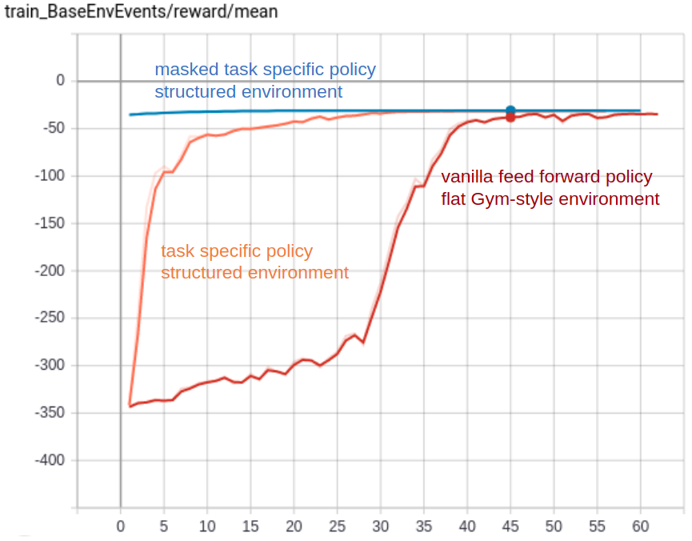

.. role:: raw-html(raw)
    :format: html

.. _struct_env_tutorial:

Structured Environments and Action Masking
==========================================

This tutorial provides a step by step guide explaining how to implement a decision problem
as a structured environment and how to train an agent for such a :class:`~maze.core.env.structured_env.StructuredEnv`
with a structured :ref:`Maze Trainer<maze_trainers>`.
The examples are again based on the online version of the *Guillotine 2D Cutting Stock Problem*
which is a perfect fit for introducing the underlying concepts.

In particular, we will see how to evolve the performance of an RL agent by going through the following stages:

 1. Flat Gym-style environment with vanilla feed forward models
 2. Structured environment (e.g., with hierarchical sub-steps) with task specific policy networks
 3. Structured environment (e.g., with hierarchical sub-steps) with masked task specific policy networks

Before diving into this tutorial we recommend to familiarize yourself with
:ref:`Control Flows with Structured Environments <control_flows_struct_envs>` and the basic
:ref:`Maze - step by step tutorial <env_from_scratch>`.

The remainder of this tutorial is structured as follows:

.. toctree::
   :maxdepth: 1
   :hidden:

   struct_env/flat_to_structured.rst
   struct_env/train_no_mask.rst
   struct_env/adding_masking.rst
   struct_env/train_with_mask.rst

:ref:`Turning a “flat” MazeEnv into a StructuredEnv <flat_to_structured>` :raw-html:` `
We will reformulate the problem from a "flat" Gym-style environment into a structured environment.

:ref:`Training the Structured Environment <train_no_mask>` :raw-html:` `
We will train the structured environment with a Maze Trainer.

:ref:`Adding Step-Conditional Action Masking <adding_masking>` :raw-html:` `
We will learn how to substantially increase the sample efficiency by adding step-conditional action masking.

:ref:`Training with Action Masking <train_with_mask>` :raw-html:` `
We will retrain the structured environment with step-conditional action masking activated
and benchmark it with the initial version environment.