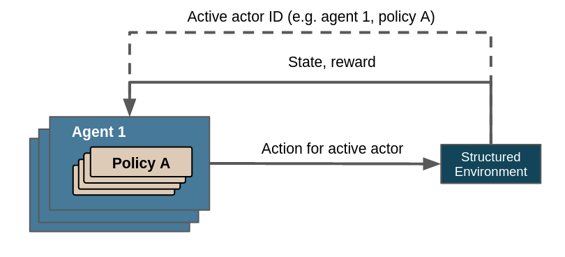

.. _control_flows_struct_envs:

Control Flows with Structured Environments
==========================================

The basic reinforcement learning formulation assumes a single actor in an environment, enacting one policy-suggested action per step to fulfill exactly one task. We refer to this as a *flat* environment. A classic example for this is the cartpole balancing problem, in which a single actor attempts to balance a cartpole as stably as possible. However, some problems incentivize or even require these assumptions to be violated:

 #. *Single actor*: Plenty of real-world scenarios motivate taking several actors into account. E.g.: `optimizing delivery with a fleet of vehicles <https://en.wikipedia.org/wiki/Vehicle_routing_problem>`_ involves emergent effects and interdependences between individual vehicles, such as that the availability and suitability of orders for any given vehicle depends on the proximity and activity of other vehicles. Treating them in isolation from each other is inefficient and detrimental to the learning process.
 #. *One action per step*: Some usecases, such as `cutting raw material according to customer specifications with as little waste as possible <https://en.wikipedia.org/wiki/Cutting_stock_problem>`_, necessarily involve a well-defined sequence of actions. Stock-cutting involves (a) the selection of a piece of suitable size and (b) cutting it in an appropriate manner. We know that (a) is always followed by (b) and that the latter is a necessary precondition for the former. We can incorporate this information in our RL control loop to facilitate a faster learning process by enforcing that the environment should always execute two actions in a single step: First select, then cut.
 #. *Exactly one task*: Occasionally, the problem we want to solve cannot be neatly formulated as a single task, but consists of a hierarchy of tasks. This is exemplified by `pick and place robots <https://6river.com/what-is-a-pick-and-place-robot/>`_. They solve a complex task, which is reflected by the associated hierarchy of goals: The overall goal requires (a) reaching the target object, (b) grasping the target object, (c) moving target object to target location and (d) placing the target object safey in the target location. Solving this task cannot be reduced to a single goal.

.. _control_flows_struct_envs_approach:

Beyond Flat Environments with Actors
------------------------------------

Maze addresses these problems by baking the concept of *actors* into its control flow.

An actor is defined as the combination of a specific policy and a specific agent. They are uniquely identified by the agent ID and the policy key. From a more abstract perspective an actor describes *which task should be done* (via the policy) for *which entity* (the agent). In the case of the vehicle routing problem an agent might correspond to a vehicle and a policy might correspond to a task like "pick an order" or "drive to point X". A :class:`StructuredEnv <maze.core.env.structured_env.StructuredEnv>` has exactly one active actor at any time. There can be an arbitrary number of actors. They can be created and destroyed dynamically by the environment, by respectively specifying their ID or marking them as *done*. Their lifecycles are thus flexible, they don't have to be available through the entirety of the environment's lifecycle.

**Decoupling actions from steps**

The actor mechanism decouples actions from steps, thereby allowing environments to query actions for its actors on demand, not just after a step has been completed. The cardinality between involved actors and steps is therefore up to the environment - one actor can be active throughout multiple steps, one step can utilize several actors, both or neither (i.e. exactly one actor per step). The discussed stock cutting problem for example might have policies with the keys "selection" or "cutting", both of which take place in a single step; the pick and place problem might use policies with the keys "reach", "grasp", "move" or "place", all of which last one to several steps.

**Support of multiple agents and policies**

A multi-agent scenario can be realized by defining the corresponding actor IDs under consideration of the desired number of agents. Several actors can use the same policy, which infers the recommended actions for the respective agents. Note that it is only reasonable to add a new policy if the underlying process is distinct enough from the activity described by available policies. In the case of the vehicle routing problem using separate policies for the activies of "fetch item" and "deliver item" are likely not warranted: even though they describe different phases of the environment lifecycle, they describe virtually the same activity. While Maze provides default policies, you are encouraged to write a customized policy that fits your use case better - see :ref:`Policies, Critics and Agents<policies_and_agents>` for more information.

**Selection of active actor**

The environment determines the active actor based on its internal state. The current actor evaluates the observation provided by the environment and selects an appropriate action, i.e. every action is associated with a specific actor. This action updates the environment's state, after which the the environment reevaluates which actor should be active. Since it is left to the environment to decide when which actor should be active, it is possible to chain, combine and nest policies and therefore tasks in arbitrary manner.

Every :class:`StructuredEnv <maze.core.env.structured_env.StructuredEnv>` is required to implement :meth:`~maze.core.env.structured_env.StructuredEnv.actor_id`, which returns the ID of the currently active actor. An environment with a single actor may return a single-actor signature such as `(0, 0)`.

**Policy-specific space conversion**

Since different policies may benefit from or even require a different preprocessing of their actions and/or observations (especially, but not exclusively, for action masking), Maze requires the specification of a corresponding :class:`ActionConversionInterface <maze.core.env.action_conversion.ActionConversionInterface>` and :class:`ObservationConversionInterface <maze.core.env.observation_conversion.ObservationConversionInterface>` class for each policy. This permits to tailor actions and/or observations to the mode of operation of the relevant policy.

**Summary**

The actor concept and the mechanisms supporting it are thus capable of

- representing an arbitrary number of agents with flexible lifecycles that may differ from their environment's;
- identifying which policy should be applied for which agent via the provision of :meth:`~maze.core.env.structured_env.StructuredEnv.actor_id`;
- supporting an arbitrary nesting of policies (and in further abstraction tasks);
- selecting actions via the policy fitting the currently active actor;
- preprocessing actions and observations w.r.t. the currently used actor/policy;
- querying actions from policies on demand, not just after a step has been completed.

These capabilities allow to bypass the tree restrictions laid out at the outset.

.. _control_flows_struct_envs_context:

Maze Mechanisms in a Broader Context
------------------------------------

The assumptions stated above are related to concepts well established in RL literature: *1.* to `multi-agent learning <https://arxiv.org/abs/1911.10635>`_, *2.* to `auto-regressive action distributions (ARAD) <https://docs.ray.io/en/master/rllib-models.html#autoregressive-action-distributions>`_ and *3.* to `hierarchical RL <https://arxiv.org/abs/1909.10618>`_. Multi-agent learning and hierarchical RL are supported by Maze.

The problem motivating *2.* is a lack of temporal coherency in the sequence of selected actions: if there is some necessary, recurring order of actions, we would like to identify it as quickly as possible. ARADs as used in in DeepMind's `Grandmaster level in StarCraft II using multi-agent reinforcement learning <https://www.nature.com/articles/s41586-019-1724-z>`_ are one way to tackle this. They still execute one action per step, but condition it on the previous state and *action* instead of the state alone. This allows it to be more sensitive towards such recurring patterns of actions. We do not explictily implement ARADs, but offer *multi-stepping* as an alternative. Multi-stepping is a pattern that utilizes the actor mechanism as previously discussed to enact multiple actions in a single step in their correct order, without having to rely on learned autoregressive policies learning.

Both approaches aim at increasing the temporal coherence of actions. Multi-stepping allows to incorporate domain knowledge about the correct order of actions or tasks, but depends on the environment to incorporate this. ARAD policies do not presuppose (and cannot make use of) any such prior knowledge. They could be approximated within MAZE with the available set of functionality however by extending observations by prior actions and forwarding those to the active actor. If relevant domain knowledge is available, we recommend to implement the multi-stepping though.

.. _control_flows_struct_envs_next:

Where to Go Next
----------------

Different specifications of structured environments allow various capabilities not possible with flat environments. We discuss them in a series of articles listed below. Links to examples are included either in those articles or here directly.

- Flat environments, while instances of :class:`StructuredEnv <maze.core.env.structured_env.StructuredEnv>`, do not utilize its actor mechanism and thus don't warrant an in-depth discussion. Example: :ref:`Stock cutting without multi-stepping.<env_from_scratch-problem>`.
- :ref:`Multi-stepping with structured environments<struct_env_multistep>`. Example: :ref:`Stock cutting with multi-stepping<flat_to_structured>`.
- :ref:`Multi-agent RL with structure environments<struct_env_multiagent>`. Example: Vehicle routing problem, i.e. the coordination of a fleet of delivery vehicles with different targets [todo].
- :ref:`Hierarchical RL with structured environments<struct_env_hierarchical>`. Example: Pick and place robots, i.e. a robotic arm picking and placing objects, in the process iterating over a sequence of sub-goals [todo - also: different example prob. better].
- :ref:`Arbitrary environments with evolutionary strategies<struct_env_evolutionary>` [todo].
