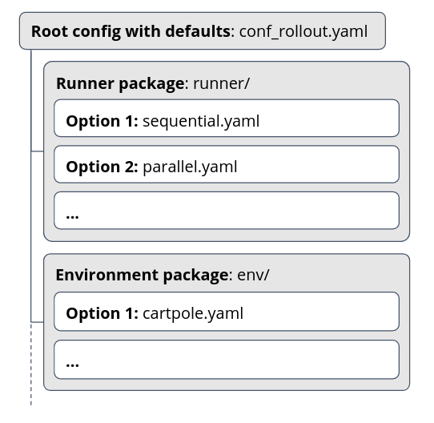

.. |hydra_basic_example| raw:: html

   <a href="https://hydra.cc/docs/next/intro#basic-example/" target="_blank">basic example</a>

.. |hydra_composition_example| raw:: html

   <a href="https://hydra.cc/docs/next/intro#composition-example/" target="_blank">composition example</a>

.. |hydra_basic_overrides| raw:: html

   <a href="https://hydra.cc/docs/next/advanced/override_grammar/basic/" target="_blank">basic overrides</a>

.. |hydra_extended_override_syntax| raw:: html

   <a href="https://hydra.cc/docs/next/advanced/override_grammar/extended/" target="_blank">extended override syntax</a>

.. |hydra_output_working_directory| raw:: html

   <a href="https://hydra.cc/docs/next/tutorials/basic/running_your_app/working_directory/" target="_blank">Output/Working directory</a>

.. |hydra_customizing_working_directory_pattern| raw:: html

   <a href="https://hydra.cc/docs/next/configure_hydra/workdir/" target="_blank">customizing working directory pattern</a>

.. _hydra-overview:

Hydra: Overview
===============

The motivation behind using Hydra is primarily to:

- Keep separate components (e.g., environment, policy) in individual YAML files which
  are easier to understand
- Run multiple experiments with different components (like using two different environment configurations,
  or training with PPO vs. A2C) without duplicating the whole config file
- Make components/values different from the defaults immediately visible (with, e.g., ``maze-run runner=sequential``)

Below, the core concepts of Hydra as Maze uses it are described:

- :ref:`Introduction<hydra-overview-intro>` explains the core concepts of assembling configuration with Hydra
- :ref:`Config Root & Defaults<hydra-overview-config_root>` explains how the root config file works and how
  default components are specified
- :ref:`Overrides<hydra-overview-overrides>` show how you can easily customize the config parameters
  without duplicating the config file, and have Hydra assemble the config and log it for you
- :ref:`Output Directory<hydra-overview-output>` shows how Hydra creates separate directories for your runs
  automatically. It is a bit separated from the previous concepts but still important for running your jobs.
- :ref:`Runner concept<hydra-overview-runners>` section explains how the Hydra config is handled
  by Maze to launch various kinds of jobs (like rollout or train runs) with different configurations

.. _hydra-overview-intro:

Introduction
------------

Hydra is a configuration framework that, in short, allows you to:

1. Break down your configuration into multiple smaller YAML files
   (representing individual components)
2. Launch your job through CLI providing overrides for individual components or values
   and have Hydra assemble the config for you

Ad (1): For illustrative purposes, this is an example of how your Hydra config structure can look like:

Ad (2): With the structure above, you could then launch your jobs with specified components
(again, this is only for illustrative purposes):

.. code-block:: bash

    maze-run runner=parallel

Or, you can even override any individual value anywhere in the config like this:

.. code-block:: bash

    maze-run runner=parallel runner.n_processes=10

You can also review the |hydra_basic_example| and |hydra_composition_example| at Hydra docs.

.. _hydra-overview-config_root:

Configuration Root, Groups and Defaults
---------------------------------------

The starting place for a Hydra config is the **root configuration file**. It lists (1) the individual
**configuration groups** that you would like to use along with their defaults, and (2) any other
configuration that is universal. A simple root config file might look like this (all of these examples
are snippets taken from ``maze`` config, shortened for brevity):

.. code-block:: yaml

  # These are the individual config components with their defaults
  defaults:
    - runner: parallel
    - env: cartpole
    - wrappers: default
      optional: true
    # ...

  # Other values that are universally applicable (still can be changed with overrides)
  log_base_dir: outputs

  # ...

The snippet ``runner: parallel`` tells Hydra to look for a file ``runner/parallel.yaml`` and
transplant its contents under the ``runner:`` key. (If ``optional: true`` is specified,
Hydra does not raise an error when such a config file cannot be found.)

Hence, if the ``runner/parallel.yaml`` file looks like this:

.. code-block:: yaml

  n_processes: 5
  n_episodes: 50
  # ...

the final assembled config would look like this:

.. code-block:: yaml

  runner:
  n_processes: 5
    n_episodes: 50
    # ...
  env:
    # ...

.. _hydra-overview-overrides:

Overrides
---------

When running your job through a command line, you can customize individual
bits of your configuration via command-line arguments.

As briefly demonstrated above, you can override individual defaults in the config file.
For example, when running a Maze rollout, the default runner is ``parallel``, but
you could specify the sequential runner instead:

.. literalinclude:: code_snippets/overview_sequential_rollout.sh
  :language: shell

Besides overriding specifying the config components, you can also override individual
values in the config:

.. literalinclude:: code_snippets/overview_custom_parameters.sh
  :language: shell

There is also more advanced syntax for adding/removing config keys and other patterns --
for this, you can consult Hydra docs regarding |hydra_basic_overrides| and |hydra_extended_override_syntax|.

.. _hydra-overview-output:

Output Directory
----------------

Hydra also by default handles the output directory for each job you run.

By default, ``outputs`` is used as the base output directory and a new subdirectory
is create inside for each run. Here, Hydra also logs the configuration for the current
job in the ``.hydra`` subdirectory, so that you can always get back to it.

You can override the hydra output directory as follows:

.. literalinclude:: code_snippets/overview_custom_output_dir.sh
  :language: shell

More on the output directory setting can be found in Hydra docs: |hydra_output_working_directory|
and |hydra_customizing_working_directory_pattern|.

.. _hydra-overview-runners:

Maze Runner Concept
-------------------

In Maze, the ``maze-run`` command (that you have seen above already) is the single central
utility for launching all sorts of jobs, like training or rollouts.

Under the hood, when you launch such a job, the following happens:

1. Maze checks the ``runner`` part of the Hydra configuration that was passed through
   the command. And instantiates a runner object from it (subclass of :class:`Runner <maze.runner.Runner>`).

   (The ``runner`` component of the configuration always specifies the Runner class to be
   instantiated, along with any other arguments it needs at initialization.)

2. Maze then calls the ``run`` method on the instantiated runner and passes it the whole
   config, as obtained from Hydra.

This enables the ``maze-run`` command to keep a lot of variability without much coupling
of the individual functionalities. For example, rollouts are run through subclasses
of :class:`RolloutRunner <maze.core.rollout.rollout_runner.RolloutRunner>`
and trainings through subclasses of
:class:`TrainingRunner <maze.train.trainers.common.training_runner.TrainingRunner>`.

You are also free to create your own subclasses for rollouts, trainings or any completely
different use cases.

Where to Go Next
----------------

After understanding the basics of how Maze uses Hydra, you might want to:

- Try :ref:`running a rollout<rollouts>` using Hydra configuration through command line to put these
  ideas into action
- :ref:`Create custom Hydra configuration files<hydra-custom>` for your project
- Understand the :ref:`advanced concepts of Hydra<hydra-advanced>`
