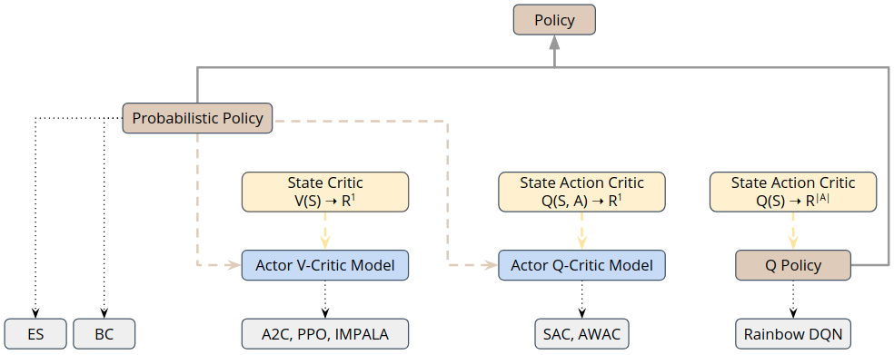

.. _policies_and_agents:

Policies, Critics and Agents
============================

Depending on the domain and task we are working on
we rely on :ref:`different trainers <maze_trainers>` (algorithm classes) to appropriately address the problem at hand.
This in turn implies different requirements for the respective :ref:`models <perception_module>`
and contained policy and value estimators.

The figure below provides a conceptual overview of the model classes contained in Maze
and relates them to compatible algorithm classes and trainers.

Note that all policy and critics are compatible with
:ref:`Structured Environments <env_hierarchy-structured_envs>`.

Policies (Actors)
-----------------

An agent holds one or more policies and acts (selects actions) according to these policies.
Each policy consists of one ore more policy networks.
This might be for example required in
(1) multi-agent RL settings where each agents acts according to its distinct policy network or
(2) when working with auto-regressive action spaces or :ref:`multi-step environments <struct_env_tutorial>`.

In case of *Policy Gradient Methods*,
such as the actor-critic learners A2C or PPO,
we rely on a **probabilistic policy** defining a conditional action selection
probability distribution :math:`\pi(a|s)` given the current State  :math:`s`.

In case of value-based methods, such as DQN,
the **Q-policy** is defined via the state-action value function :math:`Q(s, a)`
(e.g, by selecting the action with highest Q value: :math:`\mathrm{argmax}_a Q(s, a)`).

.. _critics_section:

Value Functions (Critics)
-------------------------
Maze so far supports two different kinds of critics.
A standard **state critic** represented via a scalar value function :math:`V(S)`
and a **state-action critic** represented either via a scalar state-action value function
:math:`Q(S, A)` or its vectorized equivalent :math:`Q(S)` predicting the state-action values for all actions at once.

Analogously to policies each critic holds one or more value networks depending on the current usage scenario we are in
(auto-regressive, multi-step, multi-agent, ...).
The table below provides an overview of the different critics styles.

.. list-table::
    :widths: 1 2
    :align: center

    * - **State Critic** :math:`V(S)`
      -
    * - :class:`TorchStepStateCritic <maze.core.agent.torch_state_critic.TorchStepStateCritic>`
      - Each sub-step or actor gets its individual state critic.
    * - :class:`TorchSharedStateCritic <maze.core.agent.torch_state_critic.TorchSharedStateCritic>`
      - One state critic is shared across all sub-steps or actors.
    * -
      -
    * - **State-Action Critic** :math:`Q(S, A)`
      -
    * - :class:`TorchStepStateActionCritic <maze.core.agent.torch_state_action_critic.TorchStepStateActionCritic>`
      - Each sub-step or actor gets its individual state-action critic.
    * - :class:`TorchSharedStateActionCritic <maze.core.agent.torch_state_action_critic.TorchSharedStateActionCritic>`
      - One state-action critic is shared across all sub-steps or actors.

.. _actor_critics_section:

Actor-Critics
-------------

To conveniently work with algorithms such as A2C, PPO, IMPALA or SAC we provide a
:class:`TorchActorCritic <maze.core.agent.torch_actor_critic.TorchActorCritic>` model
to unifying the different policy and critic types into one model.

Where to Go Next
----------------

- For further details please see the :ref:`reference documentation <policies_and_agents_ref>`.
- To see how to actually implement policy and critic networks see the :ref:`Perception Module <perception_module>`.
- You can see the list of available :ref:`probability distributions <action_spaces_and_distributions_module>` for
  probabilistic policies.
- You can also follow up on the available :ref:`Maze trainers <maze_trainers>`.
