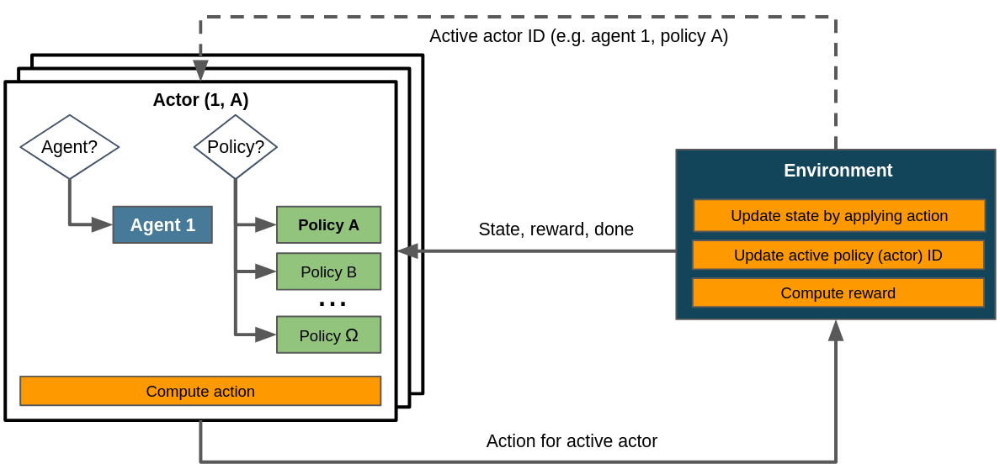

.. |summary_of_hierarchical_rl| raw:: html

   <a href="https://thegradient.pub/the-promise-of-hierarchical-reinforcement-learning" target="_blank">Well written and accessible summary of hierarchical RL covering many important concepts</a>

.. |hierarchical_reinforcement_learning_springer| raw:: html

   <a href="https://link.springer.com/referenceworkentry/10.1007%2F978-0-387-30164-8_363" target="_blank">Hierarchical reinforcement learning (HRL)</a>

.. |starcraft_2_a_new_challenge_for_reinforcement_learning| raw:: html

   <a href="https://arxiv.org/abs/1708.04782" target="_blank">StarCraft II: A New Challenge for Reinforcement Learning</a>

.. |pick_and_place_robot| raw:: html

   <a href="https://6river.com/what-is-a-pick-and-place-robot" target="_blank">pick and place robot</a>

.. _struct_env_hierarchical:

Hierarchical RL
===============

.. note::
    Recommended reads prior to this article:
        - :ref:`Control Flows with Structured Environments<control_flows_struct_envs>`.
        - :ref:`Flat Environments as a special case of structured environments<control_flows_struct_envs>`.
        - |summary_of_hierarchical_rl|.

Reinforcement learning is prone to scaling and generalization issues. With large action spaces, it takes a lot of time and resources for agents to learn the desired behaviour successfully. |hierarchical_reinforcement_learning_springer| attempts to resolve this by decomposing tasks into a hierarchy of subtasks. This addresses the curse of dimensionality by mitigating or avoiding the exponential growth of the action space.

Beyond reducing the size of the action space HRL also provides an opportunity for easier generalization. Through its modularization of tasks, learned policies for super-tasks may be reused even if the underlying sub-tasks change. This enables transfer learning between different problems in the same domain.

Note that the action space can also be reduced with :ref:`action masking<adding_masking>` as used in e.g. |starcraft_2_a_new_challenge_for_reinforcement_learning|, which indicates the invalidity of certain actions in the observations provided to the agent. HRL and action masking can be used in combination. The latter doesn't address the issue of generalization and transferability though. Whenever possible and sensible we recommend to use both.

Motivating Example
------------------

Consider a |pick_and_place_robot|. It is supposed to move to an object, pick it up, move it to a different location and place it there. It consists of different segments connected via joints that enable free movement in three dimensions and a gripper able to grasp and hold the target object. The gripper may resemble a pair of tongs or be more complex, e.g. be built to resemble a human hand.

A naive approach would present all possible actions, i.e. rotating the arm segments and moving the gripper, in a single action space. If the robot's arm segments can move in :math:`n` and its gripper in :math:`m` different ways, a flat action space would consist of :math:`n * m` different actions.

The task at hand can be intuitively represented as a hierarchy however: The top-level task is composed of the task sequence of "move", "grasp", "move", "place". This corresponds to a top-level policy choosing one of three sub-policies enacting primitive actions, i.e. arm or gripper movements. This enables the reusability of individual (sub-)policies for other tasks in the same domain.

| To reduce the dimensionality of the action space an HRL approach could omit gripper actions in the "move" action space and arm actions in the "grasp" and "place" action spaces. The total number of actions then amounts to the sum of the numbers of possible actions for all individual policies: :math:`3 + m + n + m`.
| Depending on the active policy the agent only has to consider up to :math:`max(3, n, m)` actions at once, which is signficantly less than the :math:`n * m` actions in the flat case for any realistic values for :math:`n` and :math:`m`. The complexity of problems with large action spaces can be reduced considerably by a hierarchical decomposition like this.

Control Flow
------------

    Control flow within a HRL scenario assuming a single agent. The task hierarchy is built implicitly in :meth:`~maze.core.env.maze_env.MazeEnv.step`. Dashed lines denote the exchange of information on demand as opposed to doing so passing it to or returning it from :meth:`~maze.core.env.maze_env.MazeEnv.step`.

The control flow for HRL scenarios doesn't obviously reflect the hierarchical aspect. This is because the definition and execution of the task hierarchy happens implicitly in :meth:`~maze.core.env.maze_env.MazeEnv.step`: the environment determines which task is currently active and which task should be active at the end of the current step. This allows for an arbitrarily flexible and complex task dependency graph. The possibility to implement a different :class:`ObservationConversionInterface <maze.core.env.observation_conversion.ObservationConversionInterface>` and :class:`ActionConversionInterface <maze.core.env.action_conversion.ActionConversionInterface>` for each policy enables to tailor actions and observations to the respective task.
This control flow bears strong similarity to the one for `multi-stepping<struct_env_multistep>` - in fact, multi-stepping could be seen as a special kind of hierarchical RL with a fixed task sequence and a single level of hierarchy.

Where to Go Next
----------------

- :ref:`Gym-style flat environments as a special case of structured environments<struct_env_multiagent>`.
- :ref:`Multi-stepping applies the actor mechanism to enact several policies in a single step<struct_env_multistep>`.
- :ref:`Multi-agent RL by using multiple actors with different agents<struct_env_multiagent>`.