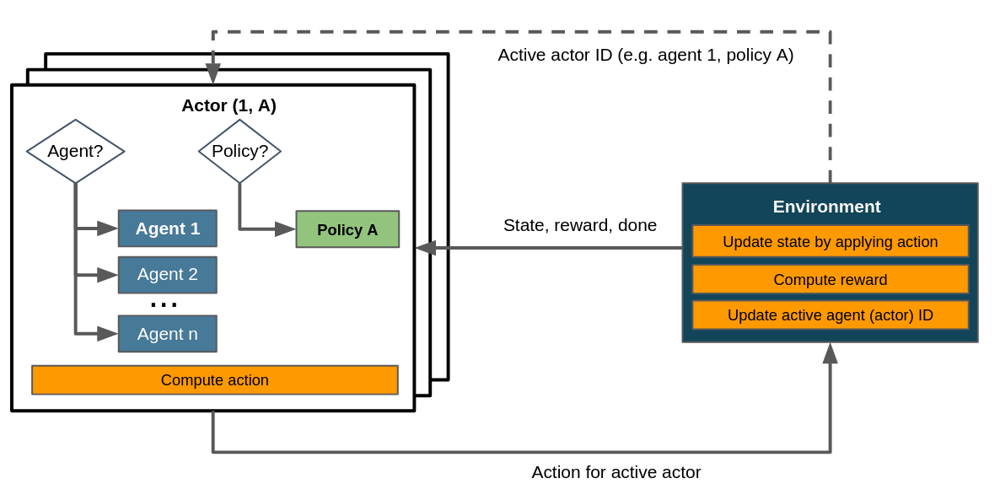

.. _struct_env_multistep:

Multi-Stepping
==============

.. note::
    Recommended reads prior to this article:
        - :ref:`Control Flows with Structured Environments<control_flows_struct_envs>`.
        - :ref:`Flat Environments as a special case of structured environments<control_flows_struct_envs>`.

We define multi-stepping as the execution of more than one action (or sub-step) in a single step. This is motivated by problem settings in which a certain sequence of actions is known a priori. In such cases incorporating this knowledge can significantly increase learning efficiency. The `stock cutting problem <https://en.wikipedia.org/wiki/Cutting_stock_problem>`_ poses an example: It is known, independently from the specifics of the environment's state, that fulfilling a single customer order for a piece involves (a) picking a piece at least as big as the ordered item (b) cutting it to the correct size.

While it is not trivial to decide which items to pick for which orders and how to cut them, the sequence of piece selection before cutting is constant - there is no advantage to letting our agent figure it out by itself. Maze permits to incorporate this sort of domain knowledge by enabling to select and execute more than one action in a single step. This is done by

- utilizing the actor mechanism to instantiate more than one policy and
- enabling to query policies on demand instead of receiving the policy output (i.e. the suggested action) as argument in :meth:`~maze.core.env.maze_env.MazeEnv.step`.

In the case of the stock cutting problem two policies could be considered: "select" and "cut". The piece selection action might be provided to the environment at the beginning of each step, after which the cutting policy - conditioned on the current state with the already selected piece - can be queried to produce an appropriate cutting action.

An implementation of a multi-stepping environment for the `stock cutting problem <https://en.wikipedia.org/wiki/Cutting_stock_problem>`_ can be found :ref:`here<flat_to_structured>`.

Control Flow
------------

In general, the control flow for multi-stepping environments involve at least two policies and one agent. It is easily possible, but not necessary, to include multiple agents in a multi-step scenario. The following image depicts a multi-step setup with one agent and an arbitrary number of sub-steps/policies.

    Control flow within a multi-stepping scenario. Note that we assume a single agent here. The loop inside the environment component indicates that this sequence of activities can be repeated an arbitrary number of times. Dashed lines denote the exchange of information on demand as opposed to doing so passing it to or returning it from the environment's :meth:`~maze.core.env.maze_env.MazeEnv.step`.

When comparing this to the control flow depicted in :ref:`the article on flat environments<control_flows_struct_envs>` you'll notice that here we consider several policies and therefore several actors - more specifically, in a setup with *n* sub-steps (or actions per step) we have at least *n* actors. Consequently the environment has to update its active actor ID, which is not necessary in flat environments.

Relation to Hierarchical RL
---------------------------

:ref:`Hierarchical RL (HRL) <struct_env_hierarchical>` describes a hierarchical formulation of reinforcement learning problems: tasks are broken down into (sequences of) subtasks, which are learned in a modular manner. Multi-stepping shares this property with HRL, since it also decomposes a task into a series of subtasks. It does not fit smoothly into the the latter's paradigm however due to the execution of multiple actions per step and the action sequence being fixed instead of learned.

Relation to Auto-Regressive Action Distributions
------------------------------------------------

Multi-stepping is closely related to `auto-regressive action distributions (ARAD) <https://docs.ray.io/en/master/rllib-models.html#autoregressive-action-distributions>`_ as used in in DeepMind's `Grandmaster level in StarCraft II using multi-agent reinforcement learning <https://www.nature.com/articles/s41586-019-1724-z>`_. Both ARADs and multi-stepping are motivated by a lack of temporal coherency in the sequence of selected actions: if there is some necessary, recurring order of actions, it should be identified it as quickly as possible.

ARADs still execute one action per step, but condition it on the previous state and *action* instead of the state alone. This allows them to be more sensitive towards such recurring patterns of actions. Multi-stepping allows to incorporate domain knowledge about the correct order of actions or tasks without having to rely on learned autoregressive policies learning, but depends on the environment to incorporate it. ARAD policies do not presuppose (and cannot make use of) any such prior knowledge.

ARADs are not explicitly implemented in Maze, but can be approximated. This can be done by including prior actions in observations supplied to the agent, which should condition the used policy on those actions. If relevant domain knowledge is available, we recommend to implement the multi-stepping though.

Where to Go Next
----------------

- :ref:`Gym-style flat environments as a special case of structured environments<struct_env_multiagent>`.
- :ref:`Multi-agent RL by using multiple actors with different agents<struct_env_multiagent>`.
- :ref:`Hierarchical RL by chaining and nesting tasks via policies.<struct_env_hierarchical>`.