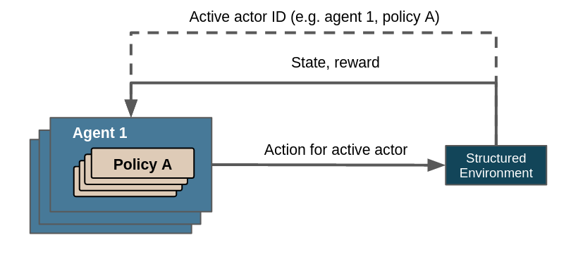

.. _control_flows_struct_envs:

Structured Environments
=======================

The basic reinforcement learning formulation assumes a single entity in an environment, enacting one policy-suggested action per step to fulfill exactly one task. We refer to this as a *flat* environment. A classic example for this is the cartpole balancing problem, in which a single entity attempts to fulfill the single task of balancing a cartpole. However, some problems incentivize or even require to generalize these assumptions:

 #. *Single entity*: Plenty of real-world scenarios motivate taking more than one acting entities into account. E.g.: `optimizing delivery with a fleet of vehicles <https://en.wikipedia.org/wiki/Vehicle_routing_problem>`_ involves emergent effects and interdependences between individual vehicles, such as that the availability and suitability of orders for any given vehicle depends on the proximity and activity of other vehicles. Treating them in isolation from each other is inefficient and detrimental to the learning process. While it is possible to have a single agent represent and coordinate all vehicles simultaneously, it can be more efficient to train multiple agents to facilitate collaborative behaviour for one vehicle each.
 #. *One action per step*: Some usecases, such as `cutting raw material according to customer specifications with as little waste as possible <https://en.wikipedia.org/wiki/Cutting_stock_problem>`_, necessarily involve a well-defined sequence of actions. Stock-cutting involves (a) the selection of a piece of suitable size and (b) cutting it in an appropriate manner. We know that (a) is always followed by (b) and that the latter is a necessary precondition for the former. We can incorporate this information in our RL control loop to facilitate a faster learning process by enforcing that the environment should always execute two actions in a single step: Select, then cut. The sequential nature of such actions often also lends itself to :ref:`action masking<adding_masking>` to increase learning efficiency [#]_.
 #. *Exactly one task*: Occasionally, the problem we want to solve cannot be neatly formulated as a single task, but consists of a hierarchy of tasks. This is exemplified by `pick and place robots <https://6river.com/what-is-a-pick-and-place-robot/>`_. They solve a complex task, which is reflected by the associated hierarchy of goals: The overall goal requires (a) reaching the target object, (b) grasping the target object, (c) moving the target object to target location and (d) placing the target object safey in the target location. Solving this task cannot be reduced to a single goal.

Maze addresses these problems by introducing :class:`StructuredEnv <maze.core.env.structured_env.StructuredEnv>`. We cover some of its applications and their broader context, including literature and examples, in a series of articles:

.. toctree::
   :maxdepth: 1

   flat/intro.rst
   multistep/intro.rst
   multiagent/intro.rst
   hierarchical/intro.rst

.. _control_flows_struct_envs_approach:

Beyond Flat Environments with Actors
------------------------------------

:class:`StructuredEnv <maze.core.env.structured_env.StructuredEnv>` bakes the concept of *actors* into its control flow.

An actor describes a specific policy that is applied on - or used by - a specific agent. They are uniquely identified by the agent's ID and the policy's key. From a more abstract perspective an actor describes *which task should be done* (the policy) for *whom* (the agent respectively the acting entities it represents). In the case of the vehicle routing problem an agent might correspond to a vehicle and a policy might correspond to a task like "pick an order" or "drive to point X". A :class:`StructuredEnv <maze.core.env.structured_env.StructuredEnv>` has exactly one active actor at any time. There can be an arbitrary number of actors. They can be created and destroyed dynamically by the environment, by respectively specifying their ID or marking them as *done*. Their lifecycles are thus flexible, they don't have to be available through the entirety of the environment's lifecycle.

    Overview of control flow with structured environments. Note that the line denoting the communication of the active actor ID is dashed because it is not returned by :meth:`~maze.core.env.maze_env.MazeEnv.step`, but instead queried via :meth:`~maze.core.env.structured_env.StructuredEnv.actor_id`.

**Decoupling actions from steps**

The actor mechanism decouples actions from steps, thereby allowing environments to query actions for its actors on demand, not just after a step has been completed. The cardinality between involved actors and steps is therefore up to the environment - one actor can be active throughout multiple steps, one step can utilize several actors, both or neither (i.e. exactly one actor per step).

The discussed stock cutting problem for example might have policies with the keys "selection" or "cutting", both of which take place in a single step; the pick and place problem might use policies with the keys "reach", "grasp", "move" or "place", all of which last one to several steps.

**Support of multiple agents and policies**

A multi-agent scenario can be realized by defining the corresponding actor IDs under consideration of the desired number of agents. Several actors can use the same policy, which infers the recommended actions for the respective agents. Note that it is only reasonable to add a new policy if the underlying process is distinct enough from the activity described by available policies.

In the case of the vehicle routing problem using separate policies for the activies of "fetch item" and "deliver item" are likely not warranted: even though they describe different phases of the environment lifecycle, they describe virtually the same activity. While Maze provides default policies, you are encouraged to write a customized policy that fits your use case better - see :ref:`Policies, Critics and Agents<policies_and_agents>` for more information.

**Selection of active actor**

| The environment determines the active actor based on its internal state. The current actor evaluates the observation provided by the environment and selects an appropriate action, i.e. every action is associated with a specific actor. This action updates the environment's state, after which the environment reevaluates which actor should be active.
| Since it is left to the environment to decide when which actor should be active, it is possible to chain, combine and nest policies and therefore tasks in arbitrary manner.

Every :class:`StructuredEnv <maze.core.env.structured_env.StructuredEnv>` is required to implement :meth:`~maze.core.env.structured_env.StructuredEnv.actor_id`, which returns the ID of the currently active actor. An environment with a single actor, e. g. a flat Gym environment, may return a single-actor signature such as `(0, 0)`. At any time there has to be exactly one active actor ID.

**Policy-specific space conversion**

Since different policies may benefit from or even require a different preprocessing of their actions and/or observations (especially, but not exclusively, for action masking), Maze requires the specification of a corresponding :class:`ActionConversionInterface <maze.core.env.action_conversion.ActionConversionInterface>` and :class:`ObservationConversionInterface <maze.core.env.observation_conversion.ObservationConversionInterface>` class for each policy. This permits to tailor actions and/or observations to the mode of operation of the relevant policy.

_____

The actor concept and the mechanisms supporting it are thus capable of

- representing an arbitrary number of agents;
- identifying which policy should be applied for which agent via the provision of :meth:`~maze.core.env.structured_env.StructuredEnv.actor_id`;
- representing an arbitrary number of actors with flexible lifecycles that may differ from their environment's;
- supporting an arbitrary nesting of policies (and in further abstraction tasks);
- selecting actions via the policy fitting the currently active actor;
- preprocessing actions and observations w.r.t. the currently used actor/policy;
- querying actions from policies on demand, not just after a step has been completed.

This allows to bypass the three restrictions laid out at the outset.

.. _control_flows_struct_envs_next:

Where to Go Next
----------------

Read about some of the patterns and capabilities possible with structured environments:

- :ref:`Flat environments<struct_env_flat>`.
- :ref:`Multi-stepping<struct_env_multistep>`.
- :ref:`Multi-agent RL<struct_env_multiagent>`.
- :ref:`Hierarchical RL<struct_env_hierarchical>`.

The underlying communication pathways are identical for all instances of :class:`StructuredEnv <maze.core.env.structured_env.StructuredEnv>`. Multi-stepping, multi-agent, hierarchical or other setups are all particular manifestations of structured environments and its actor mechanism. They are orthogonal to each other and can be used in any combination.

_____

.. [#] Action masking is used for many problems with large action spaces which would otherwise intractable, e.g. `StarCraft II: A New Challenge for Reinforcement Learning <https://arxiv.org/abs/1708.04782>`_.