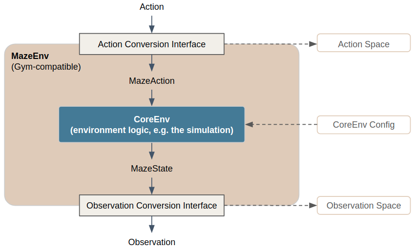

.. |gymnasium_environment| raw:: html

   <a href="https://gymnasium.farama.org/api/env" target="_blank">Gymnasium-style environment interfaces</a>

.. _custom_core_maze_envs:

Customizing Core and Maze Envs
==============================

Whenever simulations reach a certain level of complexity or
(ideally) already exist, but have been developed for other purposes than the RL scenario,
the |gymnasium_environment|
might not be sufficient anymore to meet all technical requirements
(e.g., the state is too complex to be represented as a simple Gym-style numpy array).
In case of existing simulations it probably was not even taken into account at all
and we have to deal with simulation specific interfaces and objects.

To cope with such situations Maze introduces a few additional concepts which are summarized in the figure below.
Before we continue with some practical :ref:`examples <custome_core_maze_env-a2e_s2o_config>` emphasizing why this
structure is useful for environment customization and convenient experimentation, we first describe the concepts and
components in a bit more detail. You can also find these components in the
:ref:`reference documentation <environment_interfaces_reference>`.

**Observation- and ActionConversionInterfaces:**

Maze introduces *MazeStates* and *MazeActions*, extending *Observations* and *Actions* (represented as numerical arrays)
to simulation specific generic objects.
This grants more freedom in choosing appropriate environment-specific representations
to separate the data model from the numerical representation, which in turn greatly simplifies the development and
readability of environment and engineered baseline agent implementations.

- **Action:** the Gym-style, machine readable action.
- **MazeAction:** the simulation specific representation of the action (e.g., an arbitrary Python object).
- **ActionConversionInterface:** maps agent actions to environment (simulation) specific MazeActions and defines
  the respective Gym action space.
- **Observation:** the Gym-style, machine readable observation (e.g., a numpy array).
- **MazeState:** the simulation specific representation of the observation (e.g. an arbitrary Python object).
- **ObservationConversionInterface:** maps simulation MazeStates to Gym-style observations and defines the respective
  Gym observation space.

**Core and Maze Environments:**

The same distinction is carried out for environments.

- **CoreEnv:** this is the central environment, which could be also seen as the simulation,
  forming the basis for actual, RL trainable environments.
  CoreEnvs accept *MazeAction* objects as input and yield *MazeState* objects as response.
- **CoreEnv Config:** configuration parameters for the CoreEnvironment (the simulation).
- **MazeEnv:** wraps the CoreEnvs as a Gym-style environment in a reusable form, by utilizing the interfaces (mappings)
  from the MazeState to the observations space and from the MazeAction to the action space.

List of Features
----------------

Introducing the concepts outlined above allows the following:

- Implement and maintain observations and actions as arbitrarily complex, simulation specific objects (MazeStates
  and MazeActions). In many cases sticking to Gym spaces gets quite cumbersome and makes the development processes
  unnecessarily complex.
- Easily experiment with different observation and action spaces simply by switching the
  Observation- and ActionConversionInterface.
- Train agents based on existing 3rd party simulations (environments) by implementing the Observation-
  and ActionConversionInterfaces (of course this also requires to have a Python API available).
- Easy configuration of the CoreEnv (simulation).

.. _custome_core_maze_env-a2e_s2o_config:

Example: Core- and MazeEnv Configuration
----------------------------------------

The config snippet below shows an example environment configuration for the built-in cutting-2d environment.

.. literalinclude:: code_snippets/env_a2e_s2o.yaml
  :language: yaml

The config defines:

 - which MazeEnv to use,
 - the parametrization of the CoreEnv including :ref:`reward computation <reward_aggregation>`,
 - how MazeStates are converted to observations and
 - how actions are converted to MazeActions.

All components together compose a concrete RL problem instance as a trainable environment.
In particular, whenever you would like to experiment with specific aspects of your RL problem
(e.g. tweak the observation space) you only have to exchange the respective part of your environment configuration.

.. note::
    As showing concrete implementations of a CoreEnv or the Observation- and ActionConversionInterfaces is beyond the
    scope of this page we refer to the :ref:`Maze - step by step tutorial <env_from_scratch>` for details.

Where to Go Next
----------------

 - You might want to get a bigger picture of the :ref:`Maze environment hierarchy <env-hierarchy>`.
 - Learn how to customize with :ref:`environment wrappers <env_wrappers>`.
 - Learn about :ref:`reward customization and shaping <reward_aggregation>`.
 - See the special wrappers for :ref:`observation pre-processing <observation_pre_processing>`
   and :ref:`observation normalization <observation_normalization>`.
