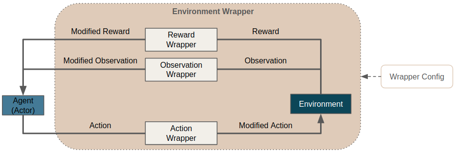

.. |gymnasium_wrapper| raw:: html

   <a href="https://gymnasium.farama.org/api/wrappers/" target="_blank">OpenAi's Gymnasium</a>

.. _env_wrappers:

Environment Wrappers
====================
Environment wrappers are an elegant way to modify and customize environments for RL training and experimentation.
As the name already suggests, they wrap an existing environment and allow to modify different parts of the
agent-environment interaction loop including observations, actions, the reward or
any other internals of the environment itself.

To gain access to the functionality of Maze environment wrappers you simply have to add
a wrapper stack in your hydra configuration.
To get started just copy one of our :ref:`hydra config snippets <env_wrappers-example-hydra>` below
or :ref:`use it directly within Python <env_wrappers-example-python>`.

.. note::
    Wrappers have been already introduced in |gymnasium_wrapper|
    and elegantly expose methods and attributes of all nested envs. However, wrapping destroys the class hierarchy,
    querying the base classes is not straight-forward.
    Maze environment wrappers fix the behaviour of isinstance() for arbitrarily nested wrappers.

List of Features
----------------
Maze environment wrappers allows the following:

- Easy customization of environments: (observations, actions, reward, internals)
- Convenient development of concepts such as :ref:`observation pre-processing <observation_pre_processing>` and
  :ref:`observation normalization <observation_normalization>`.
- Preserves the class hierarchy of nested environments.

.. _env_wrappers-example-hydra:

Example 1: Customizing Environments with Wrappers
-------------------------------------------------

To make use of Maze environment wrappers just add a config snippet as listed below.

.. literalinclude:: code_snippets/env_wrappers.yaml
  :language: yaml

Details:

 - It applies the specified wrappers in the defined order from top to bottom.
 - Adds a RandomResetWrapper randomly skipping the first 0 to 100 frames
 - Adds a TimeLimitWrapper restricting the maximum temporal horizon of the environment

Example 2: Using Custom Wrappers
--------------------------------

In case the :ref:`built-in wrappers <env_wrappers-builtin>` provided with Maze are not sufficient for your use case you can of course implement
and add additional custom wrappers.

.. literalinclude:: code_snippets/env_wrappers_custom.yaml
  :language: yaml

When adding a new environment wrappers you (1) have to implement the **Wrapper** interface and
(2) make sure that it is accessible within your Python path.
Besides that you only have to provide the reference path of the wrapper to use,
plus any parameters the wrapper initializer needs.

.. _env_wrappers-example-python:

Example 3: Plain Python Configuration
-------------------------------------

If you are not working with the Maze command line interface but still want to use wrappers directly within Python
you can start with the code snippet below.

.. literalinclude:: code_snippets/env_wrappers_python.py
  :language: python

.. _env_wrappers-builtin:

Built-in Wrappers
-----------------
Maze already comes with built-in environment wrappers.
You can find a list and further details on the functionality of the
respective wrappers in the :ref:`reference documentation <env_wrappers_ref>`.

For the following wrappers we also provide a more extensive documentation:

 - :ref:`Observation Pre-Processing <observation_pre_processing>`
 - :ref:`Observation Normalization <observation_normalization>`
 - :ref:`Observation Logging <obs_logging>`

Where to Go Next
----------------

 - For further details please see the :ref:`reference documentation <env_wrappers_ref>`.
 - Special wrapper for :ref:`observation pre-processing <observation_pre_processing>`
   and :ref:`observation normalization <observation_normalization>`.
 - You might also want to read up on the :ref:`Maze environment hierarchy <env-hierarchy>`.
