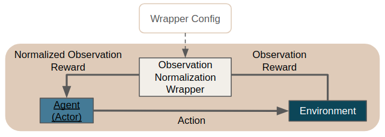
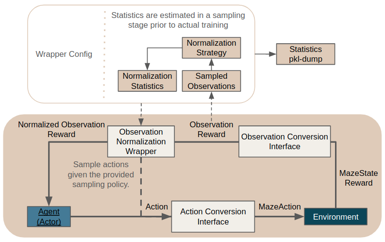

.. _observation_normalization:

Observation Normalization
=========================
For efficient RL training it is crucial that the inputs (e.g. observations) to our models
(e.g. policy and value networks) follow a certain distribution and exhibit values living within a certain range.
To ensure this precondition Maze provides general and customizable functionality for
normalizing the observations returned by the respective environments
via the :ref:`ObservationNormalizationWrapper <observation_normalization_reference>`.

This means to gain access to observation normalization and to the features listed below you simply have to add the
:ref:`ObservationNormalizationWrapper <observation_normalization_reference>`
to your wrapper stack in your Hydra configuration.

To get started you can also just copy one of our :ref:`Hydra config snippets <example_1_obs_norm_wrapper>` below
or :ref:`use it directly within Python <example_python_obs_norm_wrapper>`.

List of Features
----------------
So far observation normalization supports:

 - Different :ref:`normalization strategies <normalization_strategies>` ([*mean-zero-std-one*, *range[0, 1]*, ...)
 - :ref:`Estimating normalization statistics from observations <example_1_obs_norm_wrapper>` collected by interacting
   with the respective environment (prior to training)
 - Providing an action sampling policy for collecting these normalization statistics
 - :ref:`Manually specification <example_2_obs_norm_wrapper>` of normalization statistics in case they are know beforehand
 - :ref:`Excluding observations <example_3_obs_norm_wrapper>` such as action masks from normalization
 - Preserving these statistics for continuing a training run, subsequent rollouts or deploying an agent
 - Gym dictionary observation spaces
 - Extendability with :ref:`custom observation normalization strategies <custom_strategy>` on the fly

As not all of the features listed above might be required right from the beginning
you can find Hydra config examples with increasing complexity below.

.. _example_1_obs_norm_wrapper:

Example 1: Normalization with Estimated Statistics
--------------------------------------------------
This example applies default observation normalization to all observations
with statistics automatically estimated via sampling.

.. literalinclude:: code_snippets/obs_norm_estimate_stats.yaml
  :language: yaml

Details:

 - Applies *mean zero - standard deviation one normalization* **to all observations**
   contained in the dictionary observation space
 - Does not clip observations after normalization
 - Does not compute individual normalization statistics along different axis of the observation vector / matrix
 - Dumps the normalization statistics to the file "*statistics.pkl*"
 - Estimates the required statistics from observations collected via random sampling
 - Does not exclude any observations from normalization
 - Does not provide any normalization statistics manually

.. _example_2_obs_norm_wrapper:

Example 2: Normalization with Manual Statistics
-----------------------------------------------
In this example, we manually specify both the default normalization strategy and its corresponding
default statistics. This is useful, e.g.,
when working with RGB pixel observation spaces.
However, it requires to know the normalization statistics beforehand.

.. literalinclude:: code_snippets/obs_norm_manual_stats.yaml
  :language: yaml

Details:

 - Add *range-zero-one* normalization with manually set statistics to all observations
 - Clips the normalized observation to range [0, 1] in case something goes wrong.
   (As this example expects RGB pixel observations to have values between 0 and 255 this should not have an effect.)
 - Subtracts 0 from each value contained in the observation vector / matrix and then divides it by 255
 - The remaining settings do not have an effect here

.. _example_3_obs_norm_wrapper:

Example 3: Custom Normalization and Excluding Observations
----------------------------------------------------------
This advanced example shows how to utilize the full feature set of observation normalization.
For explanations please see the comments and details below.

.. literalinclude:: code_snippets/obs_norm_custom.yaml
  :language: YAML

Details:

 - The default behaviour for observations without manual config is identical to example 1
 - observation pixel_image: behaves as the default in example 2
 - observation feature_vector:

    - By setting axis to [0] in the *strategy_config* each element in the observation gets normalized with an
      element-wise mean and standard deviation.
    - Why? A feature_vector has shape (d,). After collecting N observations for computing the normalization statistics
      we arrive at a stacked feature_vector-matrix with shape (N, 10). By computing the normalization statistics along
      axis [0] we get normalization statistics with shape (d,) again which can be applied in an elementwise fashion.
    - Additionally each element in the vector is clipped to range [-3, 3].
 - **Note**, that even though a manual config is provided for some observations you can still decide if you would like
   to use predefined manual statistics or estimate them from sampled observations.

.. _custom_strategy:

Example 4: Using Custom Normalization Strategies
------------------------------------------------
In case the normalization strategies provided with Maze are not sufficient for your use case you can of course implement
and add your own strategies.

.. literalinclude:: code_snippets/obs_norm_custom_strategy.yaml
  :language: yaml

When adding a new normalization strategy you (1) have to implement the **ObservationNormalizationStrategy** interface
and (2) make sure that it is accessible within your Python path.
Besides that you only have to provide the reference path of the pre-processor to use.

.. _example_python_obs_norm_wrapper:

Example 5: Plain Python Configuration
-------------------------------------
If you are not working with the Maze command line interface but still want to reuse observation normalization
directly within Python you can start with the code snippet below. It shows how to:

 - instantiate an observation normalized environment
 - estimate normalization statistics via sampling
 - reuse the estimated statistics for normalization for subsequent tasks such as training or rollouts

.. literalinclude:: code_snippets/obs_norm_from_python.py
  :language: python

.. _normalization_strategies:

Built-in Normalization Strategies
---------------------------------
Normalization strategies simply specify the way how input observations are normalized.

Maze already comes with built-in normalization strategies.
You can find a list and further details on the functionality of the
respective strategies in the :ref:`reference documentation <observation_normalization_reference>`.

The Bigger Picture
------------------
The figure below shows how observation normalization is embedded in the overall interaction loop
and set the involved components into context.

It is located in between the
:class:`ObservationConversionInterface <maze.core.env.observation_conversion.ObservationConversionInterface>`
(which converts environment MazeStates into machine readable observations) and the agent.

According to the *sampling_policy* specified in the config the wrapper collects observations from the
interaction loop and uses these to estimate the normalization statistics given the provided
normalization strategies.

The statistics get dumped to the pickle file specified in the config for subsequent rollouts or deploying the agent.

If normalization statistics are known beforehand this stage can be skipped by simply providing the statistics
manually in the wrapper config.

Where to Go Next
----------------
 - Before normalizing your observations you first might want to pre-process them with the
   :ref:`PreProcessingWrapper <observation_pre_processing>`.
 - Learn about more general :ref:`environment wrappers <env_wrappers>`.
