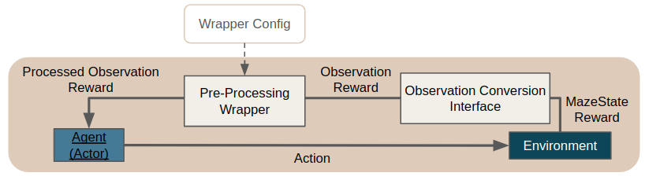

.. _observation_pre_processing:

Observation Pre-Processing
==========================
Sometimes it is required to pre-process or modify observations before passing them through our policy or value
networks. This might be for example the conversion of an three channel RGB image to a single channel grayscale image
or the one-hot encoding of a categorical observation such as the current month into a feature vector of length 12.
Maze supports observation pre-processing via the :ref:`PreProcessingWrapper <observation_pre_processing_reference>`.

This means to gain access to observation pre-processing and to the features listed below you simply have to add the
:ref:`PreProcessingWrapper <observation_pre_processing_reference>` to your wrapper stack in your Hydra configuration.

To get started you can also just copy one of our :ref:`Hydra config snippets <example_1_preproc_wrapper>`
or :ref:`use it directly from Python <example_python_preproc_wrapper>`.

List of Features
----------------
Maze observation pre-processing supports:

 - Gym dictionary observation spaces
 - :ref:`Individual pre-processors <example_1_preproc_wrapper>` for all sub-observations of these dictionary spaces
 - :ref:`Cascaded pre-processing pipelines <example_2_preproc_wrapper>` for a single observation
   (e.g. first convert an image to grayscale before inserting an additional dimension from the left for CNN processing)
 - The option to keep both, the original as well as the pre-processed observation
 - Implicit update of affected observation spaces according to the pre-processor functionality

.. _example_1_preproc_wrapper:

Example 1: Observation Specific Pre-Processors
----------------------------------------------

This example adds pre-processing to two observations (*rgb_image* and *categorical_feature*) contained in a dictionary
observation space.

.. literalinclude:: code_snippets/obs_pre_proc_specific.yaml
  :language: yaml

Details:

 - Adds a gray scale converted version of observation *rgb_image* to the observation space
   but also keeps the original observation.
 - Replaces the observation *categorical_feature* with an one-hot encoded version and drops the original observation.
 - Observations space after pre-processing: {*rgb_image*, *rgb_image-rgb2gray*, *categorical_feature-one_hot*})

.. _example_2_preproc_wrapper:

Example 2: Cascaded Pre-Processing
----------------------------------

This example shows how to apply multiple pre-processor in sequence to a single observation.

.. literalinclude:: code_snippets/obs_pre_proc_cascaded.yaml
  :language: yaml

Details:

 - Converts observation *rgb_image* into a gray scale image, then scales this gray scale image to size 96 x 96 pixel
   and finally inserts an additional dimension at index -3 to prepare the observation for CNN processing.
 - None of the intermediate observations is kept as we are only interested in the final result here.
 - Observations space after pre-processing: {*rgb_image-rgb2gray-resize_img*}).

Example 3: Using Custom Pre-Processors
--------------------------------------
In case the built-in pre-processors provided with Maze are not sufficient for your use case you can of course implement
and add additional custom processors.

.. literalinclude:: code_snippets/obs_pre_proc_new_processor.yaml
  :language: yaml

When adding a new pre-processor you (1) have to implement the **PreProcessor** interface and
(2) make sure that it is accessible within your Python path.
Besides that you only have to provide the reference path of the pre-processor to use.

Observations will be tagged with the filename of your custom preprocessor (e.g. *rgb_image* -> *rgb_image-custom*).

.. _example_python_preproc_wrapper:

Example 4: Plain Python Configuration
-------------------------------------

If you are not working with the Maze command line interface but still want to reuse observation pre-processing
directly within Python you can start with the code snippet below.

.. literalinclude:: code_snippets/obs_pre_proc_from_python.py
  :language: python

Built-in Pre-Processors
-----------------------
Maze already provides built-in pre-processors. You can find a list and further details on the functionality of the
respective processors in the :ref:`reference documentation <observation_pre_processing_reference>`.

Where to Go Next
----------------
- After pre-processing your observations you might also want to normalize them for efficient neural network processing
  using the :ref:`ObservationNormalizationWrapper <observation_normalization>`.
- Learn about more general :ref:`environment wrappers <env_wrappers>`.