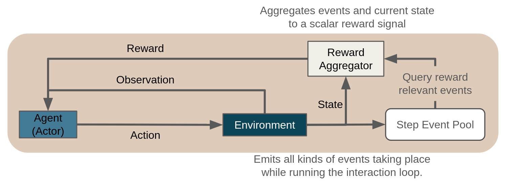

.. _reward_aggregation:

Customizing / Shaping Rewards
=============================
In a reinforcement learning problem the overall goal is defined via an appropriate reward signal.
In particular, reward is attributed to certain, problem specific key events.
During the training process the agent then has to discover a policy (behaviour)
that maximizes the cumulative future reward over time.
In case of a meaningful reward signal such a policy will be able to successfully address the decision problem at hand.

From a technical perspective, reward customization in Maze is based on the general :ref:`event system <event_system>`
(which also serves other purposes) and is implemented via
:class:`RewardAggregators <maze.core.env.reward.RewardAggregatorInterface>`.
In summary, after each step, the reward aggregator gets access to all the events the environment dispatched
during the step (e.g., a new item was replenished to inventory), and can then calculate arbitrary rewards
based on these events. This means it is possible to modify and shape the reward signal based on
different events and their characteristics by plugging in different reward aggregators
without further modifying the environment.

Below we show how to get started with reward customization by
:ref:`configuring the CoreEnv <reward_aggregation-example_core_env>` and by
:ref:`implementing a custom reward <reward_aggregation-example_custom_rwd>`.

List of Features
----------------

Maze event-based reward computation allows the following:

- Easy experimentation with different reward signals.
- Implementation of custom rewards without the need to modify the original environment (simulation).
- Computing rewards based on multiple components of the environment as well as global events.
- Combining multiple different objectives into one multi-objective reward signal.
- Computation of multiple rewards in the same env, each based on a different set of components (multi agent).

.. _reward_aggregation-example_core_env:

Configuring the CoreEnv
-----------------------

The following config snippet shows how to specify reward computation for a CoreEnv
via the field :code:`reward_aggregator`.
You only have to set the reference path of the RewardAggregator and reward computation will be
carried out accordingly in all experiments based on this config.

For further details on the remaining entries of this config you can read up on how to
:ref:`customize Core- and MazeEnvs <custom_core_maze_envs>`.

.. literalinclude:: code_snippets/env_a2e_s2o.yaml
  :language: YAML

.. _reward_aggregation-example_custom_rwd:

Implementing a Custom Reward
----------------------------

This section contains a concrete implementation of a reward aggregator for the built-in cutting environment.

In summary, the reward aggregator first declares which events it is interested in (the get_interfaces method).
At the end of the step, after all the events have been accumulated, the reward aggregator is asked to calculate the
reward (the summarize_reward method). This is the core of the reward computation -- you can see how the events are
queried and the reward assembled based on their values.

.. literalinclude:: code_snippets/custom_reward.py
  :language: PYTHON

When adding a new reward aggregator you (1) have to implement the
:class:`RewardAggregatorInterface <maze.core.env.reward.RewardAggregatorInterface>` and
(2) make sure that it is accessible within your Python path.

Besides that you only have to provide the reference path of the :code:`reward_aggregator` to use:

.. code-block:: YAML

    reward_aggregator:
        _target_: my_project.custom_reward.RawPieceUsageRewardAggregator
        reward_scale: 0.1

Where to Go Next
----------------

 - Additional options for customizing environments can be found under the entry "*Environment Customization*"
   in the sidebar.
 - For further technical details we highly recommend to read up on the :ref:`Maze event system <event_system>`.
 - To see another application of the event system you can read up on the :ref:`Maze logging system <logging>`.