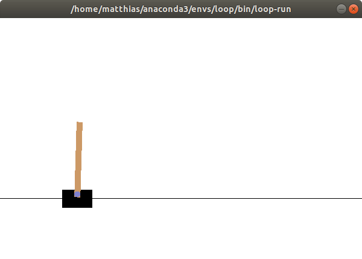
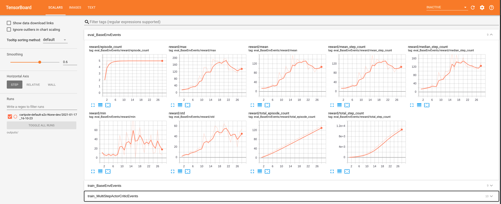
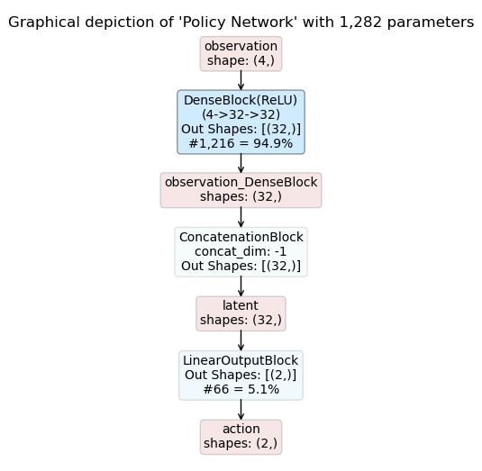
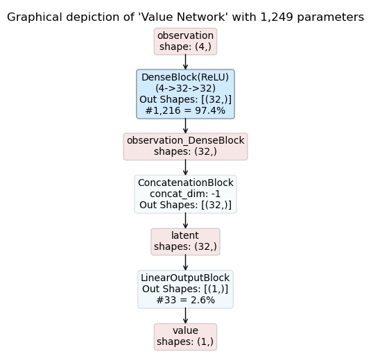

.. _first_example:

A First Example
===============

This example shows how to train and rollout a policy for the
`CartPole <https://gym.openai.com/envs/CartPole-v1/>`_ environment with A2C.
It also gives a small glimpse into the Maze framework.

Training and Rollouts
---------------------

To :ref:`train a policy <training>` with the synchronous advantage actor-critic (:ref:`A2C <maze_trainers-a2c>`), run:

.. code:: console

    $ maze-run -cn conf_train env.name=CartPole-v1 algorithm=a2c algorithm.n_epochs=5 runner.eval_concurrency=1

All training outputs including model weights will be stored in
:code:`outputs/<exp-dir>/<time-stamp>`
(for example :code:`outputs/gym_env-flatten_concat-a2c-None-local/2021-02-23_23-09-25/`).

To :ref:`perform rollouts <rollouts>` for evaluating the trained policy, run:

.. code:: console

    $ maze-run env.name=CartPole-v1 policy=torch_policy input_dir=outputs/<exp-dir>/<time-stamp>

This performs 50 rollouts and prints the resulting performance statistics to the command line:

.. code:: console

     step|path                                                              |             value
    =====|==================================================================|==================
        1|rollout_stats  DiscreteActionEvents  action  substep_0/action     | [len:7900, μ:0.5]
        1|rollout_stats  BaseEnvEvents         reward  median_step_count    |           157.500
        1|rollout_stats  BaseEnvEvents         reward  mean_step_count      |           158.000
        1|rollout_stats  BaseEnvEvents         reward  total_step_count     |          7900.000
        1|rollout_stats  BaseEnvEvents         reward  total_episode_count  |            50.000
        1|rollout_stats  BaseEnvEvents         reward  episode_count        |            50.000
        1|rollout_stats  BaseEnvEvents         reward  std                  |            31.843
        1|rollout_stats  BaseEnvEvents         reward  mean                 |           158.000
        1|rollout_stats  BaseEnvEvents         reward  min                  |            83.000
        1|rollout_stats  BaseEnvEvents         reward  max                  |           200.000

To see the policy directly in action you can also perform sequential rollouts with rendering:

.. code:: console

   $ maze-run env.name=CartPole-v1 policy=torch_policy input_dir=outputs/<exp-dir>/<time-stamp> \
     runner=sequential runner.render=true runner.record_trajectory=true

.. note::

    Managed rollouts are not yet fully supported by our Python API, but will follow soon.

Tensorboard
-----------

To :ref:`watch the training progress with Tensorboard <logging>` start it by running:

.. code:: console

    tensorboard --logdir outputs/

and view it with your browser at http://localhost:6006/.

Training Outputs
----------------

For easier reproducibility Maze writes the full :ref:`configuration compiled with Hydra <hydra>` to the command line
an preserves it in the *TEXT* tab of Tensorboard along with the original training command.

.. code:: YAML

    algorithm:
      critic_burn_in_epochs: 0
      deterministic_eval: false
      device: cpu
      entropy_coef: 0.00025
      epoch_length: 25
      eval_repeats: 2
      gae_lambda: 1.0
      gamma: 0.98
      lr: 0.0005
      max_grad_norm: 0.0
      n_epochs: 5
      n_rollout_steps: 100
      patience: 15
      policy_loss_coef: 1.0
      value_loss_coef: 0.5
    env:
      _target_: maze.core.wrappers.maze_gym_env_wrapper.make_gym_maze_env
      name: CartPole-v1
    input_dir: ''
    log_base_dir: outputs
    model:
    ...

.. note::
   For the graphical representation of models to work, you need to install **pygraphviz**. Detailed information on the
   installation instructions can be found `on this page <http://pygraphviz.github.io/>`_.

You will also find PDFs showing the :ref:`inference graphs of the policy and critic networks <perception_module>`
in the experiment output directory. This turns out to be extremely useful when playing around with model architectures
or when returning to experiments at a later stage.

