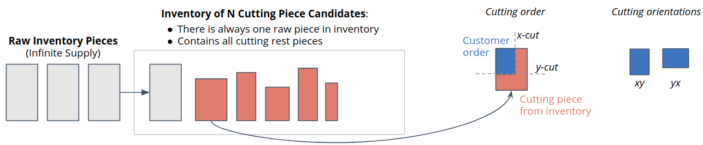
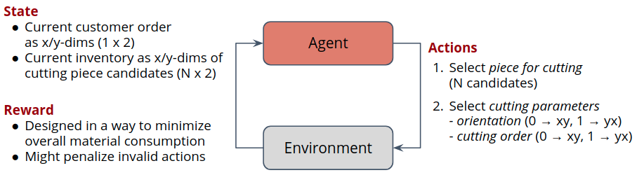
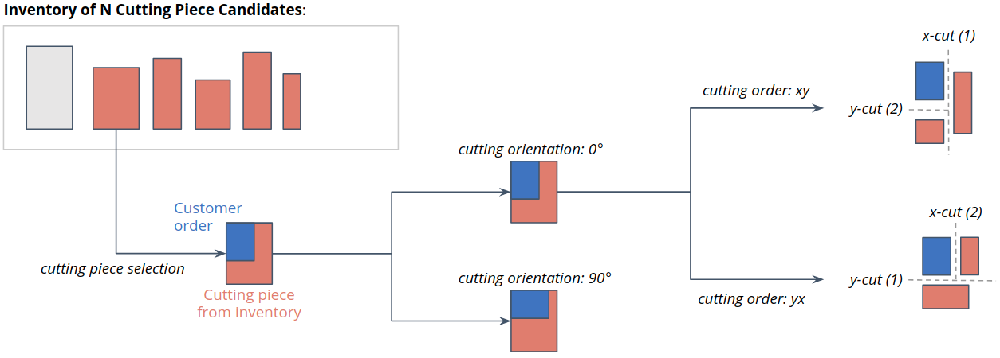

.. _env_from_scratch-problem:

Cutting-2D Problem Specification
================================

This page introduces the problem we would like to address with a Deep Reinforcement Learning agent:
an online version of the *Guillotine 2D Cutting Stock Problem*.

**Description of Problem**:

- In each step there is one new incoming customer order generated according to a certain demand pattern.
- This customer order has to be fulfilled by cutting the exact x/y-dimensions
  from a set of available candidate pieces in the inventory.
- A new raw piece is transferred to the inventory every time the current raw piece in inventory
  is used to cut and deliver a customer order.
- The goal is to use as few raw pieces as possible throughout the episode,
  which can be achieved by following a clever cutting policy.

**Agent-Environment Interaction Loop**:

To make the problem more explicit from an RL perspective we formulate it
according to the agent-environment interaction loop shown below.

- The *State* contains the dimensions of the currently pending customer orders and all pieces on inventory.
- The *Reward* is specified to discourage the usage of raw inventory pieces.
- The *Action* is a joint action consisting of the following components (see image below for details):

  - Action :math:`a_0`: Cutting piece selection (decides which piece from inventory to use for cutting)
  - Action :math:`a_1`: Cutting orientation selection (decides the orientation of the customer)
  - Action :math:`a_2`: Cutting order selection (decides which cut to take first; x or y)

Given this description of the problem we will now proceed with implementing a corresponding simulation.