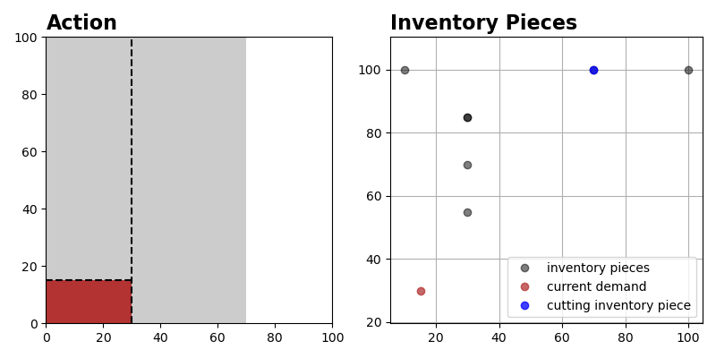

.. _env_from_scratch-renderer:

Adding a Renderer
=================

The complete code for this part of the tutorial
`can be found here <https://github.com/enlite-ai/maze-examples/tree/main/tutorial_maze_env/part02_renderer>`_

.. code:: bash

    # file structure
    - cutting_2d
        - main.py  # modified
        - env
            - core_env.py  # modified
            - inventory.py
            - maze_state.py
            - maze_action.py
            - renderer.py  # new

.. contents:: Page Overview
    :depth: 1
    :local:
    :backlinks: top

Renderer
--------
To check whether our implementation of the environment works as expected and to later on observe
how trained agents behave we add a :class:`~maze.core.rendering.renderer.Renderer` as a next step in this tutorial.

For implementing the renderer we rely on `matplotlib <https://matplotlib.org/>`_ to ensure that it is compatible with
the :ref:`Maze Rollout Visualization Tools <collecting-rollouts>`.

The ``Cutting2DRenderer`` will show the selected piece (the MazeAction) on the left,
along with the current MazeState of the inventory on the right as shown :ref:`here <env_from_scratch-renderer-example>`.

.. literalinclude:: ../../../../tutorials/tutorial_maze_env/part02_renderer/env/renderer.py
  :language: PYTHON
  :caption: env/renderer.py

Updating the CoreEnv
--------------------

To make use of the renderer we simple have to instantiate it in the constructor of the CoreEnv and
make it accessible via the :meth:`~maze.core.env.core_env.CoreEnv.get_renderer` method.

.. literalinclude:: ../../../../tutorials/tutorial_maze_env/part02_renderer/env/core_env_snippet.py
  :language: PYTHON
  :caption: env/core_env.py

Test Script
-----------

The following snippet will instantiate the environment and run it for 15 steps.

.. literalinclude:: ../../../../tutorials/tutorial_maze_env/part02_renderer/main.py
  :language: PYTHON
  :caption: main.py

When running the script you should get the following command line output:

.. code:: bash

    reward -1 | done False | info {'msg': 'valid_cut'}
    reward 0 | done False | info {'msg': 'valid_cut'}
    reward 0 | done False | info {'msg': 'valid_cut'}
    ...

and a rendering of the current MazeState and MazeAction in each time step similar to the image shown below:

.. _env_from_scratch-renderer-example:

The dashed line represents the cutting configuration specified with the MazeAction.
