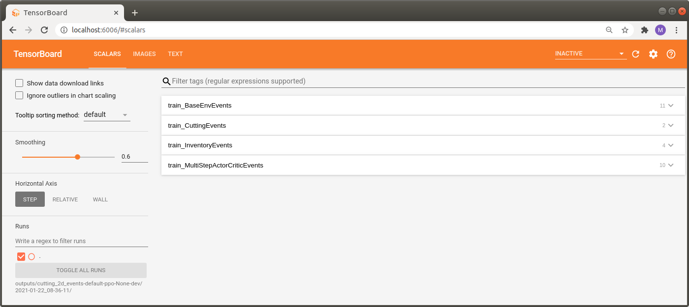

.. _train_events:

Training with Events and KPIs
=============================

The complete code for this part of the tutorial
`can be found here <https://github.com/enlite-ai/maze/tree/main/tutorials/tutorial_maze_env/part04_events>`_

.. code:: bash

    # file structure
    - cutting_2d
        - conf
            - env
                - tutorial_cutting_2d_events.yaml
            - model
                - tutorial_cutting_2d_events.yaml
            - wrappers
                - tutorial_cutting_2d_events.yaml

.. contents:: Page Overview
    :depth: 1
    :local:
    :backlinks: top

Hydra Configuration
-------------------

The entire structure of this example is identical to the one on :ref:`training the MazeEnv <train_maze_env>`.
Everything regarding the event systems was already changed in the
:ref:`section on adding events and KPIs  <env_from_scratch-events>`
and the trainers will consider these changes implicitly.

Training an Agent
-----------------

To retrain the agent on the environment extended with event and KPI logging, run:

.. code:: bash

    maze-run -cn conf_train env=tutorial_cutting_2d_events wrappers=tutorial_cutting_2d_events \
    model=tutorial_cutting_2d_events algorithm=ppo

Running the trainer should print an extended command line output similar to the one shown below.
In addition to base events we now also get a statistics log of *CuttingEvents*, *InventoryEvents* and KPIs.

.. code:: bash
    
     step|path                                                                        |               value
    =====|============================================================================|====================
        6|train     MultiStepActorCritic..time_epoch            ······················|              24.548
        6|train     MultiStepActorCritic..time_rollout          ······················|               0.762
        6|train     MultiStepActorCritic..learning_rate         ······················|               0.000
        6|train     MultiStepActorCritic..policy_loss           0                     |              -0.020
        6|train     MultiStepActorCritic..policy_grad_norm      0                     |               0.013
        6|train     MultiStepActorCritic..policy_entropy        0                     |               0.760
        6|train     MultiStepActorCritic..critic_value          0                     |             -49.238
        6|train     MultiStepActorCritic..critic_value_loss     0                     |              50.175
        6|train     MultiStepActorCritic..critic_grad_norm      0                     |               0.500
        6|train     MultiStepActorCritic..time_update           ······················|               1.210
        6|train     DiscreteActionEvents  action                substep_0/order       |   [len:8000, μ:0.0]
        6|train     DiscreteActionEvents  action                substep_0/piece_idx   | [len:8000, μ:174.2]
        6|train     DiscreteActionEvents  action                substep_0/rotation    |   [len:8000, μ:1.0]
        6|train     BaseEnvEvents         reward                median_step_count     |             200.000
        6|train     BaseEnvEvents         reward                mean_step_count       |             200.000
        6|train     BaseEnvEvents         reward                total_step_count      |           48000.000
        6|train     BaseEnvEvents         reward                total_episode_count   |             240.000
        6|train     BaseEnvEvents         reward                episode_count         |              40.000
        6|train     BaseEnvEvents         reward                std                   |              38.427
        6|train     BaseEnvEvents         reward                mean                  |            -182.175
        6|train     BaseEnvEvents         reward                min                   |            -323.000
        6|train     BaseEnvEvents         reward                max                   |            -119.000
        6|train     InventoryEvents       piece_replenished     mean_episode_total    |              15.325
        6|train     InventoryEvents       piece_discarded       mean_episode_total    |              67.400
        6|train     InventoryEvents       pieces_in_inventory   step_max              |             200.000
        6|train     InventoryEvents       pieces_in_inventory   step_mean             |             200.000
        6|train     CuttingEvents         valid_cut             mean_episode_total    |             116.075
        6|train     CuttingEvents         invalid_cut           mean_episode_total    |              83.925
        6|train     BaseEnvEvents         kpi                   max/raw_piece_usage_..|               0.135
        6|train     BaseEnvEvents         kpi                   min/raw_piece_usage_..|               0.020
        6|train     BaseEnvEvents         kpi                   std/raw_piece_usage_..|               0.028
        6|train     BaseEnvEvents         kpi                   mean/raw_piece_usage..|               0.077

Of course these changes are also reflected in the :ref:`Tensorboard log <logging>`
which you can again view with your browser at http://localhost:6006/.

.. code:: bash

    tensorboard --logdir outputs

As you can see we now have the two additional sections *train_CuttingEvents* and *train_InventoryEvents* available.

A closer look at these events reveals that the agent actually starts to learn something meaning full as
the number of invalid cuts decreases which of course implies that the number of valid cuts increases
and we are able to full fill the current customer demand.

.. image:: tb_event_details.png
    :width: 100 %
    :align: center