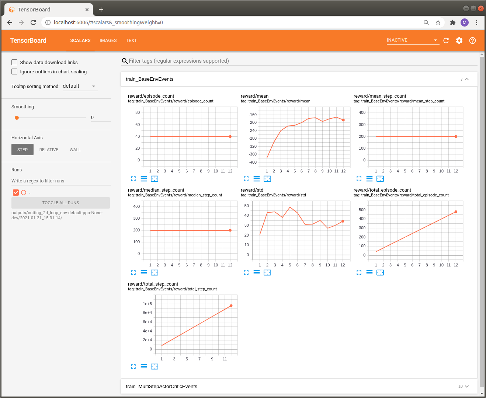

.. _train_maze_env:

Training the MazeEnv
====================

The complete code for this part of the tutorial
`can be found here <https://github.com/enlite-ai/maze/tree/main/tutorials/tutorial_maze_env/part03_maze_env>`_

.. code:: bash

    # file structure
    - cutting_2d
        - conf
            - env
                - tutorial_cutting_2d_basic.yaml
            - model
                - tutorial_cutting_2d_basic.yaml
            - wrappers
                - tutorial_cutting_2d_basic.yaml

.. contents:: Page Overview
    :depth: 1
    :local:
    :backlinks: top

Hydra Configuration
-------------------

The entire Maze workflow is boosted by the :ref:`Hydra configuration system <hydra>`.
To be able to perform our first training run via the Maze CLI we have to add a few more config files.
Going into the very details of the config structure is for now beyond the scope of this tutorial.
However, we still provide some information on the parts relevant for this example.

The config file for the ``maze_env_factory`` looks as follows:

.. literalinclude:: ../../../../tutorials/tutorial_maze_env/part03_maze_env/conf/env/tutorial_cutting_2d_basic.yaml
  :language: YAML
  :caption: conf/env/tutorial_cutting_2d_basic.yaml

Additionally, we also provide a wrapper config but refer to
:ref:`Customizing Environments with Wrappers <env_wrappers>` for details.

.. literalinclude:: ../../../../tutorials/tutorial_maze_env/part03_maze_env/conf/wrappers/tutorial_cutting_2d_basic.yaml
  :language: YAML
  :caption: conf/wrappers/tutorial_cutting_2d_basic.yaml

To learn more about the model config in ``conf/env_model/tutorial_cutting_2d_basic.yaml``
you can visit the :ref:`introduction on how to work with template models <template_models>`.

Training an Agent
-----------------

Once the config is set up we are good to go to start our first training run (in the cmd below with the PPO algorithm):

.. code:: bash

     maze-run -cn conf_train env=tutorial_cutting_2d_basic wrappers=tutorial_cutting_2d_basic \
     model=tutorial_cutting_2d_basic algorithm=ppo

Running the trainer should print a command line output similar to the one shown below.

.. code:: bash

     step|path                                                                        |               value
    =====|============================================================================|====================
       12|train     MultiStepActorCritic..time_epoch            ······················|              24.333
       12|train     MultiStepActorCritic..time_rollout          ······················|               0.754
       12|train     MultiStepActorCritic..learning_rate         ······················|               0.000
       12|train     MultiStepActorCritic..policy_loss           0                     |              -0.016
       12|train     MultiStepActorCritic..policy_grad_norm      0                     |               0.015
       12|train     MultiStepActorCritic..policy_entropy        0                     |               0.686
       12|train     MultiStepActorCritic..critic_value          0                     |             -56.659
       12|train     MultiStepActorCritic..critic_value_loss     0                     |              33.026
       12|train     MultiStepActorCritic..critic_grad_norm      0                     |               0.500
       12|train     MultiStepActorCritic..time_update           ······················|               1.205
       12|train     DiscreteActionEvents  action                substep_0/order       |   [len:8000, μ:0.5]
       12|train     DiscreteActionEvents  action                substep_0/piece_idx   | [len:8000, μ:169.2]
       12|train     DiscreteActionEvents  action                substep_0/rotation    |   [len:8000, μ:1.0]
       12|train     BaseEnvEvents         reward                median_step_count     |             200.000
       12|train     BaseEnvEvents         reward                mean_step_count       |             200.000
       12|train     BaseEnvEvents         reward                total_step_count      |           96000.000
       12|train     BaseEnvEvents         reward                total_episode_count   |             480.000
       12|train     BaseEnvEvents         reward                episode_count         |              40.000
       12|train     BaseEnvEvents         reward                std                   |              34.248
       12|train     BaseEnvEvents         reward                mean                  |            -186.450
       12|train     BaseEnvEvents         reward                min                   |            -259.000
       12|train     BaseEnvEvents         reward                max                   |            -130.000

To get a nicer view on these numbers we can also
:ref:`take a look at the stats with Tensorboard <logging>`.

.. code:: bash

    tensorboard --logdir outputs

You can view it with your browser at http://localhost:6006/.

For now we can only inspect standard metrics such as *reward statistics* or *mean_step_counts* per episode.
Unfortunately, this is not too informative with respect to the cutting problem we are currently addressing.
In the next part we will show how to make logging much more informative
by :ref:`introducing events and KPIs <env_from_scratch-events>`.
