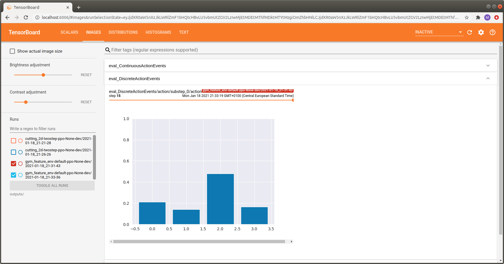
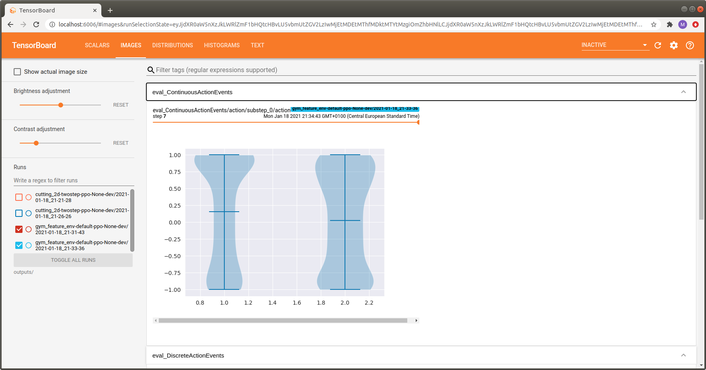

.. _act_logging:

Action Distribution Visualization
=================================
There are situations where it turns out to be extremely useful to watch the evolution of an agent's sampling behaviour
throughout the training process.
Looking at the action sampling distribution often provides a first intuition about the agent's behaviour
without the need to look at individual rollouts.

However, most importantly it is a great debugging tool immediately revealing if:

- the weights of the policy collapsed during training (e.g., the agent starts sampling always the same actions
  even though this does not make sense for the environment at hand).
- observations are properly normalized and the weights of the policy are initialized accordingly
  to result in a healthy initial sampling behaviour of the untrained model
  (e.g., each discrete action is taken a similar number of times when starting training).
- biasing the weights of the policy output layer results in the expected sampling behaviour
  (e.g., initially sampling an action twice as often as the remaining ones).
- the agents actually starts learning (i.e., the sampling distributions changes throughout the training epochs).

Maze visualizes action sampling distributions on a per-epoch basis in the *IMAGES* tab of Tensorboard.
By using the slider above the images you can step through the training epochs and see how the sampling distribution
evolves over time.

Discrete and Multi Binary Actions
---------------------------------

Each :ref:`action space <action_spaces_and_distributions>` has a dedicated visualization assigned.
Discrete and multi-binary action spaces are visualized via histograms.
The example below shows an action sampling distribution for the discrete version of
`LunarLander-v2 <https://gym.openai.com/envs/LunarLander-v2/>`_.
The indices on the x-axis correspond to the available actions:

- Action :math:`a_0` - do nothing
- Action :math:`a_1` - fire left orientation engine
- Action :math:`a_2` - fire main engine
- Action :math:`a_3` - fire right orientation engine

We can see that action :math:`a_2` (fire main engine) is taken most often, which is reasonable for this environment.

Continuous Actions
------------------

Continuous actions (Box spaces) are visualized via violin plots.
The example below shows an action sampling distribution for
`LunarLanderContinuous-v2 <https://gym.openai.com/envs/LunarLanderContinuous-v2/>`_.
The indices on the x-axis correspond to the available actions:

- Action :math:`a_1` - controls the main engine:

    - :math:`a_1 \in [-1, 0]`:  off
    - :math:`a_1 \in (0, 1]` throttle from 50% to 100% power (can't work with less than 50%).

- Action :math:`a_2` -  controls the orientation engines:

    - :math:`a_2 \in [-1.0, -0.5]`:  fire left engine
    - :math:`a_2 \in [0.5, 1.0]`: fire right engine
    - :math:`a_2 \in (-0.5, 0.5)`: off

For the first action, corresponding to the main engine, values closer to 1.0 are sampled more often which is similar
to the discrete case above.

Where to Go Next
----------------

- You might be also interested in :ref:`logging observation distributions <obs_logging>`.