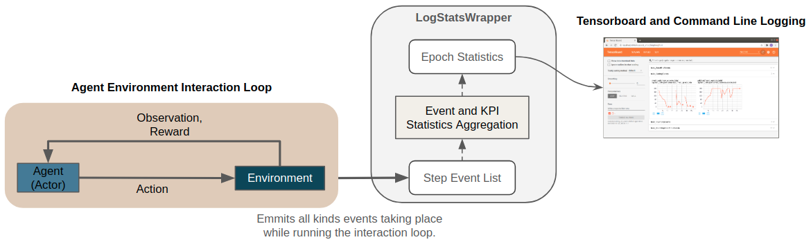
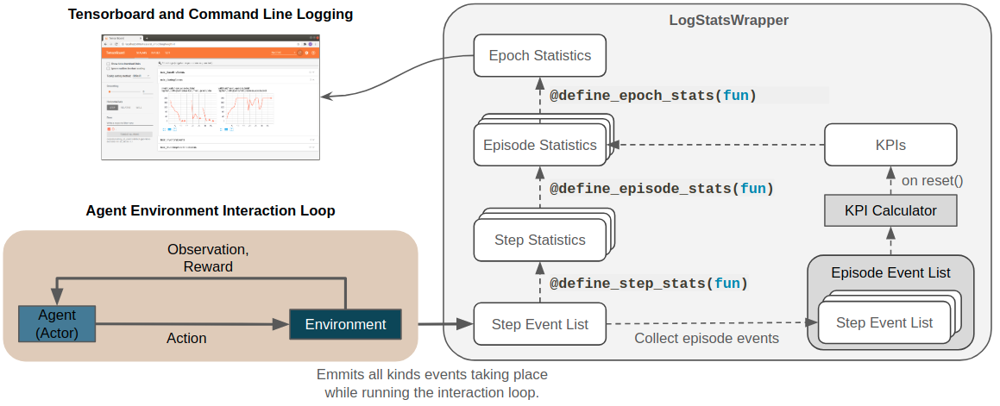

.. _event_kpi_log:

Event and KPI Logging
=====================

Monitoring only standard metrics such as reward or episode step count is not always
sufficiently informative
about the agent's behaviour and the problem at hand.
To tackle this issue and to enable better inspection and logging tools for both, agents and environments,
we introduce an event and key performance indicator (KPI) logging system.
It is based on the more general :ref:`event system <event_system>`
and allows us to log and monitor environment specific metrics.

The figure below shows a conceptual overview of the logging system.
In the remainder of this page we will go through the components in more detail.

.. _event_kpi_log-events:

Events
------

In this section we describe the event logging system from an usage perspective.
To understand how this is embedded in the broader context of a Maze environment
we refer to the :ref:`environments and KPI section <env_from_scratch-events-kpi>` of our step by step tutorial
as well as the dedicated section on the underlying :ref:`event system <event_system>`.

In general, events can be define for any component involved in the RL process (e.g., environments, agents, ...).
They get fired by the respective component whenever they occur during the agent environment interaction loop.
For logging, events are collected and aggregated via the
:class:`~maze.core.wrappers.log_stats_wrapper.LogStatsWrapper`.

To provide full flexibility Maze allows to customize which statistics are computed
at which stage of the aggregation process via event decorators (*step*, *episode*, *epoch*).
The code snipped below contains an example for an event called ``invalid_piece_selected``
borrowed from the :ref:`cutting 2D tutorial <env_from_scratch-events>`.

.. literalinclude:: code_snippets/event_stats.py
  :language: PYTHON

The snippet defines the following statistics aggregation hierarchy:

**Step Statistics** [:code:`@define_step_stats(len)`]:
in each environment step events :math:`e_i` are collected as lists of events :math:`\{e_i\}`.
The function ``len`` associated with the decorator counts
how often such an event occurred in the current step :math:`Stats_{Step}=|\{e_i\}|`
(e.g., length of ``invalid_piece_selected`` event list).

**Episode Statistics** [:code:`@define_episode_stats(sum)`]:
defines how the :math:`S` step statistics should be aggregated to episode statistics
(e.g., by simply summing them up: :math:`Stats_{Episode}=\sum^S Stats_{Step})`

**Epoch Statistics** [:code:`@define_epoch_stats(np.mean, output_name="mean_episode_total")`]:
a training epoch consists of N episodes.
This stage defines how these N episode statistics are averaged to epoch statistics
(e.g., the mean of the contained episodes: :math:`Stats_{Epoch}=(\sum^N Stats_{Episode})/N`).

The figure below provides a visual summary of the entire event statistics aggregation hierarchy
as well as its relation to KPIs which will be explained in the next section.
In :ref:`Tensorboard and on the command line <logging>`
these events get then logged in dedicated sections (e.g., as *CuttingEvents*).

.. _event_kpi_log-kpis:

Key Performance Indicators (KPIs)
---------------------------------

In applied RL settings the reward is not always the target metric
we aim at optimizing from an economical perspective.
Sometimes :ref:`rewards are heavily shaped <reward_aggregation>` to get the agent to learn the right behaviour.
This makes it hard to interpret for humans.
For such cases Maze supports computing and logging of additional Key Performance Indicators (KPIs)
along with the reward via the :class:`~maze.core.log_events.kpi_calculator.KpiCalculator`
implemented as a part of the :class:`~maze.core.env.core_env.CoreEnv` (as reward KPIs are logged as *BaseEnvEvents*).

KPIs are in contrast to events computed in an aggregated form at the end of an episode
triggered by the :meth:`~maze.core.wrappers.log_stats_wrapper.LogStatsWrapper.reset` method of the
:class:`~maze.core.wrappers.log_stats_wrapper.LogStatsWrapper`.
This is why we can compute them in a normalized fashion (e.g., dived by the total number of steps in an episode).
Conceptually KPIs life on the same level as episode statistics in the logging hierarchy (see figure above).

For further details on how to implement a concrete KPI calculator we refer to the
:ref:`KPI section <env_from_scratch-events-kpi>` of our tutorial.

Plain Python Configuration
--------------------------

When working with the :ref:`CLI and Hydra configs <hydra>` all components
necessary for logging are automatically instantiated under the hood.
In case you would like to test or run your logging setup directly from Python
you can start with the snippet below.

.. literalinclude:: code_snippets/log_stats_wrapper.py
  :language: PYTHON

To get access to event and KPI logging we need to wrap the environment with the
:class:`~maze.core.wrappers.log_stats_wrapper.LogStatsWrapper`.
To simplify the statistics logging setup we rely on the
:class:`~maze.utils.log_stats_utils.SimpleStatsLoggingSetup` helper class.

When running the script you will get an output as shown below.
Note that statistics of both, events and KPIs,
are printed along with default *reward* or *action* statistics.

.. literalinclude:: ../getting_started/maze_env/cmd_event_log.log
  :language: bash

Where to Go Next
----------------

- You can learn more about the general :ref:`event system <event_system>`.
- For a more implementation oriented summary you can visit the :ref:`events and KPI section <env_from_scratch-events>`
  of our tutorial.
- To see another application of the event system you can read up on
  :ref:`reward customization and shaping <reward_aggregation>`.
