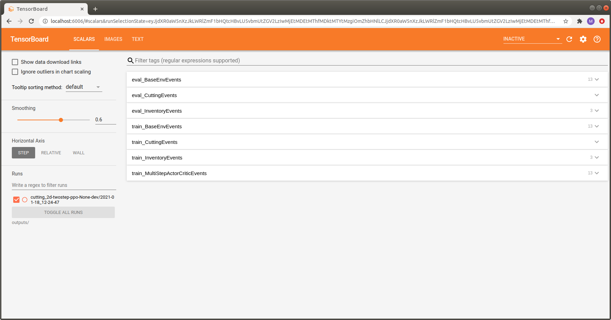

.. _logging:

Tensorboard and Command Line Logging
====================================

This page gives a brief overview of the `Tensorboard <https://www.tensorflow.org/tensorboard>`_
and command line logging facilities of Maze. We will show examples based on the cutting-2D Maze environment
to make things a bit more interesting.

To understand the underlying concepts we recommend to read the sections on
:ref:`event and KPI logging <event_kpi_log>` as well as on the :ref:`Maze event system <event_system>`.

Tensorboard Logging
-------------------

To watch the training progress with Tensorboard start it by running:

.. code:: bash

    tensorboard --logdir outputs/

and view it with your browser at http://localhost:6006/.

You will get an output similar to the one shown in the image below.

To keep everything organized and avoid having to browse through tons of pages
we group the contained items into semantically connected sections:

- Since Maze allows you to use different environments for training and evaluation,
  each logging section has a *train_* or *eval_* prefix to show
  if the corresponding stats were logged as part of the training or the evaluation environment.
- The BaseEnvEvents sections (i.e., *eval_BaseEnvEvents* and *train_BaseEnvEvents* contain general statistics
  such as rewards or step counts. This section is always present, independent of the environment used.
- Other sections are specific to the environment used.
  In the example above, these are the *CuttingEvents* and the *InventoryEvents*.
- In addition, we get one additional section containing stats of the trainer used, called *train_NameOfTrainerEvents*.
  It contains statistics such as policy loss, gradient norm or value loss.
  This section is not present for the evaluation environment.

The gallery below shows some additional useful examples and features of the Maze Tensorboard log
(click the images to display them in large).

.. list-table::
    :widths: 1 1
    :align: center

    * - | Logging of component specific events
        | in the *SCALARS* tab.
        | (Useful for understanding the environment)

      - | Logging of the training command and the complete
        | hydra job config in the *TEXT* tab.
        | (Useful for reproducing experiments)

    * - .. figure:: img/tb_events.png
           :width: 90 %
           :align: center

      - .. figure:: img/tb_text.png
           :width: 90 %
           :align: center

    * - | :ref:`Logging of action sampling statistics <act_logging>`
        | in the *IMAGE* tab.
        | (Useful for understanding the agent's behaviour)

      - | :ref:`Logging of observation distributions <obs_logging>`
        | in the *DISTRIBUTIONS* and *HISTOGRAMS* tab.
        | (Useful for analysing observations)

    * - .. figure:: img/tb_images.png
           :width: 90 %
           :align: center

      - .. figure:: img/tb_distributions.png
           :width: 90 %
           :align: center

Command Line Logging
--------------------

Whenever you start a training run you will also get a command line output similar to the one shown below.
Analogously to the Tensorboard log, Maze distinguishes between *train* and *eval* outputs and groups the items into
semantically connected output blocks.

.. literalinclude:: code_snippets/train_cmd.log
  :language: bash

Where to Go Next
----------------

- For further details please see the :ref:`reference documentation <event_stats_logging_ref>`.
- For the bigger picture we refer to :ref:`event and KPI logging <event_kpi_log>`
  as well as the :ref:`Maze event system <event_system>`.
- You might be also interested in :ref:`observation distribution logging<obs_logging>`
  and :ref:`action distribution logging <act_logging>`.
