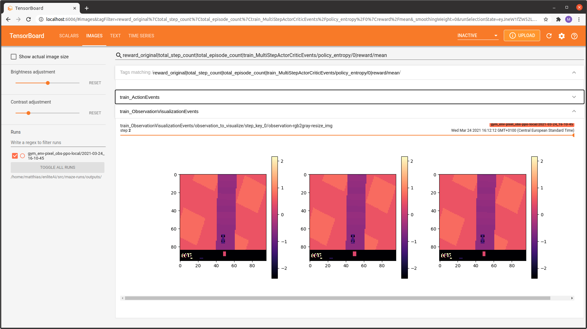

.. _obs_logging:

Observation Logging
===================

Maze provides the following options to monitor and inspect the observations presented to your policy and value networks
throughout the training process:

.. warning::

    Observation visualization and logging are supported as opt-in features via dedicated wrappers.
    We recommend to use them only for debugging and inspection purposes.
    Once everything is on track and training works as expected we suggest to remove (deactivate) the wrappers
    especially when dealing with environments with large observations.
    If you forget to remove it training might get slow and the memory consumption of Tensorboard might explode!

Observation Distribution Visualization
--------------------------------------

Watching the evolution of distributions and value ranges of observations
is especially useful for debugging your experiments and training runs as it reveals if:

- observations stay within an expected value range.
- observation normalization is applied correctly.
- observations drift as the agent's behaviour evolves throughout training.

To activate observation logging you only have to add the
:class:`~maze.core.wrappers.monitoring_wrapper.MazeEnvMonitoringWrapper`
to your environment wrapper stack in your yaml config:

.. code:: yaml

    # @package wrappers
    maze.core.wrappers.monitoring_wrapper.MazeEnvMonitoringWrapper:
        observation_logging: true
        action_logging: false
        reward_logging: false

If you are using plain Python you can start with the code snippet below.

.. code:: python

    from maze.core.wrappers.maze_gym_env_wrapper import GymMazeEnv
    from maze.core.wrappers.monitoring_wrapper import MazeEnvMonitoringWrapper

    env = GymMazeEnv(env="CartPole-v1")
    env = MazeEnvMonitoringWrapper.wrap(env, observation_logging=True, action_logging=False, reward_logging=False)

For both cases observations will be logged and distribution plots will be added to Tensorboard.

Maze visualizes observations on a per-epoch basis in the *DISTRIBUTIONS* and *HISTOGRAMS* tab of Tensorboard.
By using the slider above the graphs you can step through the training epochs and see how the observation distribution
evolves over time.

Below you see an example for both versions (just click the figure to view it in large).

.. image:: img/tb_obs_distributions.png
   :width: 49 %

.. image:: img/tb_obs_histogram.png
   :width: 49 %

Note that two different versions of the observation distribution are logged:

- *observation_original:* distribution of the original observation returned by the environment.
- *observation_processed:* distribution of the observation after processing
  (e.g. :ref:`pre-processing <observation_pre_processing>` or :ref:`normalization <observation_normalization>`).

This is useful to verify if the applied observation processing steps yield the expected result.

.. _obs_visualization:

Observation Visualization
-------------------------

Maze additionally provides the option to directly visualizes observations presented to your policy and value networks
as images in Tensorboard.

To activate observation visualization you only have to add the
:class:`~maze.core.wrappers.observation_visualization_wrapper.ObservationVisualizationWrapper`
to your environment wrapper stack in your yaml config:

.. code:: yaml

    # @package wrappers
    maze.core.wrappers.observation_visualization_wrapper.ObservationVisualizationWrapper:
        plot_function: my_project.visualization_functions.plot_1c_image_stack

and provide a reference to a custom plotting function (here, :code:`plot_1c_image_stack`).

.. literalinclude:: code_snippets/plot_1c_image_stack.py
  :language: python
  :caption: my_project.visualization_functions.plot_1c_image_stack.py

The function above visualizes the observation *observation-rgb2gray-resize_img* (a single-channel image stack)
as a subplot containing three individual images:

Where to Go Next
----------------

- You might be also interested in :ref:`logging action distributions <act_logging>`.
- You can learn more about :ref:`observation pre-processing <observation_pre_processing>`
  and :ref:`observation normalization <observation_normalization>`.