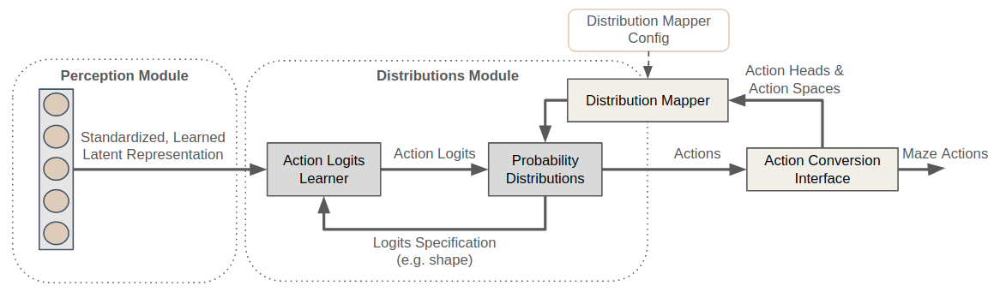

.. _action_spaces_and_distributions_module:

Action Spaces and Distributions
===============================

In response to the states perceived and rewards received,
RL agents interact with their environment by taking appropriate actions.
Depending on the problem at hand there are :ref:`different types of actions <action_spaces_and_distributions>`
an agent must be able to deal with (e.g. categorical, binary, continuous, ...).

To support this requirement Maze introduces the Distribution Module
which builds on top of the :ref:`Perception Module <perception_module>` allowing to fully customize
which probability distributions to link with certain action spaces or even individual action heads.

List of Features
----------------

The distribution module provides the following key features:

 - Supports flat dictionary action spaces (nested dict spaces are not yet supported)
 - Supports a variety of different :ref:`action spaces and probability distributions <action_spaces_and_distributions>`
 - Supports customization of which probability distribution to use for which action space or head
 - Supports action masking in combination with the perception module
 - Allows to add custom probability distributions whenever required

.. _action_spaces_and_distributions:

Action Spaces and Probability Distributions
-------------------------------------------

Maze so far supports the following action space - probability distribution combinations.

+------------------+-------------------------------------------------------+
| **Action Space** | **Available Distributions**                           |
+------------------+-------------------------------------------------------+
| Discrete         | Categorical (default)                                 |
+------------------+-------------------------------------------------------+
| Multi-Discrete   | Multi-Categorical (default)                           |
+------------------+-------------------------------------------------------+
| (Multi-)Binary   | Bernoulli (default)                                   |
+------------------+-------------------------------------------------------+
| Box (Continuous) | Diagonal-Gaussian (default), Beta, Squashed-Gaussian  |
+------------------+-------------------------------------------------------+
| Dict             | DictProbabilityDistribution (default)                 |
+------------------+-------------------------------------------------------+

The DictProbabilityDistribution combines any of the other action spaces and distributions into a joint action space
in case you agent has to interact with the environment via different action space types at the same time.

Note that the table above does not always follow a one-to-one mapping.
In case of a Box (Continuous) action space for example you can choose between a Diagonal-Gaussian distribution
in case of an unbounded action space or a Beta or a Squashed-Gaussian distribution in case of a bounded action space.
In other cases you might even want to :ref:`add additional probability distributions <adding_new_distributions>`
according to the nature of the environment you are facing.

To allow for easy customization of the links between action spaces and distributions
Maze introduces the **DistributionMapper** for which we show usage examples below.

Example 1: Mapping Action Spaces to Distributions
-------------------------------------------------

Adding the snippet below to your model config specifies the following:

 - Use Beta distributions for all Box action spaces.
 - All other action spaces behave as specified in the :ref:`defaults <action_spaces_and_distributions>`.

.. literalinclude:: code_snippets/action_spaces_to_distributions.yaml
  :language: YAML

Example 2: Mapping Actions to Distributions
-------------------------------------------

Adding the snippet below to your model config specifies the following:

 - Use Beta distributions for all Box action spaces.
 - Use a Squashed-Gaussian distributions for the action with key "special_action".
 - All other action spaces behave as specified in the :ref:`defaults <action_spaces_and_distributions>`.

.. literalinclude:: code_snippets/action_heads_to_distributions.yaml
  :language: YAML

When specifying custom behaviour for distinct action heads make sure to add them below the more general action space
configurations (e.g. get more specific from top to bottom).

.. _adding_new_distributions:

Example 3: Using Custom Distributions
-------------------------------------
In case the probability distributions contained in Maze are not sufficient for your use case you can of course add
additional custom probability distributions.

.. literalinclude:: code_snippets/new_distributions.yaml
  :language: YAML

The example above defines to use a **CustomCategoricalProbabilityDistribution** for all discrete action spaces.
When adding a new distribution you (1) have to implement the **ProbabilityDistribution** interface and
(2) make sure that it is accessible within your python path.
Besides that you only have to provide the reference path of the probability distribution you would like to use.

Example 4: Plain Python Configuration
-------------------------------------

For completeness we also provide a code snippet in plain Python showing how to:

 - Define a simple policy network.
 - Instantiate a default DistributionMapper.
 - Use the DistributionMapper to compute the required logits shapes for the Policy network.
 - Compute action logits from a random observation.
 - Instantiate the appropriate probability distribution and sample actions.

.. literalinclude:: code_snippets/sampling_from_policy.py
  :language: PYTHON

The Bigger Picture
------------------
The figure below relates the distribution module with the overall workflow.

The distribution mapper takes the (dictionary) action space as an input
and links the action spaces with the respective probability distributions specified in the config.
Action logits are learned on top of the representation produced by the perception module where each probability
distribution specifies its expected logits shape.

Where to Go Next
----------------
 - For further details please see the :ref:`reference documentation <distributions_reference>`.
 - Processing raw observations with the Maze Perception Module.
 - Customizing models with Hydra.
