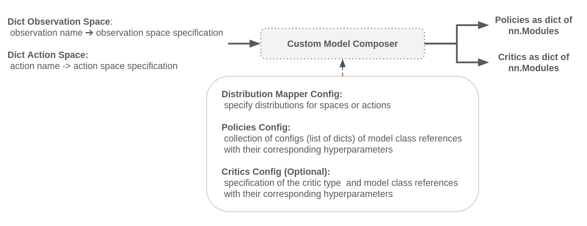
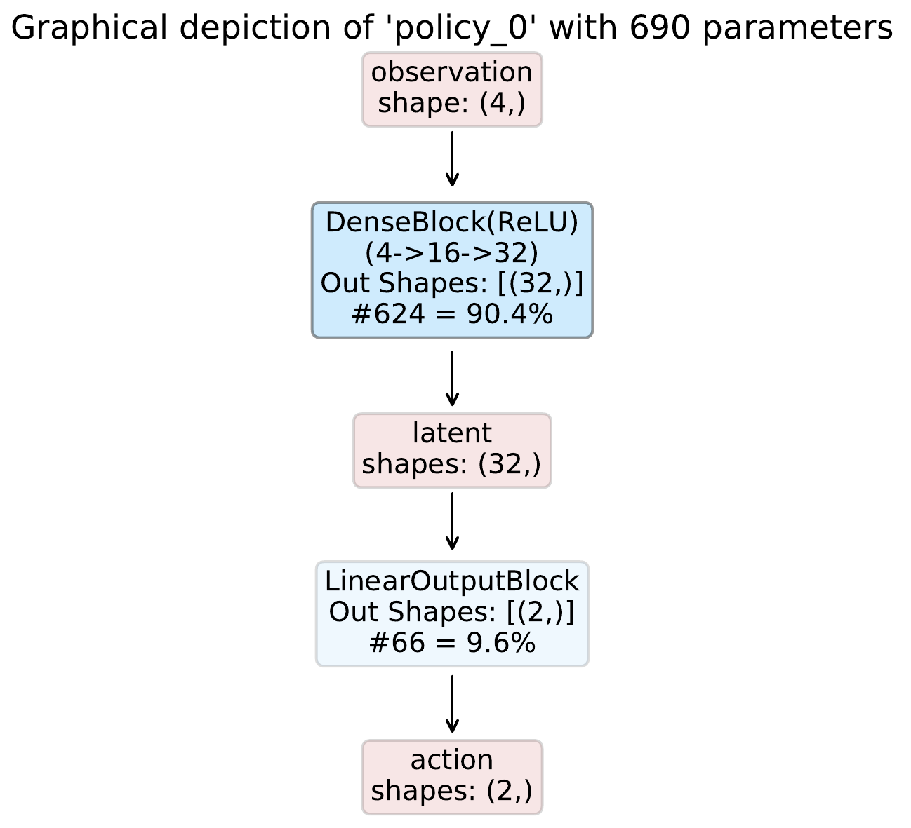
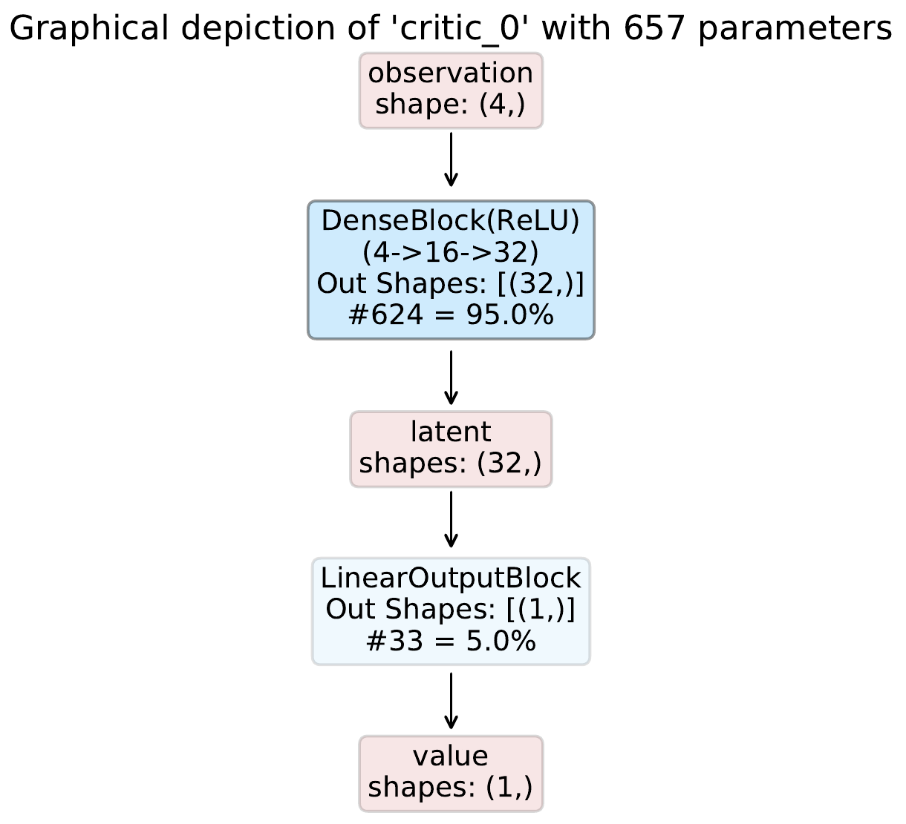
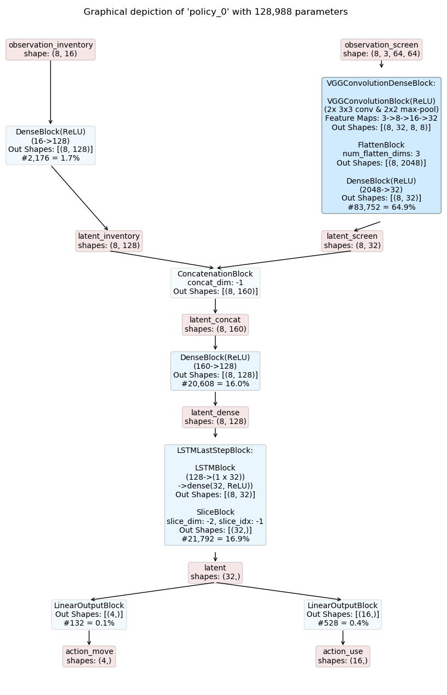
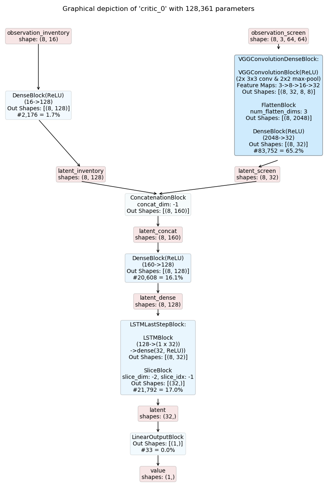
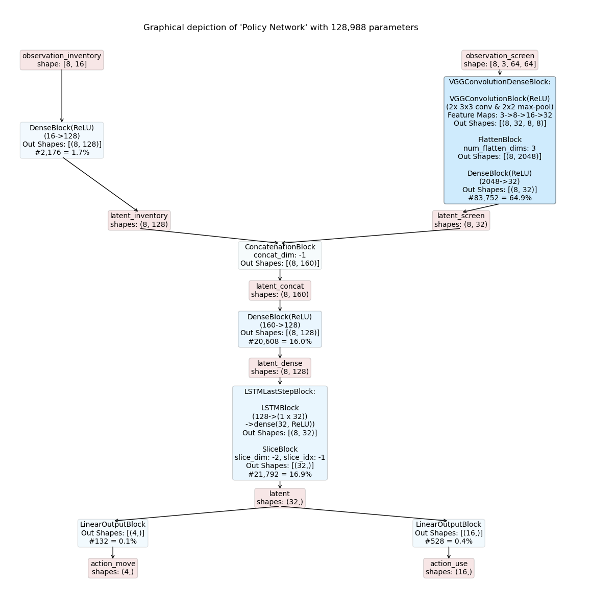
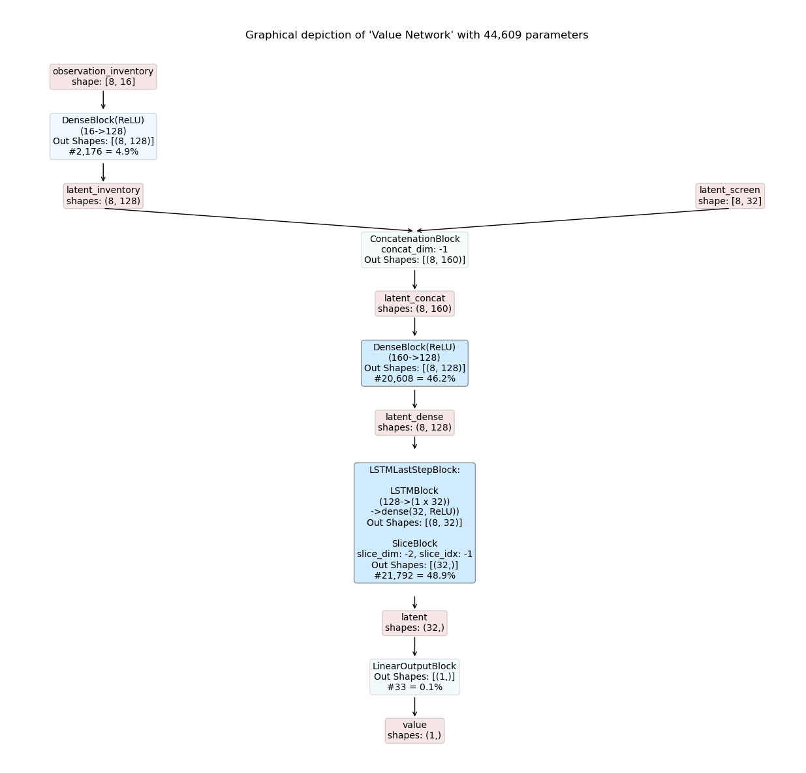

.. |nn_module| raw:: html

   <a href="https://pytorch.org/docs/master/generated/torch.nn.Module.html#torch.nn.Module" target="_blank">nn.Module</a>

.. |cartpole_website| raw:: html

   <a href="https://gymnasium.farama.org/environments/classic_control/cart_pole" target="_blank">CartPole</a>

.. _custom_models:

Working with Custom Models
==========================
The Maze custom :ref:`model composer <model_composers>` enables us to explicitly specify application specific models
directly in Python. Models can be either written with Maze perception blocks or with plain PyTorch as long as they
inherit from Pytorch’s |nn_module|.

As such models can be easily created, and even existing models from previous work or well known papers can be easily
reused with minor adjustments. However, we recommend to create models using the predefined perception blocks in order
to speed up writing
as well as to take full advantage of features such as shape inference and graphical rendering of the models.

On this page we cover the features and general working principles.
Afterwards we demonstrate the custom model composer with three examples:

 - A simple :ref:`feed forward model <custom_example_1>` for cartpole.
 - A more :ref:`complex recurrent network <custom_example_2>` example.
 - The cartpole example, this time using :ref:`plain PyTorch <custom_example_3>` (that is, no Maze-Perception Blocks).

List of Features
----------------

The custom model composer supports the following features:

 - Specify complex models directly in Python.
 - Supports shape inference and shape checks for a given observation space when relying on Maze perception blocks.
 - Reuse existing PyTorch nn.Models with minor modifications.
 - Stores a graphical rendering of the networks if the
   :class:`InferenceBlock <maze.perception.blocks.inference.InferenceBlock>` is utilized.
 - Custom weight initialization and action head biasing.
 - Custom shared embedding between actor and critic.

.. _custom_models_signature:

The Custom Models Signature
---------------------------

The constraints we impose on any model used in conjunction with the custom model composer are threefold:
fist, the network class has to adhere to PyTorch's
|nn_module| and implement the *forward* method.
Second, a custom network class requires specified constructor arguments depending on the type of network
(policy, state critic, ...). And lastly the model has to return a dictionary when calling the forward method.

**Policy Networks** require the constructor arguments *obs_shapes* and *action_logits_shapes*.
When models are built in the the custom model composer these two arguments are passed to the
model constructor in addition to any other arbitrary arguments specified.
*obs_shapes* is a dictionary, mapping observation names to their corresponding shapes.
Similarly *action_logits_shapes* is a dictionary that maps action names to their
corresponding :ref:`action logits shapes <action_spaces_and_distributions_module>`.
Both, observation and action logits shapes are automatically inferred in the model composer.

    - implement |nn_module|
    - constructor arguments: *obs_shapes* and *action_logits_shapes*
    - return type of forward method: Here the forward method has to return a dict, where the keys correspond to the
      actions of the environment.

**State Critic Networks** require only the constructor argument *obs_shapes*.

    - implement |nn_module|
    - constructor arguments: *obs_shapes*
    - return type of forward method: The critic networks also have to return a dict, where the key is 'value'.

.. _custom_example_1:

Example 1: Simple Networks with Perception Blocks
-------------------------------------------------

Even though designed for more complex models that process multiple observations and predict multiple actions at the
same time you can also compose models for simpler use cases, of course.

In this example we utilize the custom model composer in combination with the perception blocks to compose an
actor-critic model for OpenAI Gym's |cartpole_website|
using a single dense block in each network.
CartPole has an observation space with dimensionality four and a discrete action space with two options.

The policy model can then be defined as:

.. literalinclude:: code_snippets/custom_cartpole_policy_net.py
  :language: python

And the critic model as:

.. literalinclude:: code_snippets/custom_cartpole_critic_net.py
  :language: python

An example config for the model composer could then look like this:

.. literalinclude:: code_snippets/custom_cartpole_net.yaml
  :language: yaml

Details:

 - Models are composed by the :ref:`CustomModelComposer <model_composers>`.
 - No specific action space and probability distribution overrides are specified.
 - It specifies a probabilistic policy, the policy network to use and its constructor arguments.
 - It specifies a state critic, the value network to use and its constructor arguments.

Given this config, the resulting inference graphs are shown below:

.. _custom_example_2:

Example 2: Complex Networks with Perception Blocks
--------------------------------------------------

Now we consider the more complex example already used in the :ref:`template model composer <template_feed_forward>`.

The observation space is defined as:

    - *observation_screen* :  a 64 x 64 RGB image
    - *observation_inventory* : a 16-dimensional feature vector

The action space is defined as:

    * *action_move* : a :ref:`categorical action <action_spaces_and_distributions>` with four options deciding to move [*UP, DOWN, LEFT, RIGHT*]
    * *action_use* :  a 16-dimensional :ref:`multi-binary action <action_spaces_and_distributions>` deciding which item to use from inventory

Since we will build a policy and state critic network, where both networks should have the same low level network
structure we can create a common *base* or *latent space* network:

.. literalinclude:: code_snippets/custom_complex_latent_net.py
  :language: python

Given this base class we can now create the policy network:

.. literalinclude:: code_snippets/custom_complex_policy_net.py
  :language: python

... and the critic network:

.. literalinclude:: code_snippets/custom_complex_critic_net.py
  :language: python

An example config for the model composer could then look like this:

.. literalinclude:: code_snippets/custom_complex_net.yaml
  :language: yaml

The resulting inference graphs for a recurrent actor-critic model are shown below. Note that the models are identical
except for the output layers due to the shared base model.

.. _custom_example_3:

Example 3: Custom Networks with (plain PyTorch) Python
------------------------------------------------------

Here, we take a look at how to create a custom model with plain PyTorch.
As already mentioned, we still have to specify the constructor arguments *obs_shapes* and *action_logits_shapes*
but not necessarily need to use them.

**Important**: Your models have to use dictionaries with torch.Tensors as values for both inputs and outputs.

For Gym's |cartpole_website| the policy model could be defined like this:

.. literalinclude:: code_snippets/custom_plain_cartpole_policy_net.py
  :language: python

And the critic model as:

.. literalinclude:: code_snippets/custom_plain_cartpole_critic_net.py
  :language: python

An example config for the model composer could then look like this:

.. literalinclude:: code_snippets/custom_plain_cartpole_net.yaml
  :language: yaml

.. note::
    Since we do not use the :ref:`inference block <inference_graph_visualization>` in this example, no visual
    representation of the model can be rendered.

.. _custom_example_4:

Example 4: Custom Shared embeddings with Perception Blocks
----------------------------------------------------------

For this example we want to showcase the capabilities for using shared embeddings referring to
:ref:`Example 2: <custom_example_2>` for the setup of the observations and actions. Now lets consider the case where
we would like to share the observation_screen embedding *only*.

Here the policy will look very similar to :ref:`Example 2: <custom_example_2>`, using the same latent net. The only
difference here is that we specify an additional *out_key* when creating the inference block:

.. literalinclude:: code_snippets/custom_shared_complex_policy_net.py
  :language: python

Now for the critic, we already get the specified additional *out_key* as part of the obs_shapes dict and can therefore
be used as such:

.. literalinclude:: code_snippets/custom_shared_complex_critic_net.py
  :language: python

The yaml file would look the same as for :ref:`Example 2: <custom_example_2>`, we only specify different networks.

.. literalinclude:: code_snippets/custom_shared_complex_net.yaml
  :language: yaml

The resulting inference graphs for a recurrent shared actor-critic model are shown below.

Where to Go Next
----------------
 - You can read up on our general introduction to the :ref:`Perception Module <perception_module>`.
 - As an alternative to custom models you can also use the :ref:`template model builder <template_models>`.
 - Learn how to link policy network outputs with
   :ref:`probability distributions <action_spaces_and_distributions_module>` for action sampling.