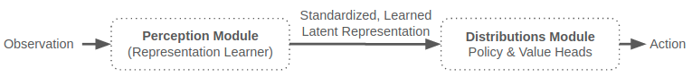
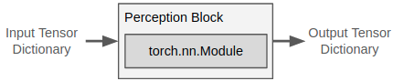
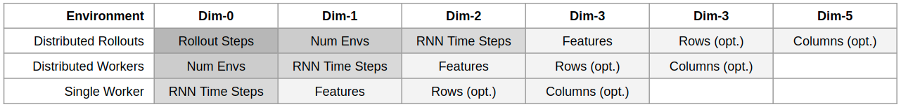
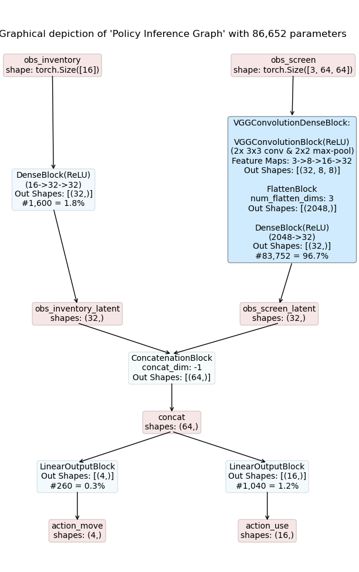
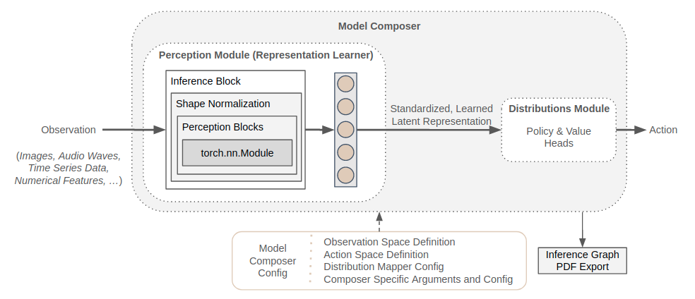

.. |pytorch_website| raw:: html

   <a href="https://pytorch.org" target="_blank">PyTorch</a>

.. |nn_module| raw:: html

   <a href="https://pytorch.org/docs/master/generated/torch.nn.Module.html#torch.nn.Module" target="_blank">nn.Module</a>

.. _perception_module:

Introducing the Perception Module
=================================

One of the key ingredients for successfully training RL agents in complex environments
is their combination with powerful representation learners; in our case PyTorch-based neural networks.
These enable the agent to perceive all kinds of observations (e.g. images, audio waves, sensor data, ...),
unlocking the full potential of the underlying RL-based learning systems.

Maze supports neural network building blocks via the *Perception Module*,
which is responsible for transforming raw observations into standardized, learned latent representations.
These representations are then utilized by the
:ref:`Action Spaces and Distributions Module <action_spaces_and_distributions_module>`
to yield policy as well as critic outputs.

This page provides a general introduction into the Perception Module (which we
recommend to read, of course).
However, you can also start using the module right away and jump to
the :ref:`template <template_models>` or :ref:`custom models <custom_models>` section.

List of Features
----------------

Below we list the key features and design choices of the perception module:

 - Based on |pytorch_website|.
 - Supports dictionary observation spaces.
 - Provides a large variety of :ref:`neural network building blocks <perception_reference>`
   and model styles for customizing policy and value networks:

   - feed forward: dense, convolution, graph convolution and attention, ...
   - recurrent: LSTM, last-step-LSTM, ...
   - general purpose: action and observation masking, self-attention, concatenation, slicing, ...

 - Provides shape inference allowing to derive custom models directly from observation space definitions.
 - Allows for environment specific customization of existing network templates per yaml configuration.
 - Definition of complex networks explicitly in Python using Maze perception blocks and/or PyTorch.
 - Generates detailed visualizations of policy and value networks (model graphs)
   containing the perception building blocks as well as all intermediate representation produced.
 - Can be easily extended with custom network components if necessary.

.. _perception_block:

Perception Blocks
-----------------
Perception blocks are components for composing models such as policy and value networks within Maze.
They implement PyTorch's |nn_module|
interface and encapsulate neural network functionality into distinct, reusable units.
In order to handle all our requirements (listed in the motivation below),
every perception block expects a tensor dictionary as input and produce a tensor dictionary again as an output.

Maze already supports a number of :ref:`built-in neural network building blocks <perception_blocks_reference>`
which are, like all other components, :ref:`easily extendable <perception_new_blocks>`.

**Motivation:** Maze introduces perception blocks to extend PyTorch's nn.Module with **shape inference** to
support the following features:

1. To derive, generate and customize :ref:`template models <template_models>` directly from observation
   and action space definitions.
2. To :ref:`visualize models <inference_graph_visualization>` and how these process observations to ultimately arrive at
   an action or value prediction.
3. To seamlessly apply models at different stages of the RL development processes without the need for extensive
   input reshaping regardless if we perform a distributed training using parallel rollout workers
   or if we deploy a single agent in production.
   The figure below shows a few examples of such scenarios.

.. _inference_graph_visualization:

Inference Blocks
----------------
The InferenceBlock, a special perception block, combines multiple perception blocks into one prediction module.
This is convenient and allows us to easily reuse semantically connected parts of our models
but also enables us to derive and visualize inference graphs of these models.
This is feasible as perception blocks operate with input and output tensor dictionaries,
which can be easily linked to an inference graph.

The figure below shows a simple example of how such a graph can look like.

Details:

- The model depicted in the figure above takes two observations as inputs:

   - *obs_inventory* : a 16-dimensional feature vector
   - *obs_screen* :    a 64 x 64 RGB image

- *obs_inventory* is processed by a DenseBlock resulting in a 32-dimensional latent representation.
- *obs_screen* is processed by a VGG-style model resulting in a 32-dimensional latent representation.
- Next, these two representations are concatenated into a joint representation with dimension 64.
- Finally we have two LinearOutputBlocks yielding the logits for two distinct action heads:

   - *action_move* : a :ref:`categorical action <action_spaces_and_distributions>`
     deciding to move [*UP, DOWN, LEFT, RIGHT*],
   - *action_use* :  a :ref:`multi-binary action <action_spaces_and_distributions>`
     deciding which item to use from inventory.

**Comments on visualization**: Blue boxes are blocks, while red ones are tensors.
The color depth of blocks (blue) indicates the number of the parameters relative to the total number of parameters.

.. _model_composers:

Model Composers
---------------
Model Composers, as the name suggest, compose the models and as such bring all components of the perception module
together under one roof. In particular, they hold:

 - Definitions of observation and actions spaces.
 - All defined models, that is, policies (multiple ones in multi-step scenarios) and critics
   (multiple ones in multi-step scenarios depending on the critic type).
 - The :ref:`Distribution Mapper <action_spaces_and_distributions>`,
   mapping (possible custom) probability distributions to action spaces.

Maze supports :ref:`different types of model composers <perception_composers_reference>` and we will show
how to work with :ref:`template <template_models>` and :ref:`custom models <custom_models>` in detail later on.

.. _perception_new_blocks:

Implementing Custom Perception Blocks
-------------------------------------
In case you would like to implement and use custom components when designing your models you can add new blocks
by implementing:

 - The PerceptionBlock interface common for all perception blocks.
 - The ShapeNormalizationBlock interface normalizing the input and de-normalizing the output tensor dimensions if
   required for your block (optional).
 - The respective forward pass of your block.

The code-snippet below shows a simple toy-example block, wrapping a linear layer into a Maze perception block.

.. literalinclude:: code_snippets/my_linear_block.py
  :language: python

The Bigger Picture
------------------
The figure below shows how the components introduced in the perception module relate to each other.

Where to Go Next
----------------

 - For further details please see the :ref:`reference documentation <perception_reference>`.
 - Action Spaces and Distributions
 - Working with template models
 - Working with custom models
 - Pre-processing and observation normalization