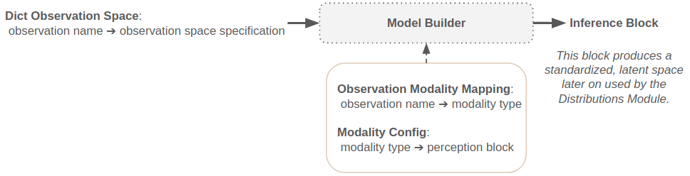
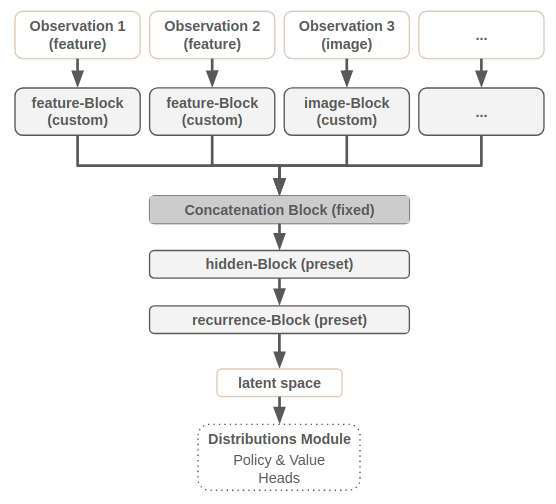
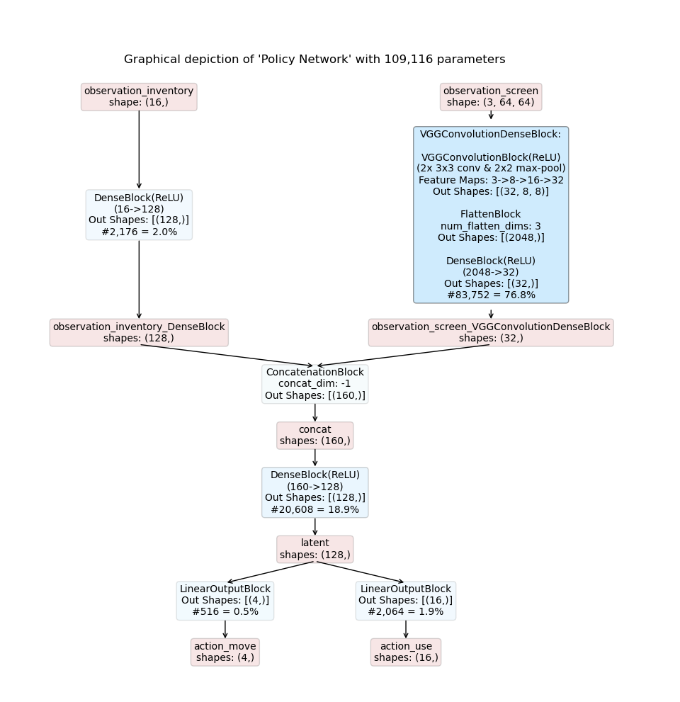
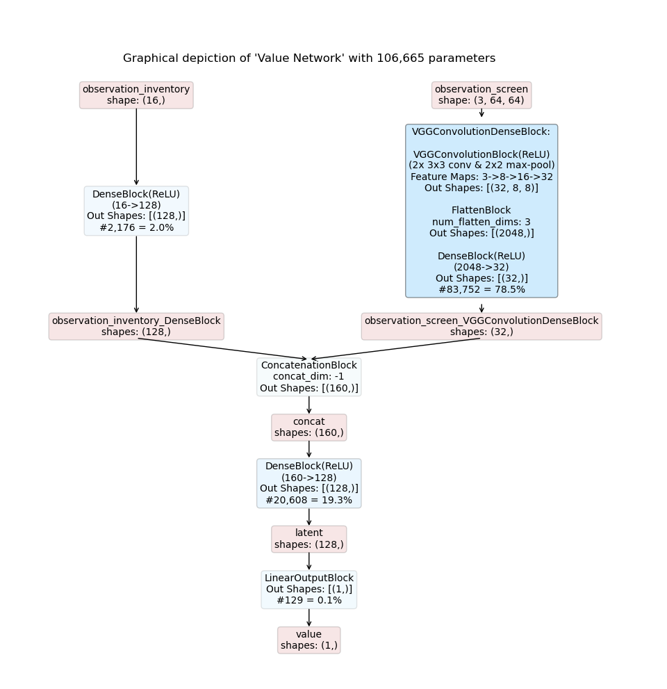
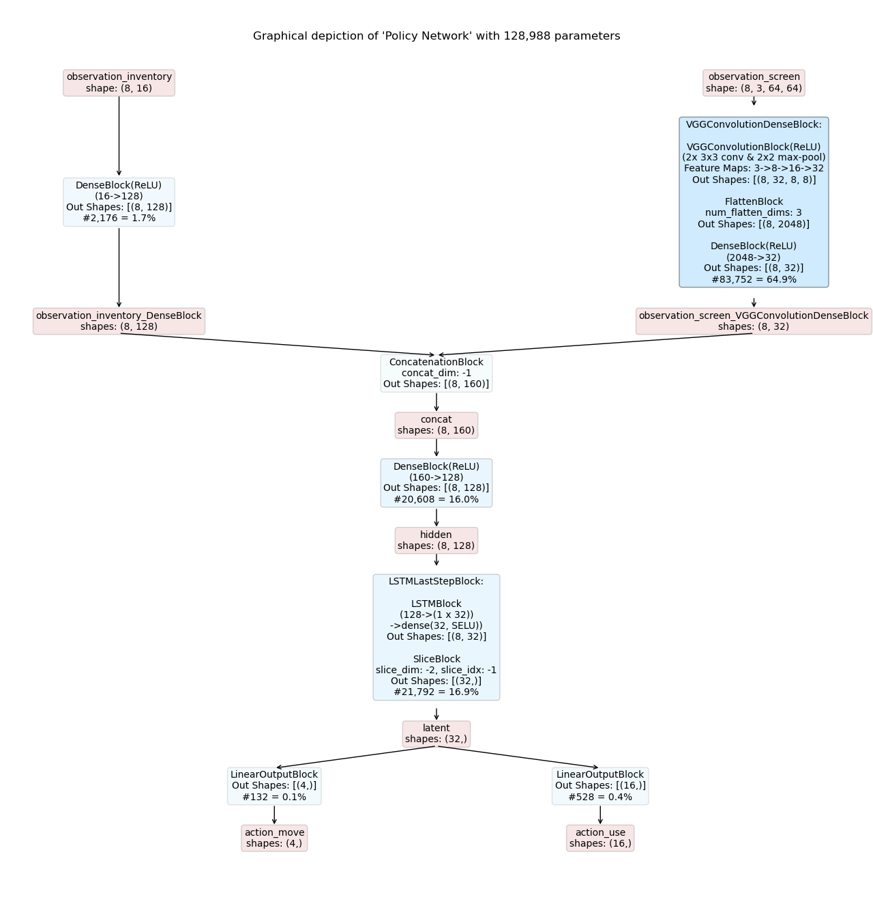
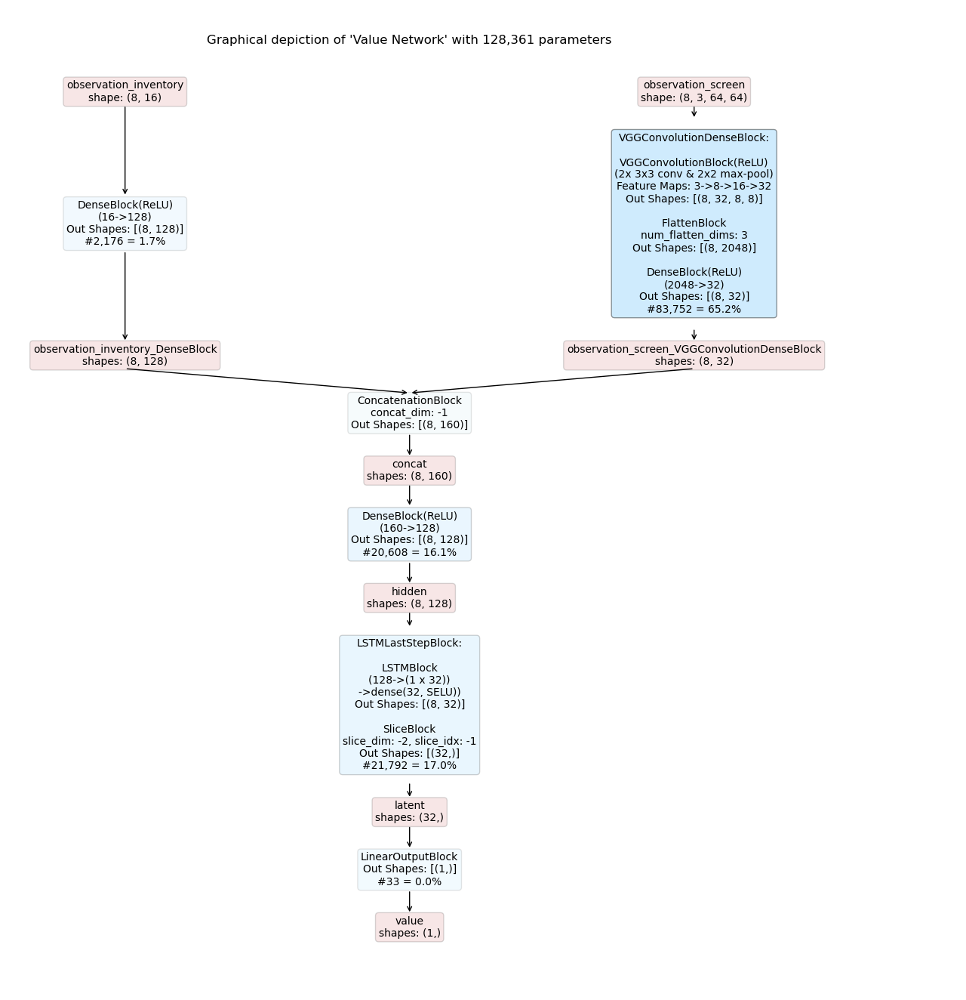
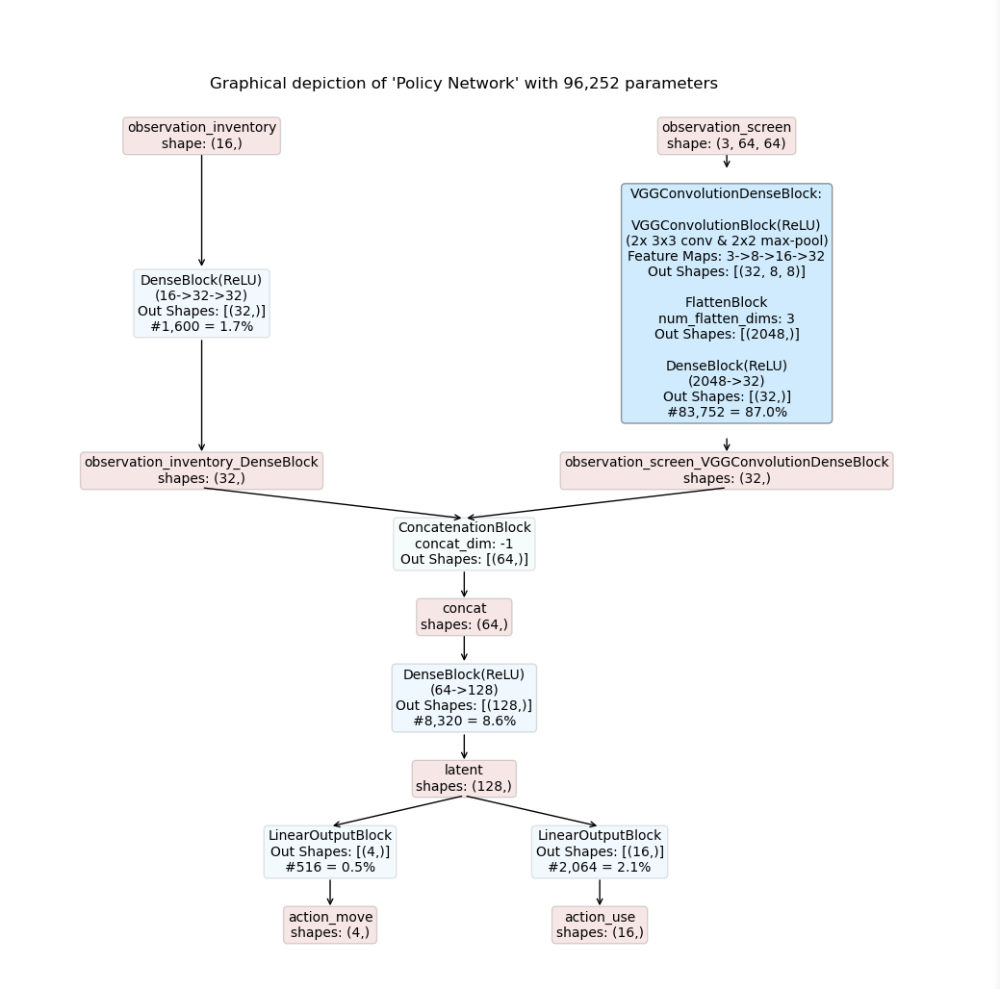
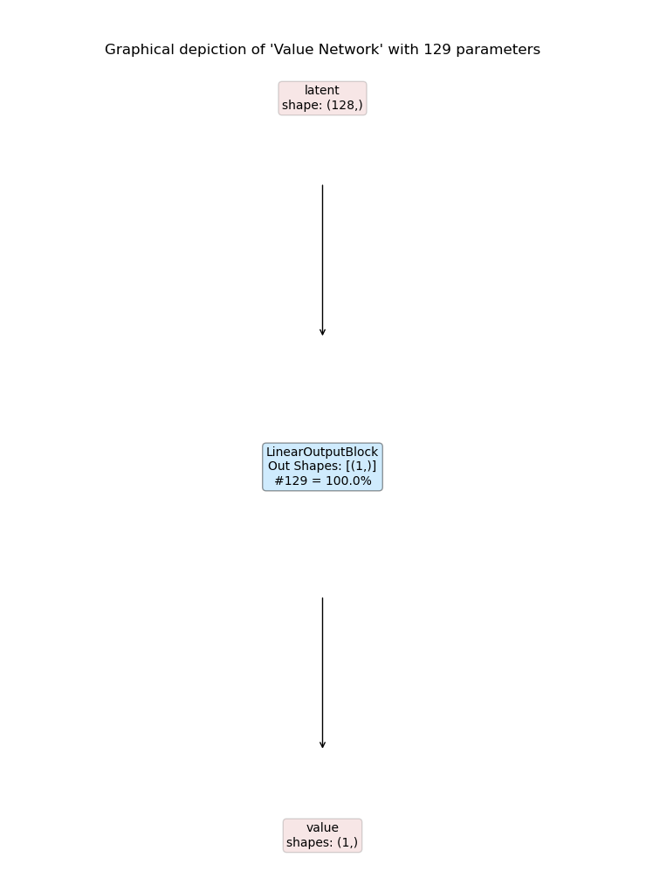

.. _template_models:

Working with Template Models
============================
The Maze template :ref:`model composer <model_composers>` allows us to compose policy and value networks
directly from an environment's observation and action space specification
according to a selected model template and a corresponding model config.
The central part of a template model composer is the :ref:`Model Builder <architecture_templates>` holding an
:ref:`Inference Block <inference_graph_visualization>` template (architecture template), which is then instantiated
according to the config.

Next, we will introduce the general working principles.
However, you can of course directly jump to the examples below to see how to build a
:ref:`feed forward <template_feed_forward>` as well as a
:ref:`recurrent policy network <template_recurrent>` using the ConcatModelBuilder
or check out how to work with simple :ref:`single observation and action environments <template_simple>`.

List of Features
----------------

A template model supports the following features:

 - Works with dictionary observation spaces.
 - Maps individual observations to modalities via the **Observation Modality Mapping**.
 - Allows to individually assign :ref:`Perception Blocks <perception_block>` to modalities via the **Modality Config**.
 - Allows to pick :ref:`architecture templates <architecture_templates>` defining the underlying modal structure via
   **Maze Model Builders**.
 - Cooperates with the :ref:`Distributions Module <action_spaces_and_distributions_module>` supporting customization
   of action and value outputs.
 - Allows to individually specify shared embedding keys for actor critic models; this enables shared embeddings
   between actor and critic.

.. note::
    Maze so far does not support "end-to-end" default behaviour but instead provides config templates,
    which can be adopted to the respective needs.
    We opted for this route as complete defaults might lead to unintended and non-transparent results.

.. _architecture_templates:

Model Builders (Architecture Templates)
---------------------------------------

This section lists and describes the available Model Builder architectures templates.
Before we describe the builder instances in more detail we provide some information on the available block types:

- **Fixed**: these blocks are fixed and are applied by the model builder per default.
- **Preset**: these blocks are predefined for the respective model builder. They are basically place holders for which
  you can specify the perception blocks they should hold.
- **Custom**: these blocks are introduced by the user for processing the respective observation modalities (types)
  such as features or images.

.. _concat_model_builder:

**ConcatModelBuilder** (:ref:`Reference Documentation <perception_builders_reference>`)

Model builder details:

- Processes the individual observations with **modality blocks** (custom).
- Joins the respective modality hidden representations via a **concatenation block** (fixed).
- The resulting representation is then further processed by the **hidden** and **recurrence block** (preset).

.. _template_feed_forward:

Example 1: Feed Forward Models
------------------------------

In this example we utilize the :ref:`ConcatModelBuilder <concat_model_builder>`
to compose a feed forward actor-critic model processing two observations
for predicting two actions and one critic (value) output.

Observation Space:

* *observation_inventory* : a 16-dimensional feature vector
* *observation_screen* :    a 64 x 64 RGB image

Action Space:

- *action_move* : a :ref:`categorical action <action_spaces_and_distributions>` with four options
  deciding to move [*UP, DOWN, LEFT, RIGHT*]
- *action_use* :  a 16-dimensional :ref:`multi-binary action <action_spaces_and_distributions>`
  deciding which item to use from inventory

The model config is defined as:

.. literalinclude:: code_snippets/ff_concat_model_builder.yaml
  :language: YAML

Details:

 - Models are composed by the Maze :ref:`TemplateModelComposer <model_composers>`.
 - No specific action space and probability distribution overrides are specified.
 - The model is based on the ConcatModelBuilder architecture template.
 - No shared embedding is used.
 - Observation *observation_inventory* is mapped to the user specified custom modality *feature*.
 - Observation *observation_screen* is mapped to the user specified custom modality *image*.
 - Modality Config:

    - Modalities of type *feature* are processed with a DenseBlock.
    - Modalities of type *image* are processed with a VGGConvolutionDenseBlock.
    - The concatenated joint spaces is processed with another DenseBlock.
    - No recurrence is employed.

The resulting inference graphs for an actor-critic model are shown below:

.. _template_recurrent:

Example 2: Recurrent Models
---------------------------

In this example we utilize the :ref:`ConcatModelBuilder <concat_model_builder>`
to compose a recurrent actor-critic model for the :ref:`the previous example <template_feed_forward>`.

.. literalinclude:: code_snippets/rnn_concat_model_builder.yaml
  :language: YAML

Details:

- The main part of the model is identical to the example above.
- However, the example adds an additional recurrent block (LSTMLastStepBlock) considering not only the present but also
  the *k* previous time steps for its action and value predictions.

The resulting inference graphs for a recurrent actor-critic model are shown below:

.. _template_simple:

Example 3: Single Observation and Action Models
-----------------------------------------------

Even though designed for more complex models
which process multiple observations and prediction multiple actions at the same time
you can of course also compose models for simpler use cases.

In this example we utilize the :ref:`ConcatModelBuilder <concat_model_builder>`
to compose an actor-critic model for OpenAI Gym's `CartPole Env <https://gym.openai.com/envs/CartPole-v0/>`_.
CartPole has an observation space with dimensionality four and a discrete action spaces with two options.

The model config is defined as:

.. literalinclude:: code_snippets/cartpole_concat_model_builder.yaml
  :language: YAML

The resulting inference graphs for an actor-critic model are shown below:

.. image:: cartpole_concat_policy_graph.png
    :width: 49 %
.. image:: cartpole_concat_critic_graph.png
    :width: 49 %

Details:

- When there is only one observation, as for the present example,
  concatenation acts simply as an identity mapping of the previous output tensor
  (in this case *observation_DenseBlock*).

.. _template_shared_feed_forward:

Example 4: Shared Embedding Feed Forward Model
----------------------------------------------

In case of large dimensional input spaces it might sometimes be useful to share the embedding between the actor and
critic network when training with an actor-critic algorithm. In this example we showcase how this can be done with
the template model composer on the :ref:`Example 1 <template_feed_forward>`. Here everything stays the same, with one
small exception: Now we specify the shared embedding key in the model builder config to be `['latent']` as can be seen
below.

The model config is defined as:

.. literalinclude:: code_snippets/ff_shared_embedding_concat_model_builder.yaml
  :language: YAML

Now the output of the perception block `'latent'` will be used as the input to the critic network. The resulting
inference graphs for an actor-critic model are shown below:

Where to Go Next
----------------
 - You can read up on our general introduction to the :ref:`Perception Module <perception_module>`.
 - Here we explain how to define and work with :ref:`custom models <custom_models>` in case the template models are not
   sufficient.
