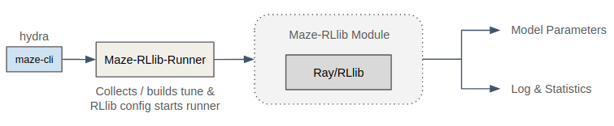
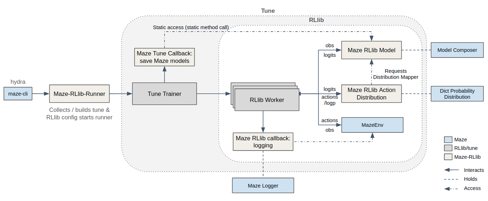

.. _maze_rllib_runner:

Maze RLlib Runner
=================

The RLlib Runner allows to use RLlib Trainers in combination with Maze models and environments.
`Ray-RLlib <https://docs.ray.io/en/master/rllib.html>`_ is one of the most popular RL frameworks
(algorithm collections) within the scientific community but also when it comes to practical relevance.
It already comprises an extensive and tuned collection of various different RL training
algorithms. To gain access to RLlib’s algorithm collection while still having access to all of practical Maze features
we introduce the Maze Rllib Module.
It basically wraps
:ref:`Maze models <perception_module>` (including our extensive Perception Module),
:ref:`Maze environments <env-hierarchy>` (including wrappers) as well as the customizable
:ref:`Maze action distributions <action_spaces_and_distributions_module>`.
It further allows us to use the Maze hydra cmd-line interfaces together with RLlib
while at the same time using the well optimized algorithms from RLlib.

This page gives an overview of the RLlib module and provides examples on how to apply it.

List of Features
----------------

* Use Maze environments, models and action distributes in conjunction with RLlib algorithms.
* Make full use of the Maze environment customization utils (wrappers, pre-processing, ...).
* Use the hydra cmd-line interface to start training runs.
* Models trained with the Maze RLlib Runner are fully compatible with the remaining framework (except when using
  the default RLlib models).

Example 1: Training with Maze-RLlib and Hydra
---------------------------------------------

Using RLlib algorithms with Maze and Hydra works analogously to
:ref:`starting training <training-first_run>` with native :ref:`Maze Trainers <maze_trainers>`.
To train the CartPole environment with RLlib's PPO, run:

.. code-block:: console

  $ maze-run -cn conf_rllib env.name=CartPole-v0 rllib/algorithm=ppo

Here the ``-cn conf_rllib`` argument specifies to use the ``conf_rllib.yaml``
(available in ``maze-rllib``) package, as our root config file.
It specifies the way how to use RLlib trainers within Maze.
(For more on root configuration files, see :ref:`Hydra overview<hydra-overview-config_root>`.)

Example 2: Overwriting Training Parameters
------------------------------------------

Similar to :ref:`native Maze trainers <training-default_run>`, the parametrization of RLlib training runs is also done via
Hydra. The main parameters for customizing training and are:

- Environment (``env`` configuration group), configuring which environment the training runs on, this stays the same as
  in maze-train for example.
- Algorithm (``rllib/algorithm`` configuration group), specifies the algorithm and its configuration
  (:ref:`all supported algorithms <maze_rllib-supported_algorithms>`).
- Model (``model`` configuration group), specifying how the models for policies and (optionally) critics
  should be assembled, this also stays the same as in maze-train.
- Runner (``rllib/runner`` configuration group), specifies how training is run (e.g. locally, in development mode).
  The runner is also the main object responsible for administering the whole training run.. The runner is also the main
  object responsible for administering the whole training run.

To train with a different algorithm we simply have to specify the ``rllib/algorithm`` parameter:

.. code-block::

  $ maze-run -cn conf_rllib env.name=CartPole-v0 rllib/algorithm=a3c

Furthermore, we have full access to the algorithm hyper parameters defined by RLlib
and can overwrite them. E.g., to change the learning rate and rollout fragment length, execute

.. code-block::

  $ maze-run -cn conf_rllib env.name=CartPole-v0 rllib/algorithm=a3c \
    algorithm.config.lr=0.001 algorithm.config.rollout_fragment_length=50

Example 3: Training with RLlib's Default Models
-----------------------------------------------

Finally, it is also possible to utilize the RLlib default model builder by specifying ``model=rllib``.
This will load the rllib default model and parameters, which can again be customized via Hydra:

.. code-block::

  $ maze-run -cn conf_rllib env.name=CartPole-v0 model=rllib \
    model.fcnet_hiddens=[128,128] model.vf_share_layers=False

.. _maze_rllib-supported_algorithms:

Supported Algorithms
--------------------

* `Advantage Actor-Critic (A2C, A3C) <https://docs.ray.io/en/latest/rllib-algorithms.html#a2c>`_
* `Deep Deterministic Policy Gradients (DDPG, TD3) <https://docs.ray.io/en/latest/rllib-algorithms.html#ddpg>`_
* `Distributed Prioritized Experience Replay (Ape-X) <https://docs.ray.io/en/latest/rllib-algorithms.html#apex>`_
* `Deep Q Networks (DQN, Rainbow, Parametric DQN) <https://docs.ray.io/en/latest/rllib-algorithms.html#dqn>`_
* `Importance Weighted Actor-Learner Architecture (IMPALA) <https://docs.ray.io/en/latest/rllib-algorithms.html#impala>`_
* `Model-Agnostic Meta-Learning (MAML) <https://docs.ray.io/en/latest/rllib-algorithms.html#maml>`_
* `Policy Gradients (PG) <https://docs.ray.io/en/latest/rllib-algorithms.html#pg>`_
* `Proximal Policy Optimization (PPO) <https://docs.ray.io/en/latest/rllib-algorithms.html#ppo>`_
* `Asynchronous Proximal Policy Optimization (APPO) <https://docs.ray.io/en/latest/rllib-algorithms.html#appo>`_

The Bigger Picture
------------------

The figure below shows an overview of how the RLlib Module connects to the different Maze components in more detail:

Good to Know
------------

.. tip::
    Using the the argument ``rllib/runner=dev`` starts ray in local mode, by default sets the number workers to 1
    and increases the log level (resulting in more information being printed). This is especially useful for debugging.

.. tip::
    When :ref:`watching the training progress <logging>` of RLlib training runs with Tensorboard
    make sure to start Tensorboard with ``--reload_multifile true`` as both Maze and RLlib will dump an event log.

Where to Go Next
----------------
- After training, you might want to :ref:`rollout <rollouts>` the trained policy to further evaluate it
  or record the actions taken.
- To create a custom Maze environment, you might want to review :ref:`Maze environment hierarchy<env-hierarchy>`
  and :ref:`creating a Maze environment from scratch<env_from_scratch>`.
- To build and use custom Maze models please refer to :ref:`Maze Perception Module<perception_module>`.
- For more details on Hydra and how to use it go to :ref:`configuration with Hydra<hydra>`.
- You can read up on our general introduction to the :ref:`Maze training workflow <training>`.