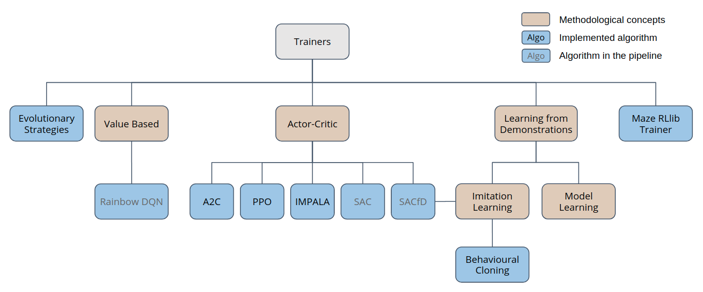

.. |asynchronous_methods_for_deep_reinforcement_learning| raw:: html

   <a href="https://arxiv.org/abs/1602.01783" target="_blank">Asynchronous methods for deep reinforcement learning</a>

.. |proximal_policy_optimization_algorithms| raw:: html

   <a href="https://arxiv.org/abs/1707.06347" target="_blank">Proximal policy optimization algorithms</a>

.. |impala_scalable_distributed_deep_rl_with_importance_weighted_actor_learner_architectures| raw:: html

   <a href="https://arxiv.org/abs/1802.01561" target="_blank">Impala: Scalable distributed deep-rl with importance weighted actor-learner architectures</a>

.. |soft_actor_critic_off_policy_maximum_entropy_deep_reinforcement_learning_with_a_stochastic_actor| raw:: html

   <a href="https://arxiv.org/abs/1801.01290" target="_blank">Soft Actor-Critic: Off-Policy Maximum Entropy Deep Reinforcement Learning with a Stochastic Actor</a>

.. |soft_actor_critic_algorithms_and_applications| raw:: html

   <a href="https://arxiv.org/abs/1812.05905" target="_blank">Soft Actor-Critic Algorithms and Applications</a>

.. |soft_actor_critic_for_discrete_action_settings| raw:: html

   <a href="https://arxiv.org/abs/1910.07207v2" target="_blank">Soft actor-critic for discrete action settings</a>

.. |imitation_learning_a_survey_of_learning_methods| raw:: html

   <a href="https://dl.acm.org/doi/abs/10.1145/3054912" target="_blank">Imitation learning: A survey of learning methods</a>

.. |evolution_strategies_as_a_scalable_alternative_to_reinforcement_learning| raw:: html

   <a href="https://arxiv.org/abs/1703.03864" target="_blank">Evolution strategies as a scalable alternative to reinforcement learning</a>

.. role:: raw-html(raw)
   :format: html

.. _maze_trainers:

Maze Trainers
=============

Trainers are the central components of the Maze framework
when it comes to optimizing policies using different RL algorithms.
To be more specific, Trainers and TrainingRunners are responsible for the following tasks:

* manage the model types (actor networks, state-critics, state-action-critic, ...),
* manage agent environment interaction and trajectory data generation,
* compute the loss (specific to the algorithm used),
* update the weights in order to decrease the loss and increase the performance,
* collect and log training statistics,
* manage model checkpoints and the training process (e.g., early stopping).

The figure below provides an overview of the currently supported Trainers.

This page gives a general (high-level) overview of the Trainers and corresponding algorithms supported by the Maze
framework. For more details especially on the implementation please refer to the
:ref:`API documentation on Trainers <trainers_ref>`. For more details on the training workflow and how to start trainings
using the Hydra config system please refer to the :ref:`training section <training>`.

Supported Spaces
----------------

If not stated otherwise, Maze Trainers support dictionary spaces for both observations and actions.

If the environment you are working with does not yet interact via dictionary spaces
simply wrap it with the built-in
:class:`~maze.core.wrappers.dict_action_wrapper.DictActionWrapper` for actions
and
:class:`~maze.core.wrappers.dict_observation_wrapper.DictObservationWrapper` for observations.
In case of standard Gym environments just use the :class:`~maze.core.wrappers.maze_gym_env_wrapper.GymMazeEnv`.

.. _maze_trainers-a2c:

Advantage Actor-Critic (A2C)
----------------------------

A2C is a synchronous version of the originally proposed Asynchronous Advantage Actor-Critic (A3C).
As a policy gradient method it maintains a probabilistic policy, computing action selection probabilities,
as well as a critic, predicting the state value function.
By setting the number of rollout steps as well as the number of parallel environments
one can control the batch size used for updating the policy and value function in each iteration.

Mnih, V., Badia, A. P., Mirza, M., Graves, A., Lillicrap, T., Harley, T., Silver, D., & Kavukcuoglu, K. (2016).
|asynchronous_methods_for_deep_reinforcement_learning|.
In International conference on machine learning (pp. 1928-1937).

**Example**

.. code:: bash

    maze-run -cn conf_train env.name=CartPole-v1 algorithm=a2c model=vector_obs critic=template_state

**Algorithm Parameters** | :class:`~maze.train.trainers.a2c.a2c_algorithm_config.A2CAlgorithmConfig`

:raw-html:`

Default parameters (maze/conf/algorithm/a2c.yaml)
`

.. literalinclude:: ../../../maze/conf/algorithm/a2c.yaml
  :language: yaml

:raw-html:`
`

**Runner Parameters** | :class:`~maze.train.trainers.common.actor_critic.actor_critic_runners.ACRunner`

:raw-html:`

Default parameters (maze/conf/algorithm_runner/a2c-dev.yaml)
`

.. literalinclude:: ../../../maze/conf/algorithm_runner/a2c-dev.yaml
  :language: yaml

:raw-html:`
`

:raw-html:`

Default parameters (maze/conf/algorithm_runner/a2c-local.yaml)
`

.. literalinclude:: ../../../maze/conf/algorithm_runner/a2c-local.yaml
  :language: yaml

:raw-html:`
`

.. _maze_trainers-ppo:

Proximal Policy Optimization (PPO)
----------------------------------

The PPO algorithm belongs to the class of actor-critic style policy gradient methods.
It optimizes a “surrogate” objective function adopted from trust region methods.
As such, it alternates between generating trajectory data via agent rollouts from the environment and optimizing the
objective function by means of a stochastic mini-batch gradient ascent.

Schulman, J., Wolski, F., Dhariwal, P., Radford, A., & Klimov, O. (2017).
|proximal_policy_optimization_algorithms|.
arXiv preprint arXiv:1707.06347.

**Example**

.. code:: bash

    maze-run -cn conf_train env.name=CartPole-v1 algorithm=ppo model=vector_obs critic=template_state

**Algorithm Parameters** | :class:`~maze.train.trainers.ppo.ppo_algorithm_config.PPOAlgorithmConfig`

:raw-html:`

Default parameters (maze/conf/algorithm/ppo.yaml)
`

.. literalinclude:: ../../../maze/conf/algorithm/ppo.yaml
  :language: yaml

:raw-html:`
`

**Runner Parameters** | :class:`~maze.train.trainers.common.actor_critic.actor_critic_runners.ACRunner`

:raw-html:`

Default parameters (maze/conf/algorithm_runner/ppo-dev.yaml)
`

.. literalinclude:: ../../../maze/conf/algorithm_runner/ppo-dev.yaml
  :language: yaml

:raw-html:`
`

:raw-html:`

Default parameters (maze/conf/algorithm_runner/ppo-local.yaml)
`

.. literalinclude:: ../../../maze/conf/algorithm_runner/ppo-local.yaml
  :language: yaml

:raw-html:`
`

Importance Weighted Actor-Learner Architecture (IMPALA)
-------------------------------------------------------

IMPALA is a RL algorithm able to scale to a very large number of machines.
Multiple workers collect trajectories (sequences of states, actions and rewards),
which are communicated to a learner responsible for updating the policy by utilizing stochastic mini-batch gradient
decent and the proposed V-trace correction algorithm.
By decoupling rollouts (interactions with the environment) and policy updates the algorithm is considered
off-policy and asynchronous, making it very suitable for compute-intense environments.

Espeholt, L., Soyer, H., Munos, R., Simonyan, K., Mnih, V., Ward, T., Doron, Y., Firoiu, V., Harley, T., Dunning, I., Legg, S., & Kavukcuoglu, K. (2018).
|impala_scalable_distributed_deep_rl_with_importance_weighted_actor_learner_architectures|.
arXiv preprint arXiv:1802.01561.

**Example**

.. code:: bash

    maze-run -cn conf_train env.name=CartPole-v1 algorithm=impala model=vector_obs critic=template_state

**Algorithm Parameters** | :class:`~maze.train.trainers.impala.impala_algorithm_config.ImpalaAlgorithmConfig`

:raw-html:`

Default parameters (maze/conf/algorithm/impala.yaml)
`

.. literalinclude:: ../../../maze/conf/algorithm/impala.yaml
  :language: yaml

:raw-html:`
`

**Runner Parameters** | :class:`~maze.train.trainers.impala.impala_runners.ImpalaRunner`

:raw-html:`

Default parameters (maze/conf/algorithm_runner/impala-dev.yaml)
`

.. literalinclude:: ../../../maze/conf/algorithm_runner/impala-dev.yaml
  :language: yaml

:raw-html:`
`

:raw-html:`

Default parameters (maze/conf/algorithm_runner/impala-local.yaml)
`

.. literalinclude:: ../../../maze/conf/algorithm_runner/impala-local.yaml
  :language: yaml

:raw-html:`
`

.. _maze_trainers-sac:

Soft Actor-Critic (from Demonstrations) (SAC, SACfD)
----------------------------------------------------

An off-policy actor-critic algorithm based on the maximum entropy reinforcement learning framework
with the goal of maximizing expected reward while at the same time maximizing entropy.
SAC exhibits high sample efficiency, is stable across different random seeds,
and achieves competitive performance especially for continuous control tasks.
In contrast to A2C, PPO and IMPALA it utilizes a stochastic state-action critic.

Additionally, our implementation allows to initialize the replay buffer from existing demonstrations (e.g., rollouts)
instead of sampling the initial transitions with the given sampling policy (per default random). This variant is called
Soft Actor-Critic from Demonstrations.

Haarnoja, T., Zhou, A., Abbeel, P., Levine, S. (2018).
|soft_actor_critic_off_policy_maximum_entropy_deep_reinforcement_learning_with_a_stochastic_actor|. arXiv preprint arXiv:1801.01290.,
Haarnoja, T., Zhou, A., Hartikainen, K., Tucker, G., Ha, S., Tan, J., ... & Levine, S. (2018). |soft_actor_critic_algorithms_and_applications|. arXiv preprint arXiv:1812.05905.,
Christodoulou, P. (2019). |soft_actor_critic_for_discrete_action_settings|. arXiv
preprint arXiv:1910.07207.

**Example SAC**

.. code:: bash

    maze-run -cn conf_train env.name=Pendulum-v0 algorithm=sac model=vector_obs critic=template_state_action

**Example SACfD**

.. code:: bash

    maze-run env.name=LunarLander-v3 policy=lunar_lander_heuristics runner.n_episodes=1000
    maze-run -cn conf_train env.name=LunarLander-v3 algorithm=sacfd model=flatten_concat critic=flatten_concat_state_action runner.initial_demonstration_trajectories.input_data=<absolute_experiment_path>/trajectory_data

**Algorithm Parameters** | :class:`~maze.train.trainers.sac.sac_algorithm_config.SACAlgorithmConfig`

:raw-html:`

Default parameters (maze/conf/algorithm/sac.yaml)
`

.. literalinclude:: ../../../maze/conf/algorithm/sac.yaml
  :language: yaml

:raw-html:`
`

**Runner Parameters SAC** | :class:`~maze.train.trainers.sac.sac_runners.SACRunner`

:raw-html:`

Default parameters (maze/conf/algorithm_runner/sac-dev.yaml)
`

.. literalinclude:: ../../../maze/conf/algorithm_runner/sac-dev.yaml
  :language: yaml

:raw-html:`
`

:raw-html:`

Default parameters (maze/conf/algorithm_runner/sac-local.yaml)
`

.. literalinclude:: ../../../maze/conf/algorithm_runner/sac-local.yaml
  :language: yaml

:raw-html:`
`

**Runner Parameters SACfD** | :class:`~maze.train.trainers.sac.sac_runners.SACRunner`

:raw-html:`

Default parameters (maze/conf/algorithm_runner/sacfd-dev.yaml)
`

.. literalinclude:: ../../../maze/conf/algorithm_runner/sacfd-dev.yaml
  :language: yaml

:raw-html:`
`

:raw-html:`

Default parameters (maze/conf/algorithm_runner/sacfd-local.yaml)
`

.. literalinclude:: ../../../maze/conf/algorithm_runner/sacfd-local.yaml
  :language: yaml

:raw-html:`
`

.. _maze_trainers-bc:

Behavioural Cloning (BC)
------------------------

Behavioural cloning is a simple imitation learning algorithm, that infers the behaviour of a "hidden" policy by
imitating the actions produced for a given observation in a supervised learning setting.
As such, it requires a set of training (example) trajectories collected prior to training.

Hussein, A., Gaber, M. M., Elyan, E., & Jayne, C. (2017).
|imitation_learning_a_survey_of_learning_methods|.
ACM Computing Surveys (CSUR), 50(2), 1-35.

**Example:** :ref:`Imitation Learning and Fine-Tuning <imitation>`

**Algorithm Parameters** | :class:`~maze.train.trainers.imitation.bc_algorithm_config.BCAlgorithmConfig`

:raw-html:`

Default parameters (maze/conf/algorithm_runner/bc.yaml)
`

.. literalinclude:: ../../../maze/conf/algorithm/bc.yaml
  :language: yaml

:raw-html:`
`

**Runner Parameters** | :class:`~maze.train.trainers.imitation.bc_runners.BCRunner`

:raw-html:`

Default parameters (maze/conf/algorithm_runner/bc-dev.yaml)
`

.. literalinclude:: ../../../maze/conf/algorithm_runner/bc-dev.yaml
  :language: yaml

:raw-html:`
`

:raw-html:`

Default parameters (maze/conf/algorithm_runner/bc-local.yaml)
`

.. literalinclude:: ../../../maze/conf/algorithm_runner/bc-local.yaml
  :language: yaml

:raw-html:`
`

.. _maze_trainers-es:

Evolutionary Strategies (ES)
----------------------------

Evolutionary strategies is a black box optimization algorithm that utilizes
direct policy search and can be very efficiently parallelized. Advantages of this methods include being invariant to
action frequencies as well as delayed rewards. Further, it shows tolerance for extremely long time horizons,
since it does need to compute or approximate a temporally discounted value function.
However, it is considered less sample efficient then actual RL algorithms.

Salimans, T., Ho, J., Chen, X., Sidor, S., & Sutskever, I. (2017).
`Evolution strategies as a scalable alternative to reinforcement learning. <https://arxiv.org/abs/1703.03864>`_
arXiv preprint arXiv:1703.03864.

**Example**

.. code:: bash

    maze-run -cn conf_train env.name=CartPole-v1 algorithm=es model=vector_obs

**Algorithm Parameters** | :class:`~maze.train.trainers.es.es_algorithm_config.ESAlgorithmConfig`

:raw-html:`

Default parameters (maze/conf/algorithm_runner/es.yaml)
`

.. literalinclude:: ../../../maze/conf/algorithm/es.yaml
  :language: yaml

:raw-html:`
`

**Runner Parameters** | :class:`~maze.train.trainers.es.es_runners.ESMasterRunner`

:raw-html:`

Default parameters (maze/conf/algorithm_runner/es-dev.yaml)
`

.. literalinclude:: ../../../maze/conf/algorithm_runner/es-dev.yaml
  :language: yaml

:raw-html:`
`

:raw-html:`

Default parameters (maze/conf/algorithm_runner/es-local.yaml)
`

.. literalinclude:: ../../../maze/conf/algorithm_runner/es-local.yaml
  :language: yaml

:raw-html:`
`

Where to Go Next
----------------

- You can read up on our general introduction to the :ref:`Maze Training Workflow <training>`.
- To build and use custom Maze models please refer to :ref:`Maze Perception Module<perception_module>`.
- You can also look up the supported
  :ref:`Action Spaces and Distributions Module<action_spaces_and_distributions_module>`.
