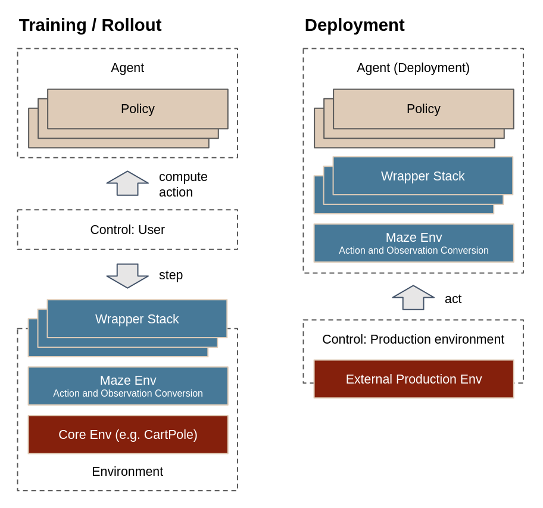

.. _deployment:

Deployment
==========

In experimental setting, deploying an agent means running a rollout on
a given test environment and evaluating the results. However, in
a real-world scenario, when we are dealing with a production environment,
running a rollout is usually not so easily feasible.

The main difference between experimental rollouts and real-world
environments is that production environments often do not follow
the Gym model and cannot be easily stepped. Instead, the control
flow is inverted, with the environment querying the agent for
an action, whenever it is ready.

The catch here is that in the Gym environment model, the wrappers
that modify the environment behavior are considered to be a part
of the environment (i.e., they are stepped together with it).
However, during deployment, the production environment expects
the wrapper stack to be maintained by the agent (after all,
the production environment should not concern itself with the likes
of observation post-processing and step-skipping).

The :code:`AgentDeployment` component in Maze deals with
exactly this matter -- packaging the policy together with the wrapper
stack and other components, so you can only call :code:`act` in
a production setting and get a processed action back, with things
like statistics logging and observation frame stacking staying intact.

Building a Deployment Agent
---------------------------

There are two ways to build a deployment agent -- either from
an already-instantiated policy and environment (which may include
a stack of wrappers):

.. literalinclude:: code_snippets/agent_deployment_init_python.py
  :language: PYTHON

Or, by providing configuration dictionary for the policy and environment
(and, optionally, for wrappers) obtained from hydra or elsewhere:

.. literalinclude:: code_snippets/agent_deployment_init_hydra.py
  :language: PYTHON

(The configuration structure here is shared with rollouts. To better
understand it, see :ref:`Rollouts<rollouts>`.)

Alternatively, you can mix and match these approaches, providing
an already-instantiated policy and an environment config, or vice versa.

After that, you can already start querying the agent for actions using
the :code:`act` method:

.. code-block:: python

  maze_action = agent_deployment.act(maze_state, reward, done, info)

When the episode is done, you should close the agent deployment.
At this point, the agent deployment resets the env to write out
statistics and ensure all wrappers finish the episode properly.

.. note::
  Ensure that you **query the agent for actions** from a single episode,
  **in order as the states are encountered**. Otherwise, parts of the wrapper
  stack (like stats logging or observation frame stacking) might become
  inconsistent, leading to passing wrong observations to the policy.

.. note::
  Currently, the Agent Deployment supports a single episode only.
  Once the episode is done, :code:`close` the deployment and initialize a new
  instance. Support for continued resets will likely be added in the future.

The full working example below demonstrates the agent deployment
on Gym CartPole environment, where we initialize the agent deployment
and then use the :code:`external_env`
to simulate an external production env (to obtain states from),
looks like:

.. literalinclude:: code_snippets/agent_deployment_full_example.py
  :language: PYTHON

Notice that above, we are dealing with :code:`maze_state`s and
:code:`maze_actions`, i.e., in the format they come directly from
the environment. The translation to policy-friendly format
of actions and observations is handled as part of the wrapper
stack (where they are passed through action/observation conversion
interfaces and the individual wrappers).

How does this work under the hood?
----------------------------------

When initializing the :code:`AgentDeployment`, an existing
environment including the wrapper stack is taken (or first
initialized, if environment configuration was passed in).

Then, the core environment (the component just under the maze environment,
providing the core functionality -- see :ref:`Maze Environment Hierarchy<env-hierarchy>`)
is swapped out for so called :code:`ExternalCoreEnv`, and then
executed in a run loop with the provided policy on a separate thread.

The external core env hijacks execution of the step function, and
pauses the thread, waiting until new :code:`maze_state` object
(with associated reward, etc.) is passed in from the :code:`AgentDeployment`,
which runs on the main thread.

Despite what this looks like at the first glance, this is not
a concurrent setup. The threads are used only for hijacking
the execution in the step function, and they never run
concurrently during env stepping.

Either the main thread, or the second thread are always paused.
First, the environment on the second thread is waiting
for obtaining the next maze state from agent deployment on the
first thread. Then, agent deployment is waiting for the environment
run loop to iterate to the next step function, and return
the processed action back.

Where to Go Next
----------------

- To better understand the hierarchy of Core Env, Maze Env and Wrappers
  and how they affect the execution flow, see :ref:`Maze Environment Hierarchy<env-hierarchy>`
- Before deployment, you might want to :ref:`train your own policy<training>`
  and then evaluate it using :ref:`rollouts<rollouts>`.

