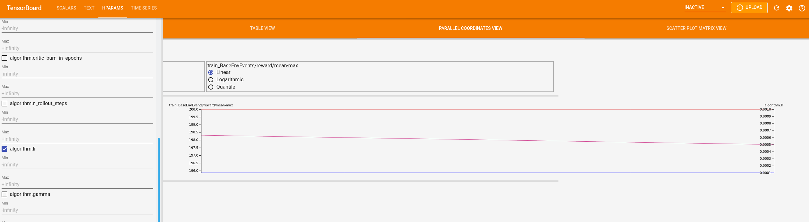

.. |maze_cartpole_template| raw:: html

   <a href="https://github.com/enlite-ai/maze-cartpole" target="_blank">project template</a>

.. |conf_train| raw:: html

   <a href="https://github.com/enlite-ai/maze/blob/main/maze/conf/conf_train.yaml" target="_blank">conf_train</a>

.. |hydra_build_in_experiment_config| raw:: html

   <a href="https://hydra.cc/docs/patterns/configuring_experiments/" target="_blank">Hydra's built-in Experiment Configuration</a>

.. |vector_obs| raw:: html

   <a href="https://github.com/enlite-ai/maze/blob/main/maze/conf/wrappers/vector_obs.yaml" target="_blank">vector_obs</a>

.. |hydra_sweeper| raw:: html

   <a href="https://hydra.cc/docs/plugins/nevergrad_sweeper" target="_blank">Hydra's Sweeper</a>

.. |hydra_rq_launcher| raw:: html

   <a href="https://hydra.cc/docs/plugins/rq_launcher" target="_blank">scalable options</a>

.. |hydra_nevergrad_sweeper| raw:: html

   <a href="https://hydra.cc/docs/plugins/nevergrad_sweeper" target="_blank">Nevergrad</a>

.. |hydra_nevergrad_sweeper_defining_target_params_example| raw:: html

   <a href="https://hydra.cc/docs/plugins/nevergrad_sweeper/#defining-the-parameters" target="_blank">Hydra docs</a>

.. |hydra_nevergrad_sweeper_example| raw:: html

   <a href="https://github.com/facebookresearch/hydra/blob/master/plugins/hydra_nevergrad_sweeper/example/config.yaml/" target="_blank">example</a>

.. _experimenting:

Experiment Configuration
========================

Launching experiments with the Maze command line interface (CLI)
is based on the :ref:`Hydra configuration system <hydra>` and hence also closely follows Hydra's experimentation
workflow. In general, there are different options for carrying out and configuring experiments with Maze.
(To see experiment configuration in action, check out our |maze_cartpole_template|.)

Command Line Overrides
----------------------

To quickly play around with parameters in an interactive (temporary) fashion
you can utilize Hydra command line overrides to reset parameters specified
in the default config (e.g., |conf_train|).

.. code:: bash

    maze-run -cn conf_train env.name=CartPole-v1 algorithm=ppo algorithm.lr=0.0001

The example above changes the trainer to PPO and optimizes with a learning rate of 0.0001.
You can of course override any other parameter of your training and rollout runs.

For an in depth explanation of the override concept we refer to our
:ref:`Hydra documentation <hydra-overview-overrides>`.

.. _experimenting_files:

Experiment Config Files
-----------------------

For a more persistent way of structuring your experiments you can also make use of |hydra_build_in_experiment_config|.

This allows you to maintain multiple experimental config files
each only specifying the changes to the default config (e.g., |conf_train|).

.. literalinclude:: ../../../maze/conf/experiment/cartpole_ppo_wrappers.yaml
    :language: yaml
    :caption: conf/experiment/cartpole_ppo_wrappers.yaml

The experiment config above sets the trainer to PPO, the learning rate to 0.0001
and additionally activates the |vector_obs| wrapper stack.

To start the training run with this config file, run:

.. code:: bash

    maze-run -cn conf_train +experiment=cartpole_ppo_wrappers

You can find a more detail explanation on how experiments are embedded in the overall configuration system in our
:ref:`Hydra experiment documentation <hydra-custom-experiments>`.

Hyper Parameter Grid Search
---------------------------

To perform a simple grid search over selected hyper parameters you can use |hydra_sweeper|
which converts lists of command line arguments into distinct jobs.

The example below shows how to launch the same experiment with three different learning rates.

.. code:: bash

    maze-run -cn conf_train env.name=CartPole-v1 algorithm=ppo algorithm.n_epochs=5 algorithm.lr=0.0001,0.0005,0.001 --multirun

We then recommend to compare the different configurations with Tensorboard.

.. code:: bash

    tensorboard --logdir outputs/

Within tensorboard the hyperparameters of the grid search are logged as well, which makes comparison between runs more
convenient as can be seen in the figure below:

Per default Hydra uses the local (sequential) runner for processing jobs.

For setting up a more scalable (local, parallel) grid search
we recommend to create an experiments file for configuration.
As a starting point Maze already contains a simple local grid search setting
based on the built-in :class:`MazeLocalLauncher <hydra_plugins.maze_local_launcher.MazeLocalLauncher>`.

.. literalinclude:: ../../../maze/conf/experiment/grid_search.yaml
  :language: yaml
  :caption: conf/experiment/grid_search.yaml

To repeat the grid search from above, but this time with multiple parallel workers, run:

.. code:: bash

    maze-run -cn conf_train env.name=CartPole-v1 algorithm=ppo algorithm.n_epochs=5 algorithm.lr=0.0001,0.0005,0.001 +experiment=grid_search --multirun

Besides the built-in :class:`MazeLocalLauncher <hydra_plugins.maze_local_launcher.MazeLocalLauncher>`,
there are also more |hydra_rq_launcher| available with Hydra.

Hyperparameter Optimization
----------------------------

Maze also support hyper parameter optimization beyond vanilla grid search via
|hydra_nevergrad_sweeper| (in case you have enough resources available).

You can start with the experiment template below and adopt it to your needs
(for details on how to define the search space we refer to the |hydra_nevergrad_sweeper_defining_target_params_example|
and this |hydra_nevergrad_sweeper_example|).

.. literalinclude:: ../../../maze/conf/experiment/nevergrad.yaml
  :language: yaml
  :caption: conf/experiment/nevergrad.yaml

To start a hyper parameter optimization, run:

.. code:: bash

    maze-run -cn conf_train env.name=Pendulum-v0 algorithm.n_epochs=5 +experiment=nevergrad --multirun

Where to Go Next
----------------

- Here you can learn how to set up a :ref:`custom configuration/experimentation module <hydra-custom-search_path>`.
- If you would like to learn about more advanced configuration options you can dive into the
  :ref:`Hydra configuration system documentation<hydra>`.
- Read up on :ref:`training <training>` and :ref:`rollouts <rollouts>`.
- Clone this |maze_cartpole_template| to start your own Maze project.