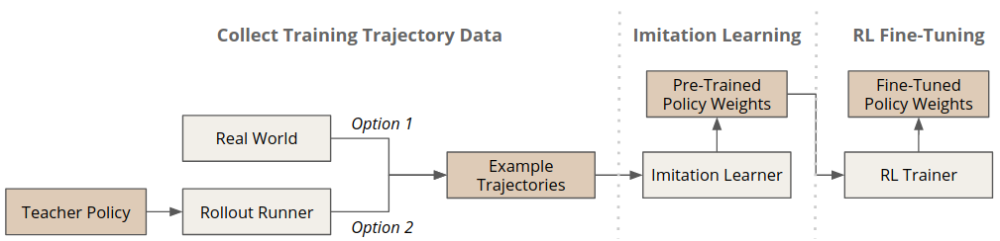
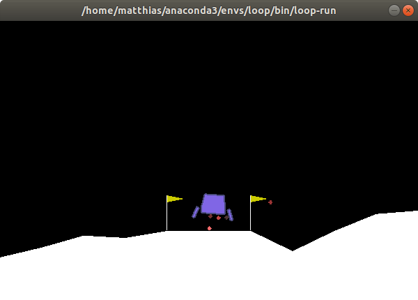
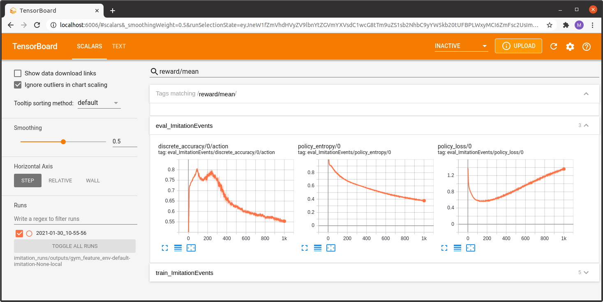
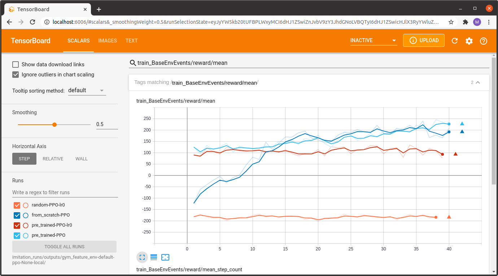

.. _imitation:

Imitation Learning and Fine-Tuning
==================================

Imitation learning refers to the task of learning a policy by imitating the behaviour of an existing teacher policy
usually represented as a fixed set of example trajectories.
In some scenarios we might even have direct access to the actual teacher policy itself
allowing us to generate as many training trajectories as required.
Imitation learning is especially useful for initializing a policy
to quick-start an actual training by interaction run
or for settings where no training environment is available at all (e.g., offline RL).

Since imitation learning involves rollouts, this is as of yet not supported by :class:`~maze.api.run_context.RunContext`. A guide for managed pure-Python imitation learning will be provided together will rollout support.

.. contents:: Overview:
    :depth: 1
    :local:
    :backlinks: top

Collect Training Trajectory Data
---------------------------------

This section explains how to rollout a policy for collecting example trajectories.
As the training trajectories might be already available (e.g., collected in practice)
this step is optional.

As an example environment we pick the discrete version of the
`LunarLander environment <https://gym.openai.com/envs/LunarLander-v2>`_
as it already provides a heuristic policy which we can use to collect or training trajectories for imitation learning.

But first let's check if the policy actually does something meaningful by running a few rendering rollouts:

.. code-block:: console

  maze-run env.name=LunarLander-v2 policy=lunar_lander_heuristics \
  runner=sequential runner.render=true runner.n_episodes=3

Hopefully this looks good and we can continue with actually collecting example trajectories for imitation learning.

The command bellow performs 3 rollouts of the heuristic policy
and records them to the output directory.

.. code-block:: console

  maze-run env.name=LunarLander-v2 policy=lunar_lander_heuristics runner.n_episodes=3

You will get the following output summarizing the statistics of the rollouts.

.. code-block:: console

     step|path                                                                  |           value
    =====|======================================================================|================
        1|rollout_stats    DiscreteActionEvents  action|  substep_0/action      |[len:583, μ:1.2]
        1|rollout_stats    BaseEnvEvents         reward|  median_step_count     |         200.000
        1|rollout_stats    BaseEnvEvents         reward|  mean_step_count       |         194.333
        1|rollout_stats    BaseEnvEvents         reward|  total_step_count      |         583.000
        1|rollout_stats    BaseEnvEvents         reward|  total_episode_count   |           3.000
        1|rollout_stats    BaseEnvEvents         reward|  episode_count         |           3.000
        1|rollout_stats    BaseEnvEvents         reward|  std                   |          51.350
        1|rollout_stats    BaseEnvEvents         reward|  mean                  |         190.116
        1|rollout_stats    BaseEnvEvents         reward|  min                   |         121.352
        1|rollout_stats    BaseEnvEvents         reward|  max                   |         244.720

The trajectories will be dumped similar to the file structure shown below.

.. code-block:: console

    - outputs/<experiment_path>
        - maze_cli.log
        - event_logs
        - trajectory_data
            - 00653455-d7e2-4737-a82b-d6d1bfce12f7.pkl
            - ...

The pickle files contain the distinct episodes recorded as
:class:`StateTrajectoryRecord <maze.core.trajectory_recording.records.trajectory_record.StateTrajectoryRecord>` objects,
each containing a sequence of
:class:`StateRecord <maze.core.trajectory_recording.records.state_record.StateRecord>` objects,
which keep the trajectory data for one step (state, action, reward, ...).

Learn from Example Trajectories
-------------------------------

Given the trajectories recorded in the previous step
we now train a policy with :ref:`behavioral cloning <maze_trainers-bc>`, a simple version of imitation learning.

To do so we simply provide the trajectory data as an argument and run:

.. code-block:: console

    maze-run -cn conf_train env.name=LunarLander-v2 model=vector_obs wrappers=vector_obs \
    algorithm=bc algorithm.validation_percentage=50 \
    runner.dataset.dir_or_file=<absolute_experiment_path>/trajectory_data

.. code-block:: console

    ...
    ********** Epoch 24: Iteration 1500 **********
     step|path                                                                    |    value
    =====|========================================================================|=========
       96|train     ImitationEvents       discrete_accuracy     0/action          |    0.948
       96|train     ImitationEvents       policy_loss           0                 |    0.150
       96|train     ImitationEvents       policy_entropy        0                 |    0.209
       96|train     ImitationEvents       policy_l2_norm        0                 |   42.416
       96|train     ImitationEvents       policy_grad_norm      0                 |    0.870
     step|path                                                                    |    value
    =====|========================================================================|=========
       96|eval      ImitationEvents       discrete_accuracy     0/action          |    0.947
       96|eval      ImitationEvents       policy_loss           0                 |    0.152
       96|eval      ImitationEvents       policy_entropy        0                 |    0.207
    -> new overall best model -0.15179!
    ...

As with all trainers, we can watch the training progress with Tensorboard.

.. code-block:: console

    tensorboard --logdir outputs/

Once training is complete we can check how the behaviourally cloned policy performs in action.

.. code-block:: console

    maze-run env.name=LunarLander-v2 model=vector_obs wrappers=vector_obs \
    policy=torch_policy input_dir=outputs/<imitation-learning-experiment>

.. code-block:: console

     step|path                                                                 |           value
    =====|=====================================================================|=================
        1|rollout_stats    DiscreteActionEvents  action    substep_0/action    |[len:8033, μ:1.2]
        1|rollout_stats    BaseEnvEvents         reward    median_step_count   |          186.000
        1|rollout_stats    BaseEnvEvents         reward    mean_step_count     |          160.660
        1|rollout_stats    BaseEnvEvents         reward    total_step_count    |         8033.000
        1|rollout_stats    BaseEnvEvents         reward    total_episode_count |           50.000
        1|rollout_stats    BaseEnvEvents         reward    episode_count       |           50.000
        1|rollout_stats    BaseEnvEvents         reward    std                 |          111.266
        1|rollout_stats    BaseEnvEvents         reward    mean                |          101.243
        1|rollout_stats    BaseEnvEvents         reward    min                 |         -164.563
        1|rollout_stats    BaseEnvEvents         reward    max                 |          282.895

With a mean reward of 101 this already looks like a promising starting point for RL fine-tuning.

Fine-Tune a Pre-Trained Policy
------------------------------

In the last section we show how to fine-tune the pre-trained policy with a model-free RL learner
such as :ref:`PPO <maze_trainers-ppo>`.
It is basically a standard PPO training run initialized with the imitation learning output.

.. code-block:: console

    maze-run -cn conf_train env.name=LunarLander-v2 model=vector_obs critic=template_state wrappers=vector_obs \
    algorithm=ppo runner.eval_repeats=100 runner.critic_burn_in_epochs=10 \
    input_dir=outputs/<imitation-learning-experiment>

Once training started we can observe the progress with Tensorboard
(for the sake of clarity of this example we renamed the experiment directories for the screenshot below).

The Tensorboard log below compares the following experiments:

- a randomly initialized policy trained with learning rate 0.0 (random-PPO-lr0)
- a behavioural cloning pre-trained policy trained with learning rate 0.0 (pre_trained-PPO-lr0)
- a randomly initialized policy trained with PPO (from_scratch-PPO)
- a behavioural cloning pre-trained policy trained with PPO (pre_trained-PPO)

We also included training runs with a learning rate of 0.0 to get a feeling for the performance of
the initial performance of the two models (randomly initialized vs. pre-trained).

As expected, we see that PPO fine-tuning of the pretrained model starts at an initially much higher reward level
compared to the model trained entirely from scratch.

Although this is a quite simple example it is still a nice showcase
for the usefulness of this two-stage learning paradigm.
For scenarios with delayed and/or sparse rewards following this principle
is often crucial to get the RL trainer to start learning at all.

Where to Go Next
----------------

 - You can find more details on :ref:`training <training>` and :ref:`rollouts <rollouts>` on the dedicated pages.
 - You can also read up on how to :ref:`visualize recorded rollouts <collecting-rollouts>`.
 - For further details on the learning algorithms you can visit the :ref:`Trainers <maze_trainers>` page.