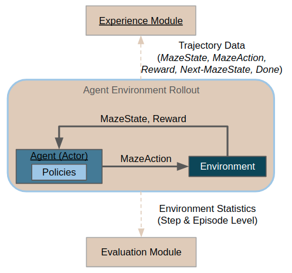

.. _rollouts:

Rollouts
========

During rollouts, the agent interacts with a given environment, issuing actions
obtained from a given policy (be it a heuristic or a trained policy).

Usually, the purpose of rollouts is either evaluation (or even deployment) of
a given policy in a given environment, or collection of trajectory data.
Collected trajectory data can later be used for further learning
(e.g. :ref:`imitation learning <imitation>`)
or for inspecting the policy behavior more closely using
:ref:`trajectory viewers <collecting-rollouts>`.

On this page:

- :ref:`The First Rollout<rollouts-first_rollout>` demonstrates the main mechanics of running a rollout.
- :ref:`Rollout Runner Configuration<rollouts-runner_config>` explains how to configure the rollout runners.
- :ref:`Environment and Agent Configuration<rollouts-env_and_agent>` shows how to configure different environments
  and agents.
- Finally, :ref:`Plain Python Configuration<rollouts-from_python>` shows how to run rollouts without the CLI.

.. _rollouts-first_rollout:

The First Rollout
-----------------

Rollouts can be run from the command line, using the :code:`maze-run` command.
Rollout configuration (:code:`conf_rollout`) is used by default. Hence, to run
your first rollout, it suffices to execute:

.. code-block:: console

  $ maze-run env=gym_env env.name=CartPole-v1

This runs a rollout of a random policy on :code:`cartpole` environment. Statistics
from the rollout are printed to the console, and trajectory data with event logs
are stored in the output directory automatically configured by Hydra.

Alternatively, we might configure the rollouts to run just one episode in sequential mode
and render the env (but more on that and other configuration options below):

.. code-block:: console

  $ maze-run env=gym_env env.name=CartPole-v1 runner=sequential runner.n_episodes=1 runner.render=true

.. _rollouts-runner_config:

Rollout Runner Configuration
----------------------------

Rollouts are run by rollout :ref:`runners<hydra-overview-runners>`,
which are agent- and environment-agnostic (for configuring environments
and agents, see the following section).

By default, rollouts are run in multiple processes in parallel (as can be
seen in the rollout configuration file, which lists :code:`runner: parallel`
in the defaults), and are handled by the ParallelRolloutRunner.

Alternatively, rollouts can be run sequentially in a single process by
opting for the :code:`sequential` runner configuration:

.. code-block:: console

  $ maze-run env=gym_env env.name=CartPole-v1 runner=sequential

This is mainly useful when running a single episode only or for debugging, as
sequential rollouts are much slower.

The available configuration options for both scenarios are listed in
the Hydra runner package (:code:`conf/runner/`).

These are the parameters for :code:`parallel` rollout runner:

.. code-block:: yaml

    # @package _group_
    _target_: maze.core.rollout.parallel_rollout_runner.ParallelRolloutRunner

    # Number of processes to run the rollouts in concurrently
    n_processes: 5

    # Total number of episodes to run
    n_episodes: 50

    # Max steps per episode to perform
    max_episode_steps: 200

    # If true, trajectory data will be recorded and stored in :code:`trajectory_data` directory
    record_trajectory: true

    # If true, event logs will be recorded and stored in `event_logs_directory
    record_event_logs: true

    # (Note that the default output directory is handled by Hydra)

Using these parameters, we can modify the rollout to e.g. be run only in 3 processes,
and be comprised of 100 episodes, each of max 50 steps:

.. code-block:: console

  $ maze-run env=gym_env env.name=CartPole-v1 runner.n_processes=3 \
    runner.n_episodes=100 runner.max_episode_steps=10

(Alternatively, you can create your own configuration file that you will then
supply to the :code:`maze-run` command as described in Hydra primer section).

.. _rollouts-env_and_agent:

Environment and Policy Configuration
------------------------------------

Environment and policy are configured using the :code:`env`, resp. :code:`policy` Hydra
packages. Rollout runners are environment- and agent-agnostic, and will attempt
to instantiate the type specified in the config files using Maze Factory.

Environment is expected to conform to the :code:`StructuredEnv` interface and agent to
the :code:`StructuredPolicy` interface.

For agents, there are the following example config files:

- :code:`policy/random_policy.yaml` for instantiating a class that conforms
  to the :code:`StructuredPolicy` interface directly
- :code:`policy/cutting_2d_greedy_policy` (in :code:`maze-envs/logistics`) for wrapping (potentially multiple) flat
  policies into a structured policy
- :code:`policy/torch_policy` (in :code:`maze/train`) for loading and rolling out
  a policy trained using the Maze framework

Hence, after training a policy on the :ref:`tutorial Cutting 2D environment <env_from_scratch>`:

.. code-block:: console

  $ maze-run -cn conf_train env=tutorial_cutting_2d_struct_masked
    wrappers=tutorial_cutting_2d model=tutorial_cutting_2d_struct_masked

We can roll it out using:

.. code-block:: console

  $ maze-run policy=torch_policy env=tutorial_cutting_2d_struct_masked wrappers=tutorial_cutting_2d \
    model=tutorial_cutting_2d_struct_masked input_dir=outputs/[training-output-dir]

Note that for this to work, the ``training-output-dir`` parameter must be set to the output directory
of the training run (the model state dict and other configuration will be loaded from there).

.. _rollouts-from_python:

Plain Python Configuration
-----------------------------------------

Rollout runners are primarily designed to support running through Hydra from command line.
That being said, you can of course instantiate and use the runners directly in Python
if you have some special needs.

.. literalinclude:: code_snippets/rollout.py
  :language: PYTHON

Using the snippet above, you can run a rollout on any agent and environment directly from Python
(parallel rollouts can be run similarly).

However, note that the rollout runners are currently designed to be run only once (which is their
main use case for runs initiated from the command line). Running them repeatedly might
cause some issues especially with statistics and event logging, as the runners initiate new writers
every time (so you might get duplicate outputs) and some of these operations are
order-sensitive (especially for the parallel rollouts where some state
might be carried over to child processes).

Where to Go Next
----------------

If you collected trajectory data during the rollout, you might want to:

- Visualize the collected rollout data in a :ref:`trajectory viewer notebook <collecting-rollouts>`
- Use the collected data for :ref:`imitation learning <imitation>`
