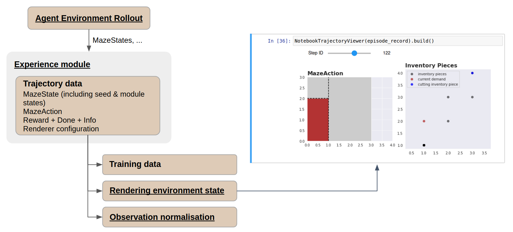
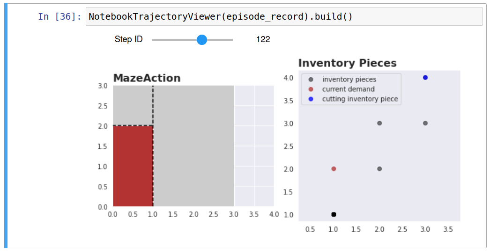

.. _collecting-rollouts:

Collecting and Visualizing Rollouts
===================================

While the :ref:`Event System <event_system>` provides an overview of
notable events happening during an episode through
:ref:`statistics and event logs <logging>`,
it is often needed to dig deeper and visualize the full environment
state at a given time step.

With the Maze Trajectory Viewer, it is possible replay past episodes
from collected trajectory data in a Jupyter Notebook.

Requirements
------------

.. note::
  Rollouts visualization in a notebook is not currently available
  for Gym environments.

The trajectory viewer notebook requires the environment to implement
a Maze-compatible :class:`Renderer <maze.core.rendering.renderer.Renderer>`
based on matplotlib. The tutorial 2D cutting
environment serves as a perfect example -- see the
:ref:`Adding a Renderer <env_from_scratch-renderer>` section to understand
how to implement one.

Unfortunately, Maze does not yet support rendering from trajectory data for
standard Gym environments. For such environments, you can render only during
the rollout itself by setting the corresponding option on the sequential renderer
(i.e., provide the following overrides for rollouts:
``runner=sequential runner.render=true``).

Trajectory Data Collection
--------------------------

When using a compliant environment, past trajectories can be rendered directly
from the trajectory data. These are usually collected using the rollout runners
via CLI.

To simply collect trajectory data of a heuristic policy on
the :ref:`tutorial Cutting 2D environment <env_from_scratch>`, run:

.. code-block:: bash

    maze-run env=tutorial_cutting_2d_flat policy=tutorial_cutting_2d_greedy_policy

Alternatively (and closer to a real training setting), you might want to first
:ref:`train <training>` an RL policy on the tutorial 2D cutting environment:

.. code-block:: bash

    maze-run -cn conf_train env=tutorial_cutting_2d_struct_masked wrappers=tutorial_cutting_2d model=tutorial_cutting_2d_struct_masked

and then :ref:`roll it out <rollouts>` to collect the trajectory data (make sure
to substitute the ``input_dir`` value for your actual training output directory):

.. code-block:: bash

    maze-run policy=torch_policy env=tutorial_cutting_2d_struct_masked wrappers=tutorial_cutting_2d model=tutorial_cutting_2d_struct_masked input_dir=outputs/[training-output-dir]

Once the rollout has run, take note of the outputs directory created by
Hydra, where the trajectory data will be logged -- by default inside
the ``trajectory_data`` subdirectory, one pickle file per episode
(identified by a UUID generated for each episode).

(Whether trajectory data is recorded during a rollout is set using
the ``runner.record_trajectory`` flag, which is on by default.)

Trajectory Visualization
------------------------

Maze includes a Jupyter Notebook in ``evaluation/viewer.ipynb`` that will guide
you through the process. You only need to supply a path to the outputs directory
where you trajectory data reside. The renderer will be automatically built
from the trajectory data.

(Note that the notebook also lists example trajectory data in case you do not
have any on hand.)

Once an episode is selected and loaded, it is possible to skim back and forward in time
using the notebook widgets slider (controllable by mouse or keyboard).

Where to Go Next
----------------

- To understand in more detail how to train a policy and then roll it out
  to collect trajectory data, check out :ref:`Trainings <training>` and :ref:`Rollouts <rollouts>`.
- Rendering and reviewing each time step in detail comes with a lot
  of overhead. In case you just want to see and easily compare notable events that happened
  across different episodes, you might want to review the :ref:`Event system <event_system>`
  and how it is used to log :ref:`statistics <logging>`, :ref:`KPIs <event_kpi_log>`,
  and :ref:`raw events <event_system-usage>`.