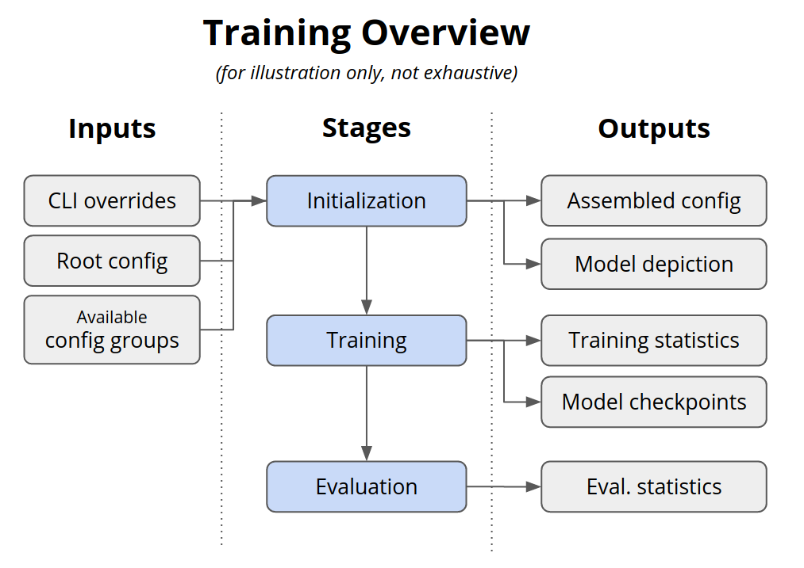

.. _training:

Training
========

Here, we show how to train a policy on a standard Gym or custom environment
using algorithms and models from Maze. This guide focuses on the main mechanics of Maze
training runs, plus also gives some pointers on how to customize the training with custom
environments (using the tutorial Maze 2D-cutting environment as an example), models, etc.

The figure below shows a conceptual overview of the Maze training workflow.

On this page:

- :ref:`The first example<training-first_run>` demostrates training with the default settings.
  The main purpose is to show how the Maze training pipeline works in general.
- :ref:`The second example<training-default_run>` explains how you can customize training on standard
  Gym and Maze environments (for which configuration files are already provided by Maze).
- The following section then explains what you need to
  :ref:`customize training for your own project<training-custom_run>`, including
  custom components and configuration files.
- Finally, the last section shows :ref:`how to launch training directly from Python<training-from_python>`
  (avoiding the CLI).

In order to fully understand the configuration mechanisms used here, you should familiarize
yourself with how :ref:`Maze makes use of the Hydra configuration framework<hydra>`.

.. _training-first_run:

Example 1: Your First Training Run
----------------------------------

We can train a policy from scratch on the Cartpole environment
with default settings using the following command:

.. code-block:: console

  $ maze-run -cn conf_train env=gym_env env.name=CartPole-v0

The ``-cn conf_train`` argument specifies that we would like to use
``conf_train.yaml`` as our root config file. This is
needed as by default, configuration for :ref:`rollouts<rollouts>` is used.

Furthermore, we specify that ``gym_env`` configuration should be used, with
``CartPole-v0`` as the Gym environment name. (For more information on how to read and customize the default configuration files,
see :ref:`Hydra overview<hydra-overview-config_root>`.)

Such a training run consists of these main stages,
loaded based on the default configuration provided by Maze:

1. The full configuration is assembled via Hydra based on the config files available, the defaults
   set in root config, and the overrides you provide via CLI (see `Hydra overview<hydra-overview>`
   to understand more about this process).
2. Hydra creates the output directory where all output files will be stored.
3. The full configuration of the job is logged: (1) to standard output,
   (2) as a text entry to your Tensorboard logs, and (3) as a YAML file in the output directory.
4. If the observation normalization wrappers is present,
   :ref:`observation normalization<observation_normalization>` statistics
   are collected and stored (note that no wrappers are applied by default).
5. Policies and critics are initialized and their graphical depictions saved.
6. The training starts, statistics are displayed in console and stored to a Tensorboard
   file, and current best model versions are saved (by default to ``state_dict.pt`` file).
7. Once the training is done, final evaluation runs are performed and final model versions saved.
   (When the training is done depends on the :ref:`training runner<runner_concept>`.
   Usually, this is specified using the ``runner.n_epochs`` argument,
   but the training can also end with early stopping if there is no more improvement).

As the job is running, you should see the statistics from the training and evaluation runs
printed in your console, as mentioned in the 6. step:

.. code-block:: console

  ...
  ********** Iteration 3 **********
   step|path                                                                                    |               value
  =====|========================================================================================|====================
      4|eval                  DiscreteActionEvents  action                substep_0/action      |    [len:281, μ:0.5]
      4|eval                  BaseEnvEvents         reward                median_step_count     |              18.500
      4|eval                  BaseEnvEvents         reward                mean_step_count       |              28.100
      4|eval                  BaseEnvEvents         reward                total_step_count      |             928.000
      4|eval                  BaseEnvEvents         reward                total_episode_count   |              40.000
      4|eval                  BaseEnvEvents         reward                episode_count         |              10.000
      4|eval                  BaseEnvEvents         reward                std                   |              16.447
      4|eval                  BaseEnvEvents         reward                mean                  |              28.100
      4|eval                  BaseEnvEvents         reward                min                   |              16.000
      4|eval                  BaseEnvEvents         reward                max                   |              66.000
  -> new overall best model 28.10000!
  ...

This main structure remains similar for all environment and training configurations.

.. _training-default_run:

Example 2: Customizing with Provided Components
-----------------------------------------------

When your Maze job is launched using ``maze-run`` from the CLI, the following happens under
the hood:

1. A job configuration is assembled by putting available configuration files together with
   the overrides you specify as arguments to the run command. More on that can be found in
   :ref:`configuration documentation page<hydra>`, specifically in :ref:`Hydra overview<hydra-overview>`.
2. The complete assembled configuration is handed over to the :ref:`Maze runner<runner_concept>`
   specified in the configuration (in the ``runner`` group). This runner then launches and manages
   the training (or any other) job.

The common points for customizing the training run correspond to the configuration groups
listed in the training root config file, namely:

- Environment (``env`` configuration group), configuring which environment the training runs on,
  as well as customizing any other inner configuration of the environment, if available (like
  raw piece size in 2D cuttting environment)
- Training algorithm (``algorithm`` configuration group), specifying the algorithm used and configuration
  for it
- Model (``model`` configuration group), specifying how the models for policies and (optionally) critics
  should be assembled
- Runner (``runner`` configuration group), specifying options for how the training is run (e.g. locally,
  in development mode, or using Ray on a Kubernetes cluster). The runner is also the main object responsible
  for administering the whole training run (and runners are thus specific to individual algorithms used).

Maze provides a host of configuration files useful for working with standard Gym environments
and environments provided by Maze (such as the 2D cutting environment). Hence, to use these,
it suffices to supply appropriate :ref:`overrides<hydra-overview-overrides>`,
without writing any additional configuration files.

By default, the ``gym_env`` configuration is used, which allows us to specify the Gym env
that we would like to instantiate:

.. code-block:: console

  $ maze-run -cn conf_train env=gym_env env.name=LunarLander-v2

With appropriate overrides, we can also include vector observation model and wrappers
(providing normalization):

.. code-block:: console

  $ maze-run -cn conf_train env=gym_env env.name=LunarLander-v0 wrappers=gym_pixel_env model=gym_pixel_env

Alternatively, we could use the :ref:`tutorial Cutting 2D environment <env_from_scratch>`:

.. code-block:: console

  $ maze-run -cn conf_train env=tutorial_cutting_2d_struct_masked \
    wrappers=tutorial_cutting_2d model=tutorial_cutting_2d_struct_masked

Further, by default, the algorithm used is Evolution Strategies (the implementation is provided by Maze).
To use a different algorithm, e.g. PPO with a shared critic, we just need to add the appropriate overrides:

.. code-block:: console

  $ maze-run -cn conf_train algorithm=ppo env=tutorial_cutting_2d_struct_masked \
    wrappers=tutorial_cutting_2d model=tutorial_cutting_2d_struct_masked

To see all the configuration files available out-of-the-box, check out the ``maze/conf`` package.

.. _training-custom_run:

Training in Your Custom Project
-------------------------------

While the default environments and configurations are nice to get started quickly or test different approaches
in standard scenarios, the primary focus of Maze are fully custom environments and models solving
real-world problems (which are of course much more fun as well!).

The best place to start with a custom environment is the :ref:`Maze step by step<env_from_scratch>`
tutorial (mentioned already in the previous section) showing how to implement a custom Maze environment from scratch,
along with respective configuration files (see also :ref:`Hydra: Your Own Configuration Files <hydra-custom>`).

Then, you can easily launch your environment by supplying your own configuration file
(here we use one from the tutorial):

.. code-block:: console

  $ maze-run -cn conf_train env=tutorial_cutting_2d_struct_masked \
    wrappers=tutorial_cutting_2d model=tutorial_cutting_2d_struct_masked

For links to more customization options (like building custom models with
:ref:`Maze Perception Module<perception_module>`), check out the
:ref:`Where to Go Next<training-wtgn>` section.

While customizing other configuration groups listed in the previous section
(e.g., ``algorithm``, ``runner``) is not needed as often, all of these can be customized
in an analogous way (i.e., implement your own components that plug into the framework
instead of the default ones, and then add your own config
to be able to configure them from the command line).

.. _training-from_python:

Plain Python Training
---------------------

In most use cases, it will probably be more convenient to launch training directly from the CLI
and just implement your custom components (wrappers, environments, models, etc.) as needed. However,
it is definitely possible to launch training also from Python, and the inner architecture of Maze
should be sufficiently modular to allow you to extract just the parts that you want.

Because each of the algorithms included in Maze has slightly different needs, the usage will
likely slightly differ. However, regardless of which algorithm you intend to use,
the :class:`TrainingRunner<maze.train.trainers.common.training_runner.TrainingRunner>`
subclasses offer good examples of what components you will need for launching
training directly from Python.

Specifically, you'll need to concentrate on the ``run`` method, which takes as an argument the full
assembled hydra configuration (which is printed to the command line every time you launch a job).

Usually, the run method does roughly the following:

- Instantiates the environment and policy components (some of this functionality is provided
  by the shared :class:`TrainingRunner <maze.train.trainers.common.training_runner.TrainingRunner>` superclass, as a large part of that is common for all training runners)
- Assembles the policy and critics into a structured policy
- Instantiates the trainer and any other components needed for training
- Launches the training

For example, this is the run method taken directly from the evolution strategies runner:

.. literalinclude:: ../../../maze/train/trainers/es/es_runners.py
   :pyobject: ESMasterRunner.run
   :language: python

.. _training-wtgn:

Where to Go Next
----------------

- After training, you might want to :ref:`roll out<rollouts>` the trained policy to further evaluate it
  or record the actions taken.
- To create a custom Maze environment, you might want to review :ref:`Maze environment hierarchy<env-hierarchy>`
  and :ref:`creating a Maze environment from scratch<env_from_scratch>`.
- To build custom Maze models, have a look at the :ref:`Maze Perception Module<perception_module>`.
- To better understand how to configure custom environments and other components of your project,
  you might want to review the more advanced parts of :ref:`configuration with Hydra<hydra>`.
